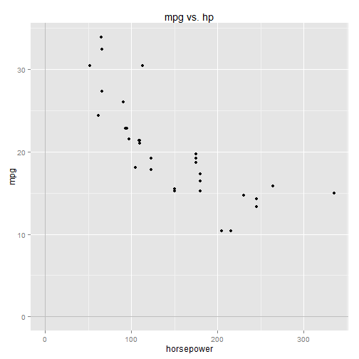
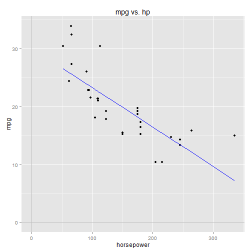
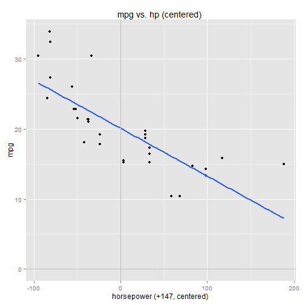

## Intro to Regression: Part 5: Interpreting coefficients, centering predictor variables

Let's turn again to the **mtcars** dataset in R and conduct another simple linear regression.
This time we'll regress the response variable, mpg, with horsepower (hp) as the predictor variable.

First things first, let's quickly explore the relationship between the two variables using a scatterplot:

---

```r
    library(ggplot2)
    library(grid)
    data(mtcars)
    qplot(x=hp, y=mpg, data=mtcars) + 
        ggtitle("mpg vs. hp") + 
        xlab("horsepower") +
        geom_vline(x=0, colour="gray") +
        geom_hline(y=0, colour="gray")
```

 

As with mpg vs. weight, there's a clear negative correlation between mpg and horsepower.  

<br />
### Building a linear model in R

In R, we use the **lm** function to build a linear model:

---

```r
    model <- lm(mpg ~ hp, data=mtcars)
```

The regression model corresponds to the linear equation: 

$$
mpg = \beta_0 + \beta_1 hp + \epsilon
$$

<ul>
<li>mpg is the response variable</li>
<li>hp is the predictor variable</li>
<li>\(\beta_0\) is the Y-intercept</li>
<li>\(\beta_1\) is the slope</li>
<li>\(\epsilon\) is the error term (the residuals)</li>
</ul>

We can get the values for \(\beta_0\) and \(\beta_1\) by looking at the model summary:

---

```r
    summary(model)
```

```
## 
## Call:
## lm(formula = mpg ~ hp, data = mtcars)
## 
## Residuals:
##     Min      1Q  Median      3Q     Max 
## -5.7121 -2.1122 -0.8854  1.5819  8.2360 
## 
## Coefficients:
##             Estimate Std. Error t value Pr(>|t|)    
## (Intercept) 30.09886    1.63392  18.421  < 2e-16 ***
## hp          -0.06823    0.01012  -6.742 1.79e-07 ***
## ---
## Signif. codes:  0 '***' 0.001 '**' 0.01 '*' 0.05 '.' 0.1 ' ' 1
## 
## Residual standard error: 3.863 on 30 degrees of freedom
## Multiple R-squared:  0.6024,	Adjusted R-squared:  0.5892 
## F-statistic: 45.46 on 1 and 30 DF,  p-value: 1.788e-07
```

```r
    ## 
    ## Call:
    ## lm(formula = mpg ~ hp, data = mtcars)
    ## 
    ## Residuals:
    ##     Min      1Q  Median      3Q     Max 
    ## -5.7121 -2.1122 -0.8854  1.5819  8.2360 
    ## 
    ## Coefficients:
    ##             Estimate Std. Error t value Pr(>|t|)    
    ## (Intercept) 30.09886    1.63392  18.421  < 2e-16 ***
    ## hp          -0.06823    0.01012  -6.742 1.79e-07 ***
    ## ---
    ## Signif. codes:  0 '***' 0.001 '**' 0.01 '*' 0.05 '.' 0.1 ' ' 1
    ## 
    ## Residual standard error: 3.863 on 30 degrees of freedom
    ## Multiple R-squared:  0.6024, Adjusted R-squared:  0.5892 
    ## F-statistic: 45.46 on 1 and 30 DF,  p-value: 1.788e-07
```

<ul>
<li>\(\beta_0\) = 30.09886, the Estimate for the (Intercept) coefficient</li>
<li>\(\beta_1\) = -0.06823, the Estimate for the hp coefficient</li>
</ul>

The linear equation for the model is thus (ignoring the error term):

$$
mpg = 30.09886 - 0.06823 \cdot hp 
$$

which we graph below:


```r
    B0 = 30.09886
    B1 = -0.06823
    mpg.predicted <- B0 + B1 * mtcars$hp

    qplot(x=hp, y=mpg, data=mtcars) + 
        ggtitle("mpg vs. hp") + 
        xlab("horsepower") +
        geom_line(mapping=aes(x=hp,y=mpg.predicted), colour="blue") +
        geom_vline(x=0, colour="gray") +
        geom_hline(y=0, colour="gray")
```

 

The regression line cuts right thru the data, just as we'd expect.

<br />
### Interpreting the coefficients

Let's focus on the linear equation and try to interpret what the coefficients are telling us:

$$
mpg = \beta_0 + \beta_1 hp  
$$

\(\beta_0\) is the Y-intercept.  It's the value of mpg when hp = 0:

$$
\begin{align*}
mpg &= \beta_0 + \beta_1 (hp=0)  
\\\\
mpg &= \beta_0 
\end{align*}
$$

So \(\beta_0\) = 30.09886 can be interpreted as the predicted mpg for a car with zero horsepower.
But zero horsepower is kind of meaningless in this context (is there such thing as a zero-horsepower car?). 
This makes \(\beta_0\) difficult to interpret practically.  In the next section we'll look at ways to
get a more meaningful interpretation out of \(\beta_0\).

<p>
\(\beta_1\) = -0.06823, correlates changes in horsepower with changes in mpg. Geometrically speaking it's the 
slope of the regression line, and we all know that slope is equal to change-in-Y divided by change-in-X.
\(\beta_1\) therefore is equal to the change-in-mpg divided by the change-in-hp.  
</p>

<p>
Another way to put it: \(\beta_1\) is equal to the change in mpg per 1-unit change in horsepower.
So a 1-unit increase in horsepower corresponds to 0.06823 decrease in predicted mpg.  
</p>


<br />
### Centering the predictor variable

A common way to get a meaningful interpretation for \(\beta_0\) is to shift the predictor variable, often by 
"centering" it.  "Centering" a predictor is done by simply subtracting its mean:

---

```r
    hp.center <- with(mtcars, hp-mean(hp))
    qplot(x=hp.center, y=mpg, data=mtcars) + 
        ggtitle("mpg vs. hp (centered) ") + 
        xlab("horsepower (+147, centered) ") +
        stat_smooth(method="lm", se=FALSE, size=1) +
        geom_vline(x=0, colour="gray") +
        geom_hline(y=0, colour="gray")
```

 

The chart looks pretty similar to the first one.  All we've done is shift the data horizontally to the left by mean(hp) = 147.
The slope of the regression line \(\beta_1\)  remains the same -- which is to say that the correlation between mpg and hp
is not changed by shifting the data.  But the Y-intercept \(\beta_0\)  has moved. 

The regression function is now:

$$
mpg = \beta_0 + \beta_1 (hp - mean(hp))
$$

The B1 term goes to 0 when hp = mean(hp):

$$
\begin{align*}
mpg &= \beta_0 + \beta_1 (mean(hp) - mean(hp)) 
\\\\
mpg &= \beta_0 
\end{align*}
$$

So \(\beta_0\) can now be interpreted as the predicted mpg for a car with average horsepower (hp=mean(hp)=147). 
This is a more practical interpretation of mpg than that of a zero-horsepower car.  

We can build a model in R using the shifted horsepower data:

---

```r
    model <- lm(mpg ~ I(hp-mean(hp)), data=mtcars)
    summary(model)
```

```
## 
## Call:
## lm(formula = mpg ~ I(hp - mean(hp)), data = mtcars)
## 
## Residuals:
##     Min      1Q  Median      3Q     Max 
## -5.7121 -2.1122 -0.8854  1.5819  8.2360 
## 
## Coefficients:
##                  Estimate Std. Error t value Pr(>|t|)    
## (Intercept)      20.09062    0.68288  29.420  < 2e-16 ***
## I(hp - mean(hp)) -0.06823    0.01012  -6.742 1.79e-07 ***
## ---
## Signif. codes:  0 '***' 0.001 '**' 0.01 '*' 0.05 '.' 0.1 ' ' 1
## 
## Residual standard error: 3.863 on 30 degrees of freedom
## Multiple R-squared:  0.6024,	Adjusted R-squared:  0.5892 
## F-statistic: 45.46 on 1 and 30 DF,  p-value: 1.788e-07
```

```r
    ## 
    ## Call:
    ## lm(formula = mpg ~ I(hp - mean(hp)), data = mtcars)
    ## 
    ## Residuals:
    ##     Min      1Q  Median      3Q     Max 
    ## -5.7121 -2.1122 -0.8854  1.5819  8.2360 
    ## 
    ## Coefficients:
    ##                  Estimate Std. Error t value Pr(>|t|)    
    ## (Intercept)      20.09062    0.68288  29.420  < 2e-16 ***
    ## I(hp - mean(hp)) -0.06823    0.01012  -6.742 1.79e-07 ***
    ## ---
    ## Signif. codes:  0 '***' 0.001 '**' 0.01 '*' 0.05 '.' 0.1 ' ' 1
    ## 
    ## Residual standard error: 3.863 on 30 degrees of freedom
    ## Multiple R-squared:  0.6024, Adjusted R-squared:  0.5892 
    ## F-statistic: 45.46 on 1 and 30 DF,  p-value: 1.788e-07
```

\(\beta_0\) = 20.09062, which we now interpret to be the predicted mpg for a car with average horsepower (hp=147).

\(\beta_1\) = -0.06823.  Notice that it is unchanged from the un-shifted model, as we should expect, since it
correlates changes in horsewpoer with changes in mpg, which is unaffected by shifting the data.  


