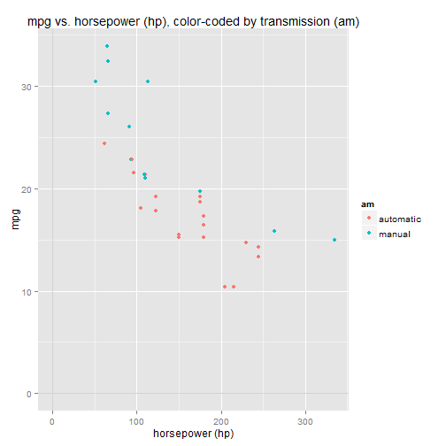
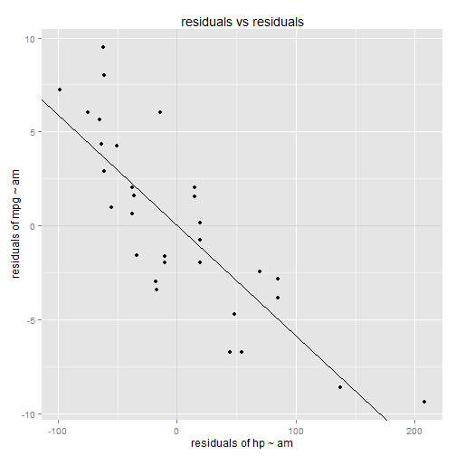
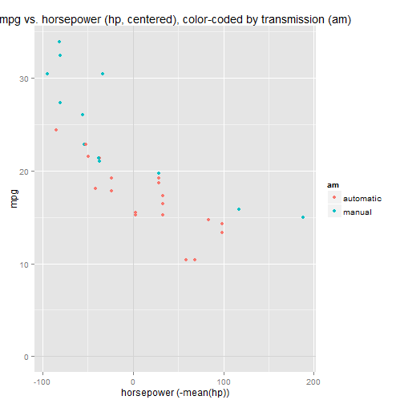
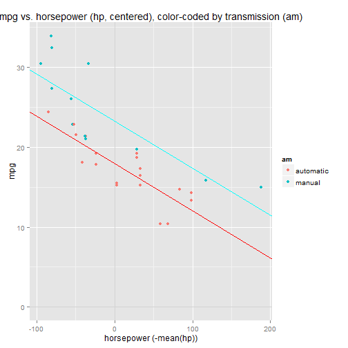
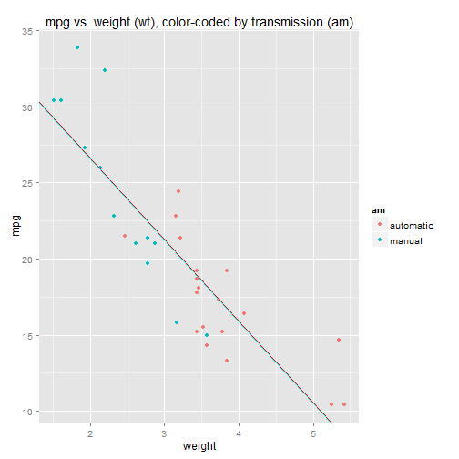
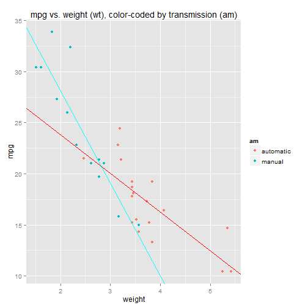

## Multiple regression: combining numeric and factor predictor variables

So far in this series, we've dealt with ***simple linear models***, where "simple" means "only
one predictor variable".  In this article we're going to look at ***multiple regression models***,
where "multiple" means "more than one predictor variable".

Again we'll use the **mtcars** dataset for an example, and again we'll use **mpg** as the response variable.
This time we'll build a multiple regression model using two predictor variables: horsepower (**hp**) and transmission
type (**am**).  Horsepower is a numeric variable, transmission type is a factor variable.

First, a quick look at a scatter plot.  We can scatter only two variables against each other (in a 2D chart), so we'll
scatter mpg (y-axis) vs. hp (x-axis), and we'll include transmission type (am) in the visualization by color-coding the data points:

---

```r
    library(ggplot2)
    library(grid)
    data(mtcars)

    # convert am to factor and rename levels
    mtcars$am <- as.factor(mtcars$am)
    levels(mtcars$am) <- c("automatic", "manual")
    
    qplot(x=hp, y=mpg, data=mtcars, colour=am) + 
        ggtitle("mpg vs. horsepower (hp), color-coded by transmission (am)") + 
        xlab("horsepower (hp)") + 
        geom_hline(y=0,colour="lightgray") +
        geom_vline(x=0,colour="lightgray") 
```

 

The regression model in R:

---

```r
    model <- lm(mpg ~ hp + am - 1, data=mtcars)
    summary(model)
```

```
## 
## Call:
## lm(formula = mpg ~ hp + am - 1, data = mtcars)
## 
## Residuals:
##     Min      1Q  Median      3Q     Max 
## -4.3843 -2.2642  0.1366  1.6968  5.8657 
## 
## Coefficients:
##              Estimate Std. Error t value Pr(>|t|)    
## hp          -0.058888   0.007857  -7.495 2.92e-08 ***
## amautomatic 26.584914   1.425094  18.655  < 2e-16 ***
## ammanual    31.861999   1.282279  24.848  < 2e-16 ***
## ---
## Signif. codes:  0 '***' 0.001 '**' 0.01 '*' 0.05 '.' 0.1 ' ' 1
## 
## Residual standard error: 2.909 on 29 degrees of freedom
## Multiple R-squared:  0.9825,	Adjusted R-squared:  0.9807 
## F-statistic: 543.4 on 3 and 29 DF,  p-value: < 2.2e-16
```

```r
    ## 
    ## Call:
    ## lm(formula = mpg ~ hp + am - 1, data = mtcars)
    ## 
    ## Residuals:
    ##     Min      1Q  Median      3Q     Max 
    ## -4.3843 -2.2642  0.1366  1.6968  5.8657 
    ## 
    ## Coefficients:
    ##              Estimate Std. Error t value Pr(>|t|)    
    ## hp          -0.058888   0.007857  -7.495 2.92e-08 ***
    ## amautomatic 26.584914   1.425094  18.655  < 2e-16 ***
    ## ammanual    31.861999   1.282279  24.848  < 2e-16 ***
    ## ---
    ## Signif. codes:  0 '***' 0.001 '**' 0.01 '*' 0.05 '.' 0.1 ' ' 1
    ## 
    ## Residual standard error: 2.909 on 29 degrees of freedom
    ## Multiple R-squared:  0.9825, Adjusted R-squared:  0.9807 
    ## F-statistic: 543.4 on 3 and 29 DF,  p-value: < 2.2e-16
```
---

Note that we're excluding the Y-intercept term (the "-1" in the model), just to make it easier to explain what's going on.

This model corresponds to the regression equation:

$$
mpg = \beta_1 \cdot hp + \beta_2 \cdot [am == "automatic"] + \beta_3 \cdot [am == "manual"] + \epsilon
$$

<ul>
<li>mpg is the response variable</li>
<li><code>[am == "automatic"]</code> is a dummy variable</li>
<li><code>[am == "manual"]</code> is another dummy variable</li>
<li>\(\epsilon\) is the error term (the residuals)</li>
</ul>

<br />
### Interpreting coefficients

When am = automatic, the `[am==automatic]` dummy variable is 1 and the `[am==manual]` dummy variable is 0,
so the `[am==manual]` term drops out of the equation: 

$$
\begin{align*}
mpg &= \beta_1 \cdot hp + \beta_2 \cdot [am == "automatic"] + \beta_3 \cdot [am == "manual"] 
\\\\[0pt]
mpg &= \beta_1 \cdot hp + \beta_2 \cdot [1] + \beta_3 \cdot [0] 
\\\\[0pt]
mpg &= \beta_1 \cdot hp + \beta_2 
\end{align*}
$$

So \(\beta_2 = 26.584914\) can be interpreted as the mpg value for an automatic when hp=0. Similarly, when am = manual, 
the <code>[am==automatic]</code> term drops out (its dummy variable is 0):

$$
\begin{align*}
mpg &= \beta_1 \cdot hp + \beta_2 \cdot [am == "automatic"] + \beta_3 \cdot [am == "manual"] 
\\\\
mpg &= \beta_1 \cdot hp + \beta_2 \cdot [0] + \beta_3 \cdot [1] 
\\\\
mpg &= \beta_1 \cdot hp + \beta_3 
\end{align*}
$$

<p>
So \(\beta_3 = 31.861999\) is the mpg value for a manual when hp=0. 
</p>

<p>
The regression model is actually two lines.  The two lines have different Y intercepts (\(\beta_2\) and \(\beta_3\)),
but they both have the same slope, \(\beta_1\), which is the coefficient attached to the continuous numeric variable hp.
</p>

$$
\begin{align*}
(1)\\  mpg &= \beta_1 \cdot hp + \beta_2 
\\\\
(2)\\  mpg &= \beta_1 \cdot hp + \beta_3 
\end{align*}
$$

<p>
So how do we interpret \(\beta_1 = -0.058888\) ?  Well, in equation #1 it's the change-in-mpg per change-in-hp for automatics,
whereas in equation #2 it's the change-in-mpg per change-in-hp for manuals.  But that can't be right, because it's quite possible 
that the change-in-mpg per change-in-hp is <i>different</i> between automatics and manuals.  Yet \(\beta_1\) has the same value in both equations.
So what gives?
</p>

<p>
\(\beta_1\) tells us about the relationship between mpg and hp <i>in this particular regression model</i>.  It gives as a value for change-in-mpg 
per change-in-hp <i>after all other predictor variables have been taken into consideration</i>.  By "taken into consideration", I mean that
all other predictor variables are "regressed out" of both the response variable (mpg) AND the predictor variable (hp).   "Regressed out"
simply means to regress one variable against another, then take the residuals and make some use of them.  The residuals represent the
"movement"/variation of the response variable after the effect/influence of the regressor/predictor variable has been
"taken into consideration"/"accounted for"/eliminated.
</p>

In this example, the only other predictor variable is transmission type (am).
So transmission type is regressed out of mpg, then it's regressed out of hp, then the residuals from both regressions are compared
against each other to determine the correlation between the residuals.

* The residuals of mpg ~ am show us how mpg "moves"/varies after eliminating the effect of transmission type
* The residuals of hp ~ am show us how hp "moves"/varies after eliminating the effect of transmission type

The correlation between these two sets of residuals tells us how mpg and hp "move together", *after* eliminating the effect of 
transmission type from both of them.  The R code below takes the two sets of residuals and scatter plots them.  It then
creates a model using just the residuals: residuals[mpg ~ am] ~ residuals[hp ~ am].  The regression line for this model
is drawn on the scatter plot:

--- 

```r
    model.mpg.am <- lm( mpg ~ am, data=mtcars )
    model.hp.am <- lm( hp ~ am, data=mtcars )

    model.mpg.am.resid <- resid(model.mpg.am)
    model.hp.am.resid <- resid(model.hp.am)

    model.mpg.hp <- lm( model.mpg.am.resid ~ model.hp.am.resid )

    qplot(x=model.hp.am.resid, y=model.mpg.am.resid) + 
        ggtitle("residuals vs residuals") + 
        ylab("residuals of mpg ~ am") + 
        xlab("residuals of hp ~ am") + 
        geom_hline(y=0,colour="lightgray") +
        geom_vline(x=0,colour="lightgray") +
        geom_abline(intercept = coef(model.mpg.hp)[1], slope = coef(model.mpg.hp)[2])
```

 

```r
    summary(model.mpg.hp)
```

```
## 
## Call:
## lm(formula = model.mpg.am.resid ~ model.hp.am.resid)
## 
## Residuals:
##     Min      1Q  Median      3Q     Max 
## -4.3843 -2.2642  0.1366  1.6968  5.8657 
## 
## Coefficients:
##                     Estimate Std. Error t value Pr(>|t|)    
## (Intercept)       -1.985e-16  5.056e-01   0.000        1    
## model.hp.am.resid -5.889e-02  7.725e-03  -7.623 1.68e-08 ***
## ---
## Signif. codes:  0 '***' 0.001 '**' 0.01 '*' 0.05 '.' 0.1 ' ' 1
## 
## Residual standard error: 2.86 on 30 degrees of freedom
## Multiple R-squared:  0.6595,	Adjusted R-squared:  0.6482 
## F-statistic: 58.12 on 1 and 30 DF,  p-value: 1.677e-08
```

```r
    ## 
    ## Call:
    ## lm(formula = model.mpg.am.resid ~ model.hp.am.resid)
    ## 
    ## Residuals:
    ##     Min      1Q  Median      3Q     Max 
    ## -4.3843 -2.2642  0.1366  1.6968  5.8657 
    ## 
    ## Coefficients:
    ##                     Estimate Std. Error t value Pr(>|t|)    
    ## (Intercept)       -1.985e-16  5.056e-01   0.000        1    
    ## model.hp.am.resid -5.889e-02  7.725e-03  -7.623 1.68e-08 ***
    ## ---
    ## Signif. codes:  0 '***' 0.001 '**' 0.01 '*' 0.05 '.' 0.1 ' ' 1
    ## 
    ## Residual standard error: 2.86 on 30 degrees of freedom
    ## Multiple R-squared:  0.6595, Adjusted R-squared:  0.6482 
    ## F-statistic: 58.12 on 1 and 30 DF,  p-value: 1.677e-08
```
---

Note that the slope coefficient for the residuals ~ residuals model, -0.05889, is the same as \(\beta_1\) 
in the multiple regression model.  This is how \(\beta_1\) is calculated.

Let's look at the chart and think about this some more.  What's on the x-axis?  It's the residuals of hp ~ am.  The
residuals show us how much the hp of a particular car varies from the average hp for cars with the same
transmission type.  The residual data points average around hp=0, which we expect, since the residuals are essentially 
the variance of hp around the mean(hp) per transmission type.

Ignoring the y-axis for now (we're only focused on deviations along the x-axis)...

* Residual data points in the left half correspond to cars with hp values that are *less than* the average hp for cars of the same transmission type
* Residual data points in the right half correspond to cars with hp values that are *greater than* the average hp for cars of the same transmission type

What's on the y-axis? It's the residuals of mpg ~ am.  These residuals show us how much mpg varies around the mean(mpg) per
transmission type.  

* Residual data points in the upper half correspond to cars with mpg values that are *greater than* the average mpg for cars of the same transmission type
* Residual data points in the lower half correspond to cars with mpg values that are *less than* the average mpg for cars of the same transmission type

There's a clear negative correlation between the two sets of residuals.  Cars with below-average hp values (w/r/t other cars 
of the same transmission type) also tend to have above-average mpg values (again, w/r/t other cars of the same transmission type).
Cars with above-average hp, on the other hand, tend to have below-average mpg. 

The two sets of residuals show us how mpg and hp "move together" w/r/t cars of the same transmission type.  This is what it means
to regress the transmission type variable out of both the mpg variable and the hp variable.  The residuals are then correlated
against each other to determine the relationship between mpg and hp *after accounting for ("regressing out") all other predictor variables in the
model*.

In future posts, we'll dive deeper into the details behind how coefficients are calculated in multiple regression models.


<br />
### Centering hp

hp=0 is a somewhat meaningless interpretation in a practical sense (a zero-horsepower car?).  This renders our 
interpretations of \(\beta_2\) and \(\beta_3\) somewhat meaninless as well.  We can get more meaningful interpretations
by "centering" the hp variable (i.e. subtracting its mean).  In that case our regression equations become:

$$
\begin{align*}
(1)\\  mpg &= \beta_1 \cdot (hp-mean(hp)) + \beta_2 
\\\\
(2)\\  mpg &= \beta_1 \cdot (hp-mean(hp)) + \beta_3 
\end{align*}
$$

Now the hp term, \(\beta_1\), drops out when hp=mean(hp), which changes our interpretation of \(\beta_2\) and \(\beta_3\):

<ul>
<li>\(\beta_2\) is the mpg for an automatic with average horsepower, hp=mean(hp)</li>
<li>\(\beta_3\) is the mpg for a manual with average horsepower, hp=mean(hp)</li>
</ul>

The slope of the regression is unaffected by centering hp; however the Y-intercepts do change, since
we're effectively shifting all the data to the left by mean(hp).  The scatter plot of the shifted data:

---

```r
    qplot(x=hp-mean(hp), y=mpg, data=mtcars, colour=am) + 
        ggtitle("mpg vs. horsepower (hp, centered), color-coded by transmission (am)") + 
        xlab("horsepower (-mean(hp))") + 
        geom_hline(y=0,colour="lightgray") +
        geom_vline(x=0,colour="lightgray") 
```

 

The model in R with the centered hp variable:

---

```r
    model.c <- lm(mpg ~ I(hp-mean(hp)) + am - 1, data=mtcars)
    summary(model.c)
```

```
## 
## Call:
## lm(formula = mpg ~ I(hp - mean(hp)) + am - 1, data = mtcars)
## 
## Residuals:
##     Min      1Q  Median      3Q     Max 
## -4.3843 -2.2642  0.1366  1.6968  5.8657 
## 
## Coefficients:
##                   Estimate Std. Error t value Pr(>|t|)    
## I(hp - mean(hp)) -0.058888   0.007857  -7.495 2.92e-08 ***
## amautomatic      17.946809   0.675884  26.553  < 2e-16 ***
## ammanual         23.223894   0.821787  28.260  < 2e-16 ***
## ---
## Signif. codes:  0 '***' 0.001 '**' 0.01 '*' 0.05 '.' 0.1 ' ' 1
## 
## Residual standard error: 2.909 on 29 degrees of freedom
## Multiple R-squared:  0.9825,	Adjusted R-squared:  0.9807 
## F-statistic: 543.4 on 3 and 29 DF,  p-value: < 2.2e-16
```

```r
    ## 
    ## Call:
    ## lm(formula = mpg ~ I(hp - mean(hp)) + am - 1, data = mtcars)
    ## 
    ## Residuals:
    ##     Min      1Q  Median      3Q     Max 
    ## -4.3843 -2.2642  0.1366  1.6968  5.8657 
    ## 
    ## Coefficients:
    ##                   Estimate Std. Error t value Pr(>|t|)    
    ## I(hp - mean(hp)) -0.058888   0.007857  -7.495 2.92e-08 ***
    ## amautomatic      17.946809   0.675884  26.553  < 2e-16 ***
    ## ammanual         23.223894   0.821787  28.260  < 2e-16 ***
    ## ---
    ## Signif. codes:  0 '***' 0.001 '**' 0.01 '*' 0.05 '.' 0.1 ' ' 1
    ## 
    ## Residual standard error: 2.909 on 29 degrees of freedom
    ## Multiple R-squared:  0.9825, Adjusted R-squared:  0.9807 
    ## F-statistic: 543.4 on 3 and 29 DF,  p-value: < 2.2e-16
    
    B1 <- coef(model.c)[1]
    B2 <- coef(model.c)[2]
    B3 <- coef(model.c)[3]

    qplot(x=hp-mean(hp), y=mpg, data=mtcars, colour=am) + 
        ggtitle("mpg vs. horsepower (hp, centered), color-coded by transmission (am)") + 
        xlab("horsepower (-mean(hp))") + 
        geom_hline(y=0,colour="lightgray") +
        geom_vline(x=0,colour="lightgray") +
        geom_abline(intercept = B2, slope = B1, colour=2) +
        geom_abline(intercept = B3, slope = B1, colour=5) 
```

 


<br />
### Including an interaction between numeric and factor predictor variables

An interaction between a numeric and factor predictor variable allows the factor variable to 
influence the coefficient (slope) of the numeric variable.

Let's jump right to an example.  This time we'll regress mpg against wt (weight) instead of hp (it's just
a better example of an interaction with transmission type than hp is). 

First we do a scatter of mpg vs. wt, color-coded by transmission type (am), and overlay it with a
regression model that does **NOT** include an interaction.  We'll include the Y-intercept term in the
model this time.  The model equation is thus:

$$
mpg = \beta_0 + \beta_1 \cdot wt + \beta_2 \cdot [am == "manual"] + \epsilon
$$

<ul>
<li>mpg is the response variable</li>
<li>\(\beta_0\) is the Y-intercept coefficient (associated with "base" level <code>[am == "automatic"]</code>)</li>
<li><code>[am == "manual"]</code> is a dummy variable</li>
<li>\(\epsilon\) is the error term (the residuals)</li>
</ul>


The two regression equations for this model are:

$$
\begin{align*}
(1)\\  mpg &= \beta_0 + \beta_1 \cdot wt 
\\\\
(2)\\  mpg &= (\beta_0 + \beta_2) + \beta_1 \cdot wt 
\end{align*}
$$

---

```r
    model <- lm(mpg ~ wt + am, data=mtcars)
    summary(model)
```

```
## 
## Call:
## lm(formula = mpg ~ wt + am, data = mtcars)
## 
## Residuals:
##     Min      1Q  Median      3Q     Max 
## -4.5295 -2.3619 -0.1317  1.4025  6.8782 
## 
## Coefficients:
##             Estimate Std. Error t value Pr(>|t|)    
## (Intercept) 37.32155    3.05464  12.218 5.84e-13 ***
## wt          -5.35281    0.78824  -6.791 1.87e-07 ***
## ammanual    -0.02362    1.54565  -0.015    0.988    
## ---
## Signif. codes:  0 '***' 0.001 '**' 0.01 '*' 0.05 '.' 0.1 ' ' 1
## 
## Residual standard error: 3.098 on 29 degrees of freedom
## Multiple R-squared:  0.7528,	Adjusted R-squared:  0.7358 
## F-statistic: 44.17 on 2 and 29 DF,  p-value: 1.579e-09
```

```r
    ## 
    ## Call:
    ## lm(formula = mpg ~ wt + am, data = mtcars)
    ## 
    ## Residuals:
    ##     Min      1Q  Median      3Q     Max 
    ## -4.5295 -2.3619 -0.1317  1.4025  6.8782 
    ## 
    ## Coefficients:
    ##             Estimate Std. Error t value Pr(>|t|)    
    ## (Intercept) 37.32155    3.05464  12.218 5.84e-13 ***
    ## wt          -5.35281    0.78824  -6.791 1.87e-07 ***
    ## ammanual    -0.02362    1.54565  -0.015    0.988    
    ## ---
    ## Signif. codes:  0 '***' 0.001 '**' 0.01 '*' 0.05 '.' 0.1 ' ' 1
    ## 
    ## Residual standard error: 3.098 on 29 degrees of freedom
    ## Multiple R-squared:  0.7528, Adjusted R-squared:  0.7358 
    ## F-statistic: 44.17 on 2 and 29 DF,  p-value: 1.579e-09
    
    
    B0 <- coef(model)[1]
    B1 <- coef(model)[2]
    B2 <- coef(model)[3]

    qplot(x=wt, y=mpg, data=mtcars, colour=am) + 
        ggtitle("mpg vs. weight (wt), color-coded by transmission (am)") + 
        xlab("weight") +
        geom_abline(intercept = B0, slope = B1, colour=2) +
        geom_abline(intercept = B0+B2, slope = B1, colour=5) 
```

 

The two regression lines fall right on top of each other (it looks like just one line but is
actually two).  They both have slope of \(\beta_1 = -5.3528 \), and the Y-intercepts differ 
by only \(\beta_2 = -0.02362\).


<br />
### Adding an interaction term

Now let's introduce the interaction term.  An interaction between two variables is easy to add to the model.
Just multiply the two variables together.  This effectively gives you a new variable, which you simply add
to the model:

---

```r
    model <- lm(mpg ~ wt + am + wt * am, data=mtcars)
    summary(model)
```

```
## 
## Call:
## lm(formula = mpg ~ wt + am + wt * am, data = mtcars)
## 
## Residuals:
##     Min      1Q  Median      3Q     Max 
## -3.6004 -1.5446 -0.5325  0.9012  6.0909 
## 
## Coefficients:
##             Estimate Std. Error t value Pr(>|t|)    
## (Intercept)  31.4161     3.0201  10.402 4.00e-11 ***
## wt           -3.7859     0.7856  -4.819 4.55e-05 ***
## ammanual     14.8784     4.2640   3.489  0.00162 ** 
## wt:ammanual  -5.2984     1.4447  -3.667  0.00102 ** 
## ---
## Signif. codes:  0 '***' 0.001 '**' 0.01 '*' 0.05 '.' 0.1 ' ' 1
## 
## Residual standard error: 2.591 on 28 degrees of freedom
## Multiple R-squared:  0.833,	Adjusted R-squared:  0.8151 
## F-statistic: 46.57 on 3 and 28 DF,  p-value: 5.209e-11
```

```r
    ## 
    ## Call:
    ## lm(formula = mpg ~ wt + am + wt * am, data = mtcars)
    ## 
    ## Residuals:
    ##     Min      1Q  Median      3Q     Max 
    ## -3.6004 -1.5446 -0.5325  0.9012  6.0909 
    ## 
    ## Coefficients:
    ##             Estimate Std. Error t value Pr(>|t|)    
    ## (Intercept)  31.4161     3.0201  10.402 4.00e-11 ***
    ## wt           -3.7859     0.7856  -4.819 4.55e-05 ***
    ## ammanual     14.8784     4.2640   3.489  0.00162 ** 
    ## wt:ammanual  -5.2984     1.4447  -3.667  0.00102 ** 
    ## ---
    ## Signif. codes:  0 '***' 0.001 '**' 0.01 '*' 0.05 '.' 0.1 ' ' 1
    ## 
    ## Residual standard error: 2.591 on 28 degrees of freedom
    ## Multiple R-squared:  0.833,  Adjusted R-squared:  0.8151 
    ## F-statistic: 46.57 on 3 and 28 DF,  p-value: 5.209e-11
```
---


The regression equation for this model:

$$
mpg = \beta_0 + \beta_1 \cdot wt + \beta_2 \cdot [am == "manual"] + \beta_3 \cdot wt \cdot [am == "manual"] + \epsilon
$$

<ul>
<li>mpg is the response variable</li>
<li>\(\beta_0\) is the Y-intercept coefficient (associated with "base" level <code>[am == "automatic"]</code>)</li>
<li><code>[am == "manual"]</code> is a dummy variable</li>
<li>\( \beta_3 \cdot wt \cdot [am == "manual"]\) is the interaction term</li>
<li>\(\epsilon\) is the error term (the residuals)</li>
</ul>

When am = "automatic", the <code>[am == "manual"]</code> terms drop out (including the interaction term) and the equation becomes:

$$
\begin{align*}
mpg &= \beta_0 + \beta_1 \cdot wt + \beta_2 \cdot [am == "manual"] + \beta_3 \cdot wt \cdot [am == "manual"] 
\\\\
mpg &= \beta_0 + \beta_1 \cdot wt + \beta_2 \cdot [0] + \beta_3 \cdot wt \cdot [0] 
\\\\
mpg &= \beta_0 + \beta_1 \cdot wt 
\end{align*}
$$

The Y-intercept is \(\beta_0\) and the slope is \(\beta_1\).  When am = "manual", the regression equation becomes:

$$
\begin{align*}
mpg &= \beta_0 + \beta_1 \cdot wt + \beta_2 \cdot [am == "manual"] + \beta_3 \cdot wt \cdot [am == "manual"] 
\\\\
mpg &= \beta_0 + \beta_1 \cdot wt + \beta_2 \cdot [1] + \beta_3 \cdot wt \cdot [1] 
\\\\
mpg &= (\beta_0 + \beta_2) + (\beta_1 + \beta_3) \cdot wt 
\end{align*}
$$

The Y-intercept has shifted to \(\beta_0 + \beta_2\), and the slope has changed to \(\beta_1 + \beta_3\).

<ul>
<li> \(\beta_2\) can be interpreted as the "change in Y-intercept" between automatics and manuals </li>
<li> \(\beta_3\) can be interpreted as the "change in slope" (relating mpg to wt) between automatics and manuals</li>
</ul>

The two regression equations for this model are:

$$
\begin{align*}
(1)\\  mpg &= \beta_0 + \beta_1 \cdot wt 
\\\\
(2)\\  mpg &= (\beta_0 + \beta_2) + (\beta_1 + \beta_3) \cdot wt 
\end{align*}
$$

---

```r
    B0 <- coef(model)[1]
    B1 <- coef(model)[2]
    B2 <- coef(model)[3]
    B3 <- coef(model)[4]

    qplot(x=wt, y=mpg, data=mtcars, colour=am) + 
        ggtitle("mpg vs. weight (wt), color-coded by transmission (am)") + 
        xlab("weight") +
        geom_abline(intercept = B0, slope = B1, colour=2) +
        geom_abline(intercept = B0+B2, slope = B1+B3, colour=5) 
```

 

The interaction term gives the factor variable an opportunity to influence the slope of the regression
equation.  As a result, the two lines more closely fit the data points for each transmission type, thus
giving us a more accurate model.  Compare the R<sup>2</sup> ("goodness of fit") for the two models:

* model: mpg ~ wt + am.  R<sup>2</sup> = 0.7528
* model: mpg ~ wt + am + wt * am.  R<sup>2</sup> = 0.833

The first model, without the interaction term, explains 75% of mpg variance.  The second model, with
the interaction term, does a little better, explaining 83% of mpg variance.
