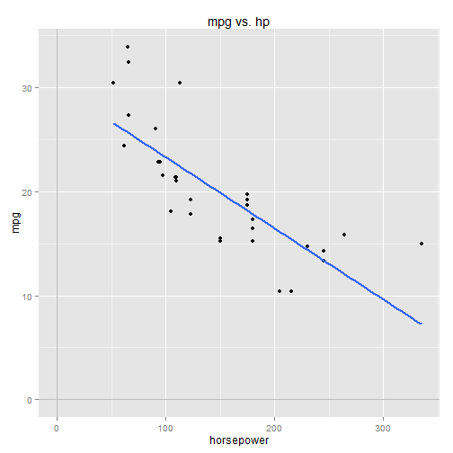
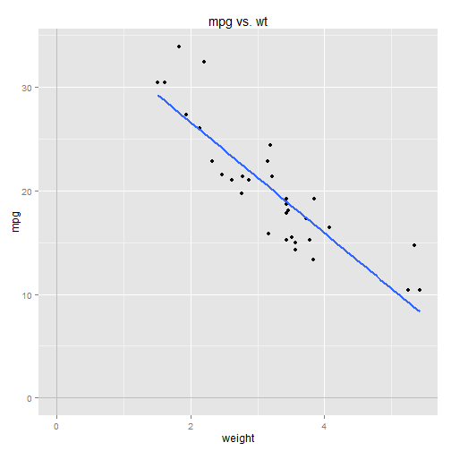
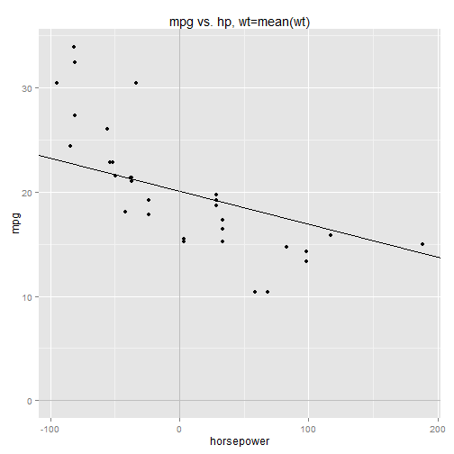
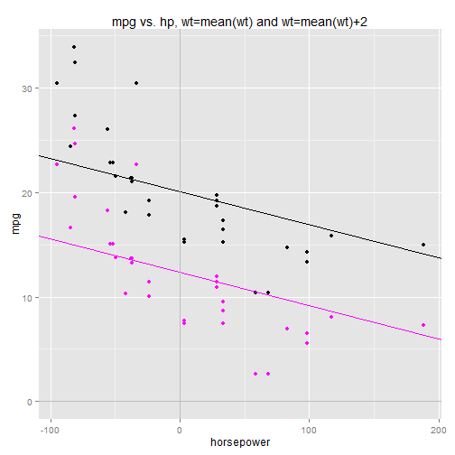
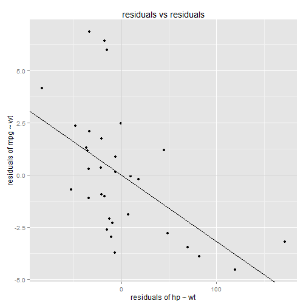
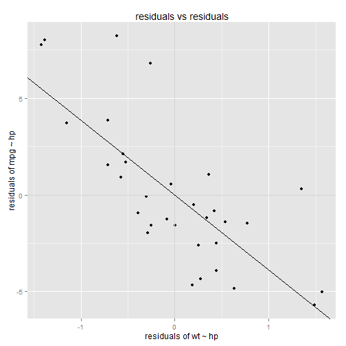

## Intro to Regression: Part 8: Multiple regression: regressing on two numeric variables

Previously we looked at a multiple regression model that used a numeric variable and a factor variable as regressors/predictors.
Let's now work thru an example of multiple regression using two numeric variables as our regressors.

Again we'll use the handy **mtcars** dataset in **R**.  We've already regressed **mpg** on **hp** and **wt**
individually.  To refresh your memory, the simple regression models are computed below:


```r
    library(ggplot2)
    data(mtcars)

    model.hp <- lm(mpg ~ hp, data=mtcars)
    summary(model.hp)
```

```
## 
## Call:
## lm(formula = mpg ~ hp, data = mtcars)
## 
## Residuals:
##     Min      1Q  Median      3Q     Max 
## -5.7121 -2.1122 -0.8854  1.5819  8.2360 
## 
## Coefficients:
##             Estimate Std. Error t value Pr(>|t|)    
## (Intercept) 30.09886    1.63392  18.421  < 2e-16 ***
## hp          -0.06823    0.01012  -6.742 1.79e-07 ***
## ---
## Signif. codes:  0 '***' 0.001 '**' 0.01 '*' 0.05 '.' 0.1 ' ' 1
## 
## Residual standard error: 3.863 on 30 degrees of freedom
## Multiple R-squared:  0.6024,	Adjusted R-squared:  0.5892 
## F-statistic: 45.46 on 1 and 30 DF,  p-value: 1.788e-07
```

```r
    ## Call:
    ## lm(formula = mpg ~ hp, data = mtcars)
    ## 
    ## Residuals:
    ##     Min      1Q  Median      3Q     Max 
    ## -5.7121 -2.1122 -0.8854  1.5819  8.2360 
    ## 
    ## Coefficients:
    ##             Estimate Std. Error t value Pr(>|t|)    
    ## (Intercept) 30.09886    1.63392  18.421  < 2e-16 ***
    ## hp          -0.06823    0.01012  -6.742 1.79e-07 ***
    ## ---
    ## Signif. codes:  0 ‘***’ 0.001 ‘**’ 0.01 ‘*’ 0.05 ‘.’ 0.1 ‘ ’ 1
    ## 
    ## Residual standard error: 3.863 on 30 degrees of freedom
    ## Multiple R-squared:  0.6024,    Adjusted R-squared:  0.5892 
    ## F-statistic: 45.46 on 1 and 30 DF,  p-value: 1.788e-07

    qplot(x=hp, y=mpg, data=mtcars) + 
        ggtitle("mpg vs. hp") + 
        xlab("horsepower") +
        stat_smooth(method="lm", se=FALSE, size=1) +
        geom_vline(x=0, colour="gray") +
        geom_hline(y=0, colour="gray")
```

 

```r
    model.wt <- lm(mpg ~ wt, data=mtcars)
    summary(model.wt)
```

```
## 
## Call:
## lm(formula = mpg ~ wt, data = mtcars)
## 
## Residuals:
##     Min      1Q  Median      3Q     Max 
## -4.5432 -2.3647 -0.1252  1.4096  6.8727 
## 
## Coefficients:
##             Estimate Std. Error t value Pr(>|t|)    
## (Intercept)  37.2851     1.8776  19.858  < 2e-16 ***
## wt           -5.3445     0.5591  -9.559 1.29e-10 ***
## ---
## Signif. codes:  0 '***' 0.001 '**' 0.01 '*' 0.05 '.' 0.1 ' ' 1
## 
## Residual standard error: 3.046 on 30 degrees of freedom
## Multiple R-squared:  0.7528,	Adjusted R-squared:  0.7446 
## F-statistic: 91.38 on 1 and 30 DF,  p-value: 1.294e-10
```

```r
    ## Call:
    ## lm(formula = mpg ~ wt, data = mtcars)
    ## 
    ## Residuals:
    ##     Min      1Q  Median      3Q     Max 
    ## -4.5432 -2.3647 -0.1252  1.4096  6.8727 
    ## 
    ## Coefficients:
    ##             Estimate Std. Error t value Pr(>|t|)    
    ## (Intercept)  37.2851     1.8776  19.858  < 2e-16 ***
    ## wt           -5.3445     0.5591  -9.559 1.29e-10 ***
    ## ---
    ## Signif. codes:  0 ‘***’ 0.001 ‘**’ 0.01 ‘*’ 0.05 ‘.’ 0.1 ‘ ’ 1
    ## 
    ## Residual standard error: 3.046 on 30 degrees of freedom
    ## Multiple R-squared:  0.7528,    Adjusted R-squared:  0.7446 
    ## F-statistic: 91.38 on 1 and 30 DF,  p-value: 1.294e-10

    qplot(x=wt, y=mpg, data=mtcars) + 
        ggtitle("mpg vs. wt") + 
        xlab("weight") +
        stat_smooth(method="lm", se=FALSE, size=1) +
        geom_vline(x=0, colour="gray") +
        geom_hline(y=0, colour="gray")
```

 


Now we'll include both hp and wt in the same model:


```r
    model.hp.wt <- lm(mpg ~ hp + wt, data=mtcars)
    summary(model.hp.wt)
```

```
## 
## Call:
## lm(formula = mpg ~ hp + wt, data = mtcars)
## 
## Residuals:
##    Min     1Q Median     3Q    Max 
## -3.941 -1.600 -0.182  1.050  5.854 
## 
## Coefficients:
##             Estimate Std. Error t value Pr(>|t|)    
## (Intercept) 37.22727    1.59879  23.285  < 2e-16 ***
## hp          -0.03177    0.00903  -3.519  0.00145 ** 
## wt          -3.87783    0.63273  -6.129 1.12e-06 ***
## ---
## Signif. codes:  0 '***' 0.001 '**' 0.01 '*' 0.05 '.' 0.1 ' ' 1
## 
## Residual standard error: 2.593 on 29 degrees of freedom
## Multiple R-squared:  0.8268,	Adjusted R-squared:  0.8148 
## F-statistic: 69.21 on 2 and 29 DF,  p-value: 9.109e-12
```

```r
    ## Call:
    ## lm(formula = mpg ~ hp + wt, data = mtcars)
    ## 
    ## Residuals:
    ##    Min     1Q Median     3Q    Max 
    ## -3.941 -1.600 -0.182  1.050  5.854 
    ## 
    ## Coefficients:
    ##             Estimate Std. Error t value Pr(>|t|)    
    ## (Intercept) 37.22727    1.59879  23.285  < 2e-16 ***
    ## hp          -0.03177    0.00903  -3.519  0.00145 ** 
    ## wt          -3.87783    0.63273  -6.129 1.12e-06 ***
    ## ---
    ## Signif. codes:  0 ‘***’ 0.001 ‘**’ 0.01 ‘*’ 0.05 ‘.’ 0.1 ‘ ’ 1
    ## 
    ## Residual standard error: 2.593 on 29 degrees of freedom
    ## Multiple R-squared:  0.8268,    Adjusted R-squared:  0.8148 
    ## F-statistic: 69.21 on 2 and 29 DF,  p-value: 9.109e-12
```

Notice that the coefficients for wt and hp have changed going from the simple models
to the multiple regression model.  

The multiple regression model linear equation is:

$$
mpg = \beta_0 + \beta_1 \cdot hp + \beta_2 \cdot wt + \epsilon
$$

<ul>
<li>mpg is the response variable</li>
<li>\(\beta_0\) is the Y-intercept</li>
<li>\(\beta_1\) and \(\beta_2\) are coefficients for the regressor variables </li>
<li>\(\epsilon\) is the error term (the residuals)</li>
</ul>

<br />
### Visualizing the model

One thing to note is that you no longer can visualize the model on a 2D graph, since
there are three variables under consideration (the response variable and the two regressors).
You need a third axis for the third variable.

So it's possible to graph the model in 3 dimensions, and you could even imagine what it would look like.
Imagine a cube, where one corner is the origin of the graph, and the x, y, and z axes go off
in each of the three dimensions.  The y-axis represents mpg, the x-axis represents hp, 
and the z-axis represents wt.  The regression "line" is actually a 2D plane cutting thru the cube.

The points along the plane are located by...

<ol>
<li>going along the x-axis by hp,</li>
<li>then rising along the y-axis by \(\beta_1 \cdot hp\),</li>
<li>then going along the z-axis by wt,</li>
<li>then rising again along the y-axis by \(\beta_2 \cdot wt \).</li>
</ol>

Where you land along the y-axis is the model-predicted mpg for a car with the given wt and hp.

<br />
### Visualizing 4D models...

While it's possible to visualize a regression line with two
regressors in 3D space, once you get to three or more regressors it's pretty much
impossible to visualize the model, unless you can manage to visualize 4D space
(which you can't. Your brain just can't do it).  

So we use lower-dimensional models to visualize the models and build 
intuition about regression in general.  Once we get beyond two regressors into higher-dimensional 
models, we can no longer visualize the model, so we have to apply our
intuition abstractly.


<br />
### Interpreting the multiple regression coefficients


Let's interpret the coefficients. Suppose hp = 0 and wt = 0, then the equation simplifies to:

$$
\begin{align*}
mpg &= \beta_0 + \beta_1 \cdot hp + \beta_2 \cdot wt 
\\\\[8pt]
mpg &= \beta_0 + \beta_1 \cdot 0 + \beta_2 \cdot 0
\\\\[8pt]
mpg &= \beta_0 
\end{align*}
$$

So \(\beta_0\) is the predicted mpg value for cars with hp = 0 and wt = 0. Both of those 0 values are meaningless 
in this context, so we could shift the regressors by their means to "center" them:

$$
mpg = \beta_0 + \beta_1 \cdot (hp - mean(hp)) + \beta_2 \cdot (wt - mean(wt)) 
$$

<p>
Neither \(\beta_1\) nor \(\beta_2\) are changed by shifting the data.  The only thing that changes is the Y-intercept, \(\beta_0\),
which can now be interpreted as the predicted mpg for cars with average hp and average wt.
</p>

What about the other coefficients?  Let's imagine that wt is held constant at wt=mean(wt), so the \(\beta_2\) term drops out:

$$
\begin{align*}
mpg &= \beta_0 + \beta_1 \cdot (hp - mean(hp)) + \beta_2 \cdot (0)
\\\\[8pt]
mpg &= \beta_0 + \beta_1 \cdot (hp - mean(hp))
\end{align*}
$$

<p>
So, like in our single regressor model, \(\beta_1\) is the slope, or the change-in-mpg
per change-in-hp. But remember that we're holding wt constant at wt=mean(wt),
so what we're actually saying is that \(\beta_1\) is the change-in-mpg per change-in-hp
<i>while holding wt constant at wt=mean(wt)</i>.
</p>

By holding wt constant at wt=mean(wt), we've reduced the equation to just two variables, so we can
graph it on a 2D chart as just a straight line with slope \(\beta_1\) and Y-intercept \(\beta_0).


```r
    # center the model
    model.hp.wt <- lm(mpg ~ I(hp-mean(hp)) + I(wt-mean(wt)), data=mtcars)
    summary(model.hp.wt)
```

```
## 
## Call:
## lm(formula = mpg ~ I(hp - mean(hp)) + I(wt - mean(wt)), data = mtcars)
## 
## Residuals:
##    Min     1Q Median     3Q    Max 
## -3.941 -1.600 -0.182  1.050  5.854 
## 
## Coefficients:
##                  Estimate Std. Error t value Pr(>|t|)    
## (Intercept)      20.09062    0.45846  43.822  < 2e-16 ***
## I(hp - mean(hp)) -0.03177    0.00903  -3.519  0.00145 ** 
## I(wt - mean(wt)) -3.87783    0.63273  -6.129 1.12e-06 ***
## ---
## Signif. codes:  0 '***' 0.001 '**' 0.01 '*' 0.05 '.' 0.1 ' ' 1
## 
## Residual standard error: 2.593 on 29 degrees of freedom
## Multiple R-squared:  0.8268,	Adjusted R-squared:  0.8148 
## F-statistic: 69.21 on 2 and 29 DF,  p-value: 9.109e-12
```

```r
    ## Call:
    ## lm(formula = mpg ~ I(hp - mean(hp)) + I(wt - mean(wt)), data = mtcars)
    ## 
    ## Residuals:
    ##    Min     1Q Median     3Q    Max 
    ## -3.941 -1.600 -0.182  1.050  5.854 
    ## 
    ## Coefficients:
    ##                  Estimate Std. Error t value Pr(>|t|)    
    ## (Intercept)      20.09062    0.45846  43.822  < 2e-16 ***
    ## I(hp - mean(hp)) -0.03177    0.00903  -3.519  0.00145 ** 
    ## I(wt - mean(wt)) -3.87783    0.63273  -6.129 1.12e-06 ***
    ## ---
    ## Signif. codes:  0 '***' 0.001 '**' 0.01 '*' 0.05 '.' 0.1 ' ' 1
    ## 
    ## Residual standard error: 2.593 on 29 degrees of freedom
    ## Multiple R-squared:  0.8268, Adjusted R-squared:  0.8148 
    ## F-statistic: 69.21 on 2 and 29 DF,  p-value: 9.109e-12

    B0 <- coef(model.hp.wt)["(Intercept)"]
    B1 <- coef(model.hp.wt)["I(hp - mean(hp))"]
    B2 <- coef(model.hp.wt)["I(wt - mean(wt))"]

    qplot(x=hp-mean(hp), y=mpg, data=mtcars) + 
        ggtitle("mpg vs. hp, wt=mean(wt)") + 
        xlab("horsepower") +
        geom_abline(intercept = B0 + B2*0, slope = B1) +
        geom_vline(x=0, colour="gray") +
        geom_hline(y=0, colour="gray")
```

 

It doesn't matter what value we hold wt constant at. We could hold it constant at wt=mean(wt)+2, 
and now the equation becomes:

$$
\begin{align*}
mpg &= \beta_0 + \beta_1 \cdot (hp - mean(hp)) + \beta_2 \cdot (wt - mean(wt)) 
\\\\[8pt]
mpg &= \beta_0 + \beta_1 \cdot (hp - mean(hp)) + \beta_2 \cdot (2)
\\\\[8pt]
mpg &= [\beta_0 + \beta_2 \cdot (2)] +  \beta_1 \cdot (hp - mean(hp))
\end{align*}
$$

<p>
\(\beta_2 \cdot (2)\) is just another constant term, like \(\beta_0\)
so it has no affect on the slope associated with hp, \(\beta_1\).  The only
thing that has changed is the Y-intercept, which is now \([\beta_0 + \beta_2 \cdot (2)]\). 
</p>

Again we could graph this on a 2D chart as another straight line, parallel to the line at
wt=mean(wt), with a Y-intercept of \(\beta_0 + \beta_2 \cdot 2\). 


```r
    qplot(x=hp-mean(hp), y=mpg, data=mtcars) + 
        ggtitle("mpg vs. hp, wt=mean(wt) and wt=mean(wt)+2") + 
        geom_point(mapping=aes(x=hp-mean(hp), y=mpg+B2*2), data=mtcars, colour=6) + 
        xlab("horsepower") +
        ylab("mpg") + 
        geom_abline(intercept = B0 + B2*0, slope = B1) +
        geom_abline(intercept = B0 + B2*2, slope = B1, colour=6) +
        geom_vline(x=0, colour="gray") +
        geom_hline(y=0, colour="gray")
```

 

<p>
The pink dots are the same as the block dots, shifted down by the wt factor, \(\beta_2 \cdot 2\).
</p>

<p>
We could hold wt constant at various levels and end up with a bunch of parallel lines,
all with the same slope but different Y-intercepts.  If you imagine a z-axis extending
into (and out of) the chart, each of those parallel lines exists at a different point along
the z-axis, corresponding to the different values for wt.  Taken together, the parallel lines
form the 2D plane of the regression model.
</p>

Similarly, \(\beta_2\) can be interpreted as the change-in-mpg per change-in-wt
while holding hp constant.  If we hold hp constant at hp=mean(hp), the \(\beta_1\) term drops out:

$$
\begin{align*}
mpg &= \beta_0 + \beta_1 \cdot (0) + \beta_2 \cdot (wt - mean(wt))
\\\\[8pt]
mpg &= \beta_0 + \beta_2 \cdot (wt - mean(wt))
\end{align*}
$$

<p>
Again, we could hold hp constant at any value and the only thing that would change is the Y-intercept.
The slope relating wt to mpg, \(\beta_2\), does not change.
</p>

Generally speaking for multiple regression models, the
coefficients of the regressor variables can be interpreted as the change-in-response 
per change-in-regressor <i>while holding all other regressors constant</i>. 

<br />
### Calculating the coefficients in a multiple regression model
            
In order to calculate a regressor's coefficient in a multiple regression model, we must first "regress out" all other
regressor variables from both the regressor in question and the response variable.  We did this in part 7
for the multiple regression model with hp and am (transmission type) as regressors.  Let's do it again 
here, to build up our understanding and intuition.

By "regress out", we mean to "remove any correlative influence" of one variable from another, so that we can
examine the variable in "isolation", so to speak.
We do this by building a simple regression model for the two variables,
treating one as the response and the other as the regressor (the one being "regressed out"), then taking the residuals 
and making some use of them (e.g. correlating them with another variable).

The residuals represent the "leftover" variance in the response 
variable *after removing* (i.e. "accounting for") any correlative relationship with the regressor variable.  In other words, the residuals
represent the portion of the response variable's variance that is NOT explained by the regressor variable. 

So the logical next step would be to try to correlate this unexplained variance with another regressor's variance, to see how well 
the other regressor variable can explain this "leftover" variance.

However we can't just directly compare the residuals with another regressor, because this 2nd regressor may be correlated with 
the first regressor (the one we just "regressed out" of the response).   In other words, a portion of the 2nd regressor's variance may already 
be explained by the first regressor (if they're correlated). 

We must remove this correlative influence first, to "isolate" the 2nd regressor from the first regressor, before considering the 2nd regressor's 
effect on the unexplained/"leftover" variance of the response variable.  We do this by building another simple regression model, with the 2nd 
regressor acting as the response variable and the first regressor acting as the regressor, then taking the residuals.  The residuals represent
the variance of the 2nd regressor that is NOT explained by the first regressor. 

Then we compare the two sets of residuals.  We're comparing the unexplained variance of the response variable with the unexplained variance
of the 2nd regressor, to determine the correlation between them, after removing ("regressing out") the influence of the first regressor.

I'm not sure if I explained that well.  Let's work thru the example and hopefully it will become more clear.

<p>
In our multiple regression model, we have one response variable (mpg) and two regressors (hp and wt).  First up, we want to calculate
\(\beta_1\), the coefficient for regressor hp.  The coefficient will tell us how mpg "moves" w/r/t hp, <i>while holding all other regressors
(wt) constant</i>. 
</p>

<p>
We can't actually hold wt constant in the dataset, simple because in reality the wt variable varies from car to car.
By "holding wt constant", what we really mean is, "remove the effect of wt from the model", which we can do by regressing it out of 
both the response variable mpg and the regressor variable hp.  Then we take the residuals from both models and correlate them, which
tells us how mpg moves w/r/t hp <i>after the effect of wt has been removed from both</i>.
</p>


```r
    model.mpg.wt <- lm( mpg ~ wt, data=mtcars )
    model.hp.wt <- lm( hp ~ wt, data=mtcars )
    
    model.mpg.wt.resid <- resid(model.mpg.wt)
    model.hp.wt.resid <- resid(model.hp.wt)
    
    model.mpg.hp <- lm( model.mpg.wt.resid ~ model.hp.wt.resid )
    summary(model.mpg.hp)
```

```
## 
## Call:
## lm(formula = model.mpg.wt.resid ~ model.hp.wt.resid)
## 
## Residuals:
##    Min     1Q Median     3Q    Max 
## -3.941 -1.600 -0.182  1.050  5.854 
## 
## Coefficients:
##                     Estimate Std. Error t value Pr(>|t|)   
## (Intercept)       -3.040e-16  4.507e-01   0.000   1.0000   
## model.hp.wt.resid -3.177e-02  8.878e-03  -3.579   0.0012 **
## ---
## Signif. codes:  0 '***' 0.001 '**' 0.01 '*' 0.05 '.' 0.1 ' ' 1
## 
## Residual standard error: 2.55 on 30 degrees of freedom
## Multiple R-squared:  0.2992,	Adjusted R-squared:  0.2758 
## F-statistic: 12.81 on 1 and 30 DF,  p-value: 0.001197
```

```r
    ## Call:
    ## lm(formula = model.mpg.wt.resid ~ model.hp.wt.resid)
    ## 
    ## Residuals:
    ##    Min     1Q Median     3Q    Max 
    ## -3.941 -1.600 -0.182  1.050  5.854 
    ## 
    ## Coefficients:
    ##                     Estimate Std. Error t value Pr(>|t|)   
    ## (Intercept)       -3.040e-16  4.507e-01   0.000   1.0000   
    ## model.hp.wt.resid -3.177e-02  8.878e-03  -3.579   0.0012 **
    ## ---
    ## Signif. codes:  0 '***' 0.001 '**' 0.01 '*' 0.05 '.' 0.1 ' ' 1
    ## 
    ## Residual standard error: 2.55 on 30 degrees of freedom
    ## Multiple R-squared:  0.2992, Adjusted R-squared:  0.2758 
    ## F-statistic: 12.81 on 1 and 30 DF,  p-value: 0.001197

    qplot(x=model.hp.wt.resid, y=model.mpg.wt.resid) + 
        ggtitle("residuals vs residuals") + 
        ylab("residuals of mpg ~ wt") + 
        xlab("residuals of hp ~ wt") + 
        geom_hline(y=0,colour="lightgray") +
        geom_vline(x=0,colour="lightgray") +
        geom_abline(intercept = coef(model.mpg.hp)[1], slope = coef(model.mpg.hp)[2])
```

 


Let's think about this chart.  The y-axis measures the residuals of mpg after wt has been removed.
The x-axis measures the residuals of hp after wt has been removed.  Variance along the y-axis 
shows us how mpg "moves" after wt has been accounted for.  Variance along the x-axis shows us
how hp "moves" after wt has been accounted for.  Comparing the two sets of residuals to each other
shows us how mpg and hp "move together", after the effect of wt has been removed from both of them.

There's a clear negative correlation in the residuals (I've overlaid the plot with the regression line).
This tells us that mpg decreases as hp increases, regardless of vehicle wt.  This agrees with
our intuitive explanations (higher hp means lower mpg, regardless of wt).  

<p>
The slope of this regression line gives us the \(\beta_1\) coefficient for the multiple regression
model.  Note from the model summary that the slope matches up with the \(\beta_1\) coefficient from
the multiple regression model.
</p>

<p>
We do the same procedure to determine the wt coefficient, \(\beta_2\).  This time we must regress
hp out of both mpg and wt.
</p>


```r
    model.mpg.hp <- lm( mpg ~ hp, data=mtcars )
    model.wt.hp <- lm( wt ~ hp, data=mtcars )
    
    model.mpg.hp.resid <- resid(model.mpg.hp)
    model.wt.hp.resid <- resid(model.wt.hp)
    
    model.mpg.wt <- lm( model.mpg.hp.resid ~ model.wt.hp.resid )
    summary(model.mpg.wt)
```

```
## 
## Call:
## lm(formula = model.mpg.hp.resid ~ model.wt.hp.resid)
## 
## Residuals:
##    Min     1Q Median     3Q    Max 
## -3.941 -1.600 -0.182  1.050  5.854 
## 
## Coefficients:
##                     Estimate Std. Error t value Pr(>|t|)    
## (Intercept)       -1.154e-16  4.507e-01   0.000        1    
## model.wt.hp.resid -3.878e+00  6.221e-01  -6.233 7.27e-07 ***
## ---
## Signif. codes:  0 '***' 0.001 '**' 0.01 '*' 0.05 '.' 0.1 ' ' 1
## 
## Residual standard error: 2.55 on 30 degrees of freedom
## Multiple R-squared:  0.5643,	Adjusted R-squared:  0.5498 
## F-statistic: 38.86 on 1 and 30 DF,  p-value: 7.273e-07
```

```r
    ## Call:
    ## lm(formula = model.mpg.hp.resid ~ model.wt.hp.resid)
    ## 
    ## Residuals:
    ##    Min     1Q Median     3Q    Max 
    ## -3.941 -1.600 -0.182  1.050  5.854 
    ## 
    ## Coefficients:
    ##                     Estimate Std. Error t value Pr(>|t|)    
    ## (Intercept)       -1.154e-16  4.507e-01   0.000        1    
    ## model.wt.hp.resid -3.878e+00  6.221e-01  -6.233 7.27e-07 ***
    ## ---
    ## Signif. codes:  0 '***' 0.001 '**' 0.01 '*' 0.05 '.' 0.1 ' ' 1
    ## 
    ## Residual standard error: 2.55 on 30 degrees of freedom
    ## Multiple R-squared:  0.5643, Adjusted R-squared:  0.5498 
    ## F-statistic: 38.86 on 1 and 30 DF,  p-value: 7.273e-07
    
    qplot(x=model.wt.hp.resid, y=model.mpg.hp.resid) + 
        ggtitle("residuals vs residuals") + 
        ylab("residuals of mpg ~ hp") + 
        xlab("residuals of wt ~ hp") + 
        geom_hline(y=0,colour="lightgray") +
        geom_vline(x=0,colour="lightgray") +
        geom_abline(intercept = coef(model.mpg.wt)[1], slope = coef(model.mpg.wt)[2])
```

 

Again, there's a negative correlation, telling us that increased wt decreases mpg, regardless
of the car's hp.  The slope of the correlation gives us the value of \(\beta_2\) in the 
multiple regression model.


