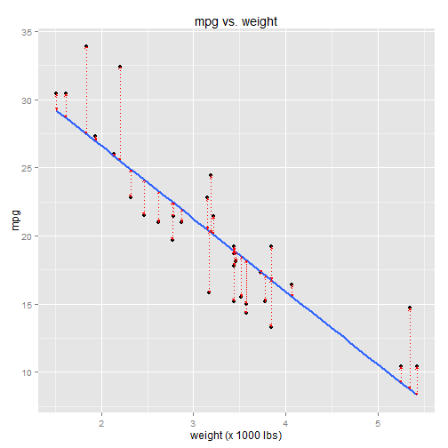
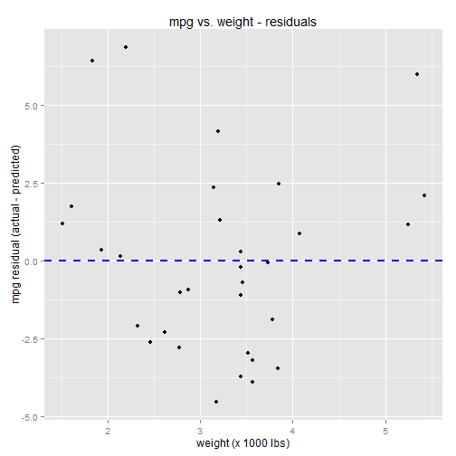
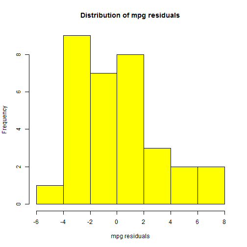

## Intro to Regression: Part 4: Distribution of prediction errors (aka the residuals) and goodness of fit (R^2)

A simple linear regression model has the following form:

$$
Y = \beta_0 + \beta_1 X + \epsilon
$$

<ul>
<li>Y is the response variable</li>
<li>X is the predictor variable</li>
<li>\(\beta_0\) is the Y-intercept of the regression line</li>
<li>\(\beta_1\) is the slope of the regression line</li>
<li>\(\epsilon\) is the error term, aka the "residuals"</li>
</ul>

The regression line, technical speaking, is everything *but* the error term:

$$
Y = \beta_0 + \beta_1 X 
$$

The regression line equation, \(\beta_0 + \beta_1 X\), tends not to perfectly predict the value
of Y.  This "prediction error" is accounted for by the error term in the model, \(\epsilon\).
That's why the error term is there.  It has no effect on the shape of the
regression line (its position or slope).  It just represents the difference
between the predicted values of Y and the actual values of Y.

$$
\begin{align*}
Y &= \beta_0 + \beta_1 X + \epsilon
\\\\
\hat{Y} &= \beta_0 + \beta_1 X 
\\\\
Y &= \hat{Y} + \epsilon
\\\\
Y - \hat{Y} &= \epsilon
\end{align*}
$$

The error term consists of the ***residuals***: the discrepencies between the predicted
values, \(\hat{Y}\), and the actual values, \(Y\).   The predicted values of Y are the points 
that lie directly along the regression line.  The residuals are the differences between
the line (the predicted values) and the actual data points.  

The residuals are highlighted in the chart below by the red lines (using the mtcars example from part 2):

---

```r
    library(ggplot2)
    library(grid)
    data(mtcars)
    
    model <- lm(mpg ~ wt, data=mtcars)
    mpg.predicted <- predict(model) 
    
    qplot(x=wt, y=mpg, data=mtcars) + 
        ggtitle("mpg vs. weight") + 
        xlab("weight (x 1000 lbs)") + 
        stat_smooth(method="lm", se=FALSE, size=1) +
        geom_line(aes(x=c(mtcars$wt, mtcars$wt),
                      y=c(mtcars$mpg,mpg.predicted), 
                      group=rep(seq_along(mtcars$wt),2)),
                  color="red", 
                  linetype="dotted", 
                  arrow=arrow(ends="both",
                              type="closed",
                              length=unit(3,"points")))
```

 

The table below tabulates the actual values of Y (mpg), the predicted values of Y, and the residuals:

---

```r
    mpg.actual <- mtcars$mpg
    mpg.predicted <- predict(model)
    mpg.residual <- resid(model)
    
    data.frame(mpg.actual, mpg.predicted, mpg.residual)
```

```
##                     mpg.actual mpg.predicted mpg.residual
## Mazda RX4                 21.0     23.282611   -2.2826106
## Mazda RX4 Wag             21.0     21.919770   -0.9197704
## Datsun 710                22.8     24.885952   -2.0859521
## Hornet 4 Drive            21.4     20.102650    1.2973499
## Hornet Sportabout         18.7     18.900144   -0.2001440
## Valiant                   18.1     18.793255   -0.6932545
## Duster 360                14.3     18.205363   -3.9053627
## Merc 240D                 24.4     20.236262    4.1637381
## Merc 230                  22.8     20.450041    2.3499593
## Merc 280                  19.2     18.900144    0.2998560
## Merc 280C                 17.8     18.900144   -1.1001440
## Merc 450SE                16.4     15.533127    0.8668731
## Merc 450SL                17.3     17.350247   -0.0502472
## Merc 450SLC               15.2     17.083024   -1.8830236
## Cadillac Fleetwood        10.4      9.226650    1.1733496
## Lincoln Continental       10.4      8.296712    2.1032876
## Chrysler Imperial         14.7      8.718926    5.9810744
## Fiat 128                  32.4     25.527289    6.8727113
## Honda Civic               30.4     28.653805    1.7461954
## Toyota Corolla            33.9     27.478021    6.4219792
## Toyota Corona             21.5     24.111004   -2.6110037
## Dodge Challenger          15.5     18.472586   -2.9725862
## AMC Javelin               15.2     18.926866   -3.7268663
## Camaro Z28                13.3     16.762355   -3.4623553
## Pontiac Firebird          19.2     16.735633    2.4643670
## Fiat X1-9                 27.3     26.943574    0.3564263
## Porsche 914-2             26.0     25.847957    0.1520430
## Lotus Europa              30.4     29.198941    1.2010593
## Ford Pantera L            15.8     20.343151   -4.5431513
## Ferrari Dino              19.7     22.480940   -2.7809399
## Maserati Bora             15.0     18.205363   -3.2053627
## Volvo 142E                21.4     22.427495   -1.0274952
```

```r
    ##                     mpg.actual mpg.predicted mpg.residual
    ## Mazda RX4                 21.0     23.282611   -2.2826106
    ## Mazda RX4 Wag             21.0     21.919770   -0.9197704
    ## Datsun 710                22.8     24.885952   -2.0859521
    ## Hornet 4 Drive            21.4     20.102650    1.2973499
    ## Hornet Sportabout         18.7     18.900144   -0.2001440
    ## Valiant                   18.1     18.793255   -0.6932545
    ## ...
```

<br />
### Plotting the residuals

It's usually a good idea to do a cursory examination of the residuals.  We expect the residuals
to be somewhat normally distributed around 0.  Why?  Because that means the prediction errors
are somewhat balanced around the regression line.  If the prediction errors are NOT balanced
around the regression line, then the relationship between predictor and response variables
may not be, in fact, linear, and further investigation into the relationship is warranted.

***Linear model assumption:*** One of the assumptions about linear models is that the residuals are 
normally distributed around 0.  If that assumption does not hold, then the accuracy of the linear 
model can't be relied on.

Let's examine the residuals by plotting them.

---

```r
    qplot(x=mtcars$wt, y=mpg.residual) + 
        ggtitle("mpg vs. weight - residuals") + 
        xlab("weight (x 1000 lbs)") + 
        ylab("mpg residual (actual - predicted)") +
        geom_hline(y=0, colour="blue", linetype="dashed", size=1)
```

 

The residuals appear to be somewhat balanced around 0.  We can get a better feel 
for the distribution of residuals by using a histogram.

---

```r
    hist(mpg.residual, 
         col="yellow", 
         main="Distribution of mpg residuals", 
         xlab="mpg residuals")
```

 

It's not a perfectly normal distribution by any means, but it's close enough.  What we're 
really looking for are non-normal patterns in the residual distribution.  Such patterns
require an explanation before we can trust that the linear model is sound.  Often these
patterns suggest either that the correlation is not linear, or that a confounding variable is not accounted for.

<br />
### Goodness of fit - R<sup>2</sup>

The accuracy of the linear model, aka its "goodness of fit", can be gauged by looking at the
variance of the residuals.  A small residual variance means the
discrepencies between predicted and actual values of the response variable are small, which suggests a good fit.
A large residual variance reflects larger discrepencies, which suggests a not-so-good fit.

One measure of goodness of fit is known as **R<sup>2</sup>**. R<sup>2</sup> is a ratio that relates the 
*total variance* of the response variable to the *residual variance*. 

***Total variance*** of the response variable is simply the variance of the response variable alone.  It could be thought
of as the variance of the response variable *without* the regression model.

***Residual variance*** is the variance of the response variable *with* the model.  

In other words, residual variance is the variance of the response variable *with respect to the regression model*, just as 
total variance is the variance of the response variable *with respect to its mean*.

R<sup>2</sup> tells us how much of the total variance of the response variable is "explained by the model".  It is calculated
by the equation below:

$$
R^2 = 1 - \frac{ SS_{res} }{ SS_{tot} }
$$

<ul>
<li>\(SS_{res}\) is the sum-of-squares of the residuals
<li>\(SS_{tot}\) is the sum-of-squares of the response variable alone (wrt its mean)
</ul>

When \(SS_{res}\) is small, \(\frac{ SS_{res} }{ SS_{tot} }\) will also be small, and \( 1 - \frac{ SS_{res} }{ SS_{tot} } \)
will be large ("large" relative the range 0 to 1, that is).  Larger R<sup>2</sup> (closer to 1) indicates a good fit.

Going back to the mtcars example:

---

```r
    ss.res <- sum(mpg.residual^2) 
    ss.tot <- with(mtcars, sum( (mpg - mean(mpg))^2 ) )
    
    R2 <- 1 - ss.res / ss.tot
    ## 0.7528328
```

This means that approximately 75% of the total variance of mpg is "explained by the model", which is to say that 75% of
the variance is correlated with ("explained by") the variance of the predictor variable.

In a simple linear model (where "simple" means "only one predictor variable"), R<sup>2</sup> is equal to the square of the correlation
coefficient.  The correlation coefficient is often denoted with a little r, so its square is r<sup>2</sup>.  This is where "R<sup>2</sup>" gets
its name from.

---

```r
    r2 <- cor(mtcars$mpg, mtcars$wt)^2
    ## 0.7528328
```

R conveniently provides goodness-of-fit information in the summary of the linear model:


```r
    summary(model)
```

```
## 
## Call:
## lm(formula = mpg ~ wt, data = mtcars)
## 
## Residuals:
##     Min      1Q  Median      3Q     Max 
## -4.5432 -2.3647 -0.1252  1.4096  6.8727 
## 
## Coefficients:
##             Estimate Std. Error t value Pr(>|t|)    
## (Intercept)  37.2851     1.8776  19.858  < 2e-16 ***
## wt           -5.3445     0.5591  -9.559 1.29e-10 ***
## ---
## Signif. codes:  0 '***' 0.001 '**' 0.01 '*' 0.05 '.' 0.1 ' ' 1
## 
## Residual standard error: 3.046 on 30 degrees of freedom
## Multiple R-squared:  0.7528,	Adjusted R-squared:  0.7446 
## F-statistic: 91.38 on 1 and 30 DF,  p-value: 1.294e-10
```

```r
    ## 
    ## Call:
    ## lm(formula = mpg ~ wt, data = mtcars)
    ## 
    ## Residuals:
    ##     Min      1Q  Median      3Q     Max 
    ## -4.5432 -2.3647 -0.1252  1.4096  6.8727 
    ## 
    ## Coefficients:
    ##             Estimate Std. Error t value Pr(>|t|)    
    ## (Intercept)  37.2851     1.8776  19.858  < 2e-16 ***
    ## wt           -5.3445     0.5591  -9.559 1.29e-10 ***
    ## ---
    ## Signif. codes:  0 '***' 0.001 '**' 0.01 '*' 0.05 '.' 0.1 ' ' 1
    ## 
    ## Residual standard error: 3.046 on 30 degrees of freedom
    ## Multiple R-squared:  0.7528, Adjusted R-squared:  0.7446 
    ## F-statistic: 91.38 on 1 and 30 DF,  p-value: 1.294e-10
```

Note that the R<sup>2</sup> from the summary ("Multiple R-squared") is equal to the R<sup>2</sup> we calculated manually above.

