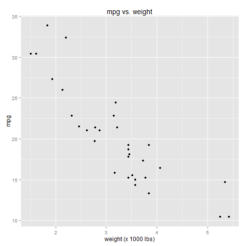
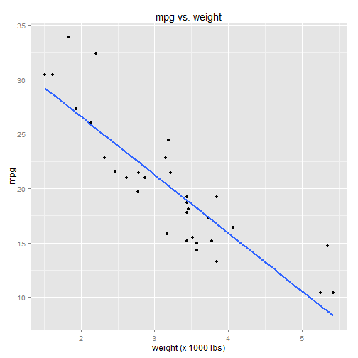
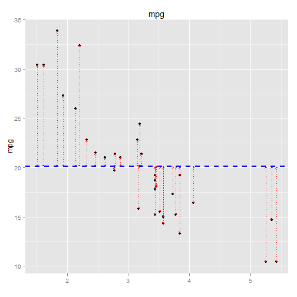
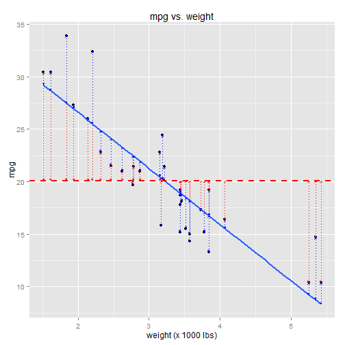
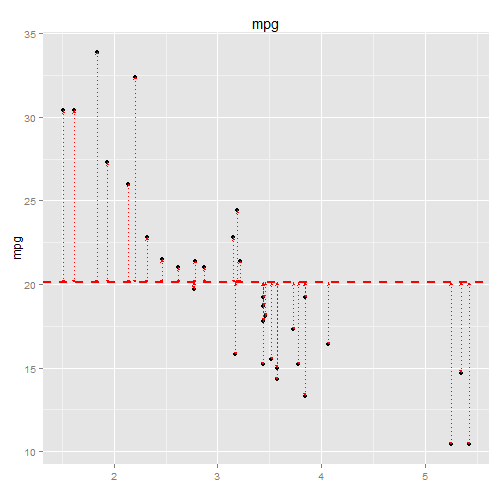
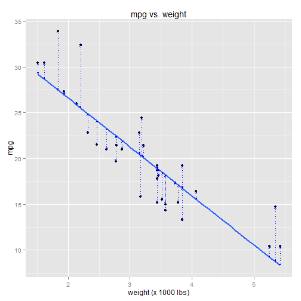

 In the middle of \( \sqrt{3} \) inline text.  in its own paragraph: $$ \sqrt{3} $$

## Intro to Regression: Part 2: Simple linear regression, an example

Before we get into an abstract analysis of linear regression models, let's build some
intuition by looking at a concrete example.  All examples in this series will
be done using **R**.

Let's look at the **mtcars** dataset.  The mtcars dataset contains performance
characteristics for 32 different car models.  Variables in the dataset include
the cars' make and model, miles-per-gallon (mpg), weight (wt), horsepower (hp),
number of cylinders (cyl), transmission type (manual vs. automatic), and a
few others.  


```r
    library(ggplot2)
    library(grid)
    data(mtcars)
    mtcars
```

```
##                      mpg cyl  disp  hp drat    wt  qsec vs am gear carb
## Mazda RX4           21.0   6 160.0 110 3.90 2.620 16.46  0  1    4    4
## Mazda RX4 Wag       21.0   6 160.0 110 3.90 2.875 17.02  0  1    4    4
## Datsun 710          22.8   4 108.0  93 3.85 2.320 18.61  1  1    4    1
## Hornet 4 Drive      21.4   6 258.0 110 3.08 3.215 19.44  1  0    3    1
## Hornet Sportabout   18.7   8 360.0 175 3.15 3.440 17.02  0  0    3    2
## Valiant             18.1   6 225.0 105 2.76 3.460 20.22  1  0    3    1
## Duster 360          14.3   8 360.0 245 3.21 3.570 15.84  0  0    3    4
## Merc 240D           24.4   4 146.7  62 3.69 3.190 20.00  1  0    4    2
## Merc 230            22.8   4 140.8  95 3.92 3.150 22.90  1  0    4    2
## Merc 280            19.2   6 167.6 123 3.92 3.440 18.30  1  0    4    4
## Merc 280C           17.8   6 167.6 123 3.92 3.440 18.90  1  0    4    4
## Merc 450SE          16.4   8 275.8 180 3.07 4.070 17.40  0  0    3    3
## Merc 450SL          17.3   8 275.8 180 3.07 3.730 17.60  0  0    3    3
## Merc 450SLC         15.2   8 275.8 180 3.07 3.780 18.00  0  0    3    3
## Cadillac Fleetwood  10.4   8 472.0 205 2.93 5.250 17.98  0  0    3    4
## Lincoln Continental 10.4   8 460.0 215 3.00 5.424 17.82  0  0    3    4
## Chrysler Imperial   14.7   8 440.0 230 3.23 5.345 17.42  0  0    3    4
## Fiat 128            32.4   4  78.7  66 4.08 2.200 19.47  1  1    4    1
## Honda Civic         30.4   4  75.7  52 4.93 1.615 18.52  1  1    4    2
## Toyota Corolla      33.9   4  71.1  65 4.22 1.835 19.90  1  1    4    1
## Toyota Corona       21.5   4 120.1  97 3.70 2.465 20.01  1  0    3    1
## Dodge Challenger    15.5   8 318.0 150 2.76 3.520 16.87  0  0    3    2
## AMC Javelin         15.2   8 304.0 150 3.15 3.435 17.30  0  0    3    2
## Camaro Z28          13.3   8 350.0 245 3.73 3.840 15.41  0  0    3    4
## Pontiac Firebird    19.2   8 400.0 175 3.08 3.845 17.05  0  0    3    2
## Fiat X1-9           27.3   4  79.0  66 4.08 1.935 18.90  1  1    4    1
## Porsche 914-2       26.0   4 120.3  91 4.43 2.140 16.70  0  1    5    2
## Lotus Europa        30.4   4  95.1 113 3.77 1.513 16.90  1  1    5    2
## Ford Pantera L      15.8   8 351.0 264 4.22 3.170 14.50  0  1    5    4
## Ferrari Dino        19.7   6 145.0 175 3.62 2.770 15.50  0  1    5    6
## Maserati Bora       15.0   8 301.0 335 3.54 3.570 14.60  0  1    5    8
## Volvo 142E          21.4   4 121.0 109 4.11 2.780 18.60  1  1    4    2
```

```r
    ##                      mpg cyl  disp  hp drat    wt  qsec vs am gear carb
    ## Mazda RX4           21.0   6 160.0 110 3.90 2.620 16.46  0  1    4    4
    ## Mazda RX4 Wag       21.0   6 160.0 110 3.90 2.875 17.02  0  1    4    4
    ## Datsun 710          22.8   4 108.0  93 3.85 2.320 18.61  1  1    4    1
    ## Hornet 4 Drive      21.4   6 258.0 110 3.08 3.215 19.44  1  0    3    1
    ## Hornet Sportabout   18.7   8 360.0 175 3.15 3.440 17.02  0  0    3    2
    ## Valiant             18.1   6 225.0 105 2.76 3.460 20.22  1  0    3    1
```

### Building a regression model that predicts mpg

For this example, we'd like to use the data to build a regression model that
can predict mpg using one (or more) of the other variables.

The response variable is mpg.  Let's keep things simple and select just a
single predictor variable: weight (wt).  To visualize the relationship between
the two variables, we'll plot them against each other in a scatterplot:


```r
    qplot(x=wt, y=mpg, data=mtcars) + 
        ggtitle("mpg vs. weight") + 
        xlab("weight (x 1000 lbs)")
```

 

There's a clear negative correlation between mpg and weight.  As the weight
variable increases (along the x-axis), the mpg variable decreases (along the y-axis).
This follows intuitively, since we should expect heavier cars to have lower mpg.

Linear regression is all about fitting a line to the data, like so:


```r
    qplot(x=wt, y=mpg, data=mtcars) + 
        ggtitle("mpg vs. weight") + 
        xlab("weight (x 1000 lbs)") + 
        stat_smooth(method="lm", se=FALSE, size=1)
```

 

Notice that some data points fall precisely on the line while others do not.
The line is selected in a way that minimizes the total distance between the
line and all data points.

### A closer look at the linear regression model

As we all know from basic geometry, a line has the formula: Y = b + mX.  

* Y is the dependent variable 
* X is the independent variable
* b is the Y-intercept (the value of Y when X=0)
* m is the slope (change-in-Y per change-in-X)

The corresponding linear regression model takes on the form: \( Y = \beta_0 + \beta_1 X + \epsilon \) 

<ul>
<li>Y is the response variable (mpg)
<li>X is the predictor variable (wt)
<li>\(\beta_0\) is the Y-intercept (the value of mpg when wt=0)
<li>\(\beta_1\) is the slope (change-in-mpg per change-in-wt)
<li>\(\epsilon\) is the error term (aka the "residuals")
</ul>

The error term accounts for the difference between the *predicted* value of Y (mpg), as predicted by the linear model,
and the *actual* value of Y.  These "prediction errors" (aka "residuals") are illustrated using the red lines in the
chart below:


```r
    model <- lm(mpg ~ wt, data=mtcars)
    mpg.predicted <- predict(model)
    
    qplot(x=wt, y=mpg, data=mtcars) + 
        ggtitle("mpg vs. weight") + 
        xlab("weight (x 1000 lbs)") + 
        stat_smooth(method="lm", se=FALSE, size=1) +
        geom_line(aes(x=c(mtcars$wt, mtcars$wt),
                      y=c(mtcars$mpg,mpg.predicted), 
                      group=rep(seq_along(mtcars$wt),2)),
                  color="red", 
                  linetype="dotted", 
                  arrow=arrow(ends="both",type="closed",length=unit(3,"points")))
```

 

The coefficients of the linear model ( \(\beta_0\) and \(\beta_1\) ) are selected in order to minimize the total prediction error
across all data points in the dataset.  This is done via a method called [Linear Least Squares](https://en.wikipedia.org/wiki/Ordinary_least_squares) 
(aka Ordinary Least Squares).  Linear Least Squares minimizes the squared differences between the
predicted values of Y (mpg) and the actual values.


### Analogy to mean and variance

In a sense, this is analagous to mean and variance. You'd rarely think of it this way, but one 
could say that a variable's mean is selected in a way that minimizes the total distance between 
the mean and all data points.  This is done by minimizing the squared differences between the 
mean and the actual values -- in other words, by minimizing the variance.

For example, let's ignore the x-axis for a moment and just consider the Y (mpg) values.  If we
were to fit a linear model using no predictor variables, our regression equation would be simply:  

$$ Y = \beta_0 + \epsilon $$

\(\beta_0\) would be selected in a way that minimizes the total prediction error, by miminmizing the squared 
differences between the predicted values and the actual values. \(\beta_0\) would therefore be set to the
mean of Y. The regression line would be horizontal, and the "prediction errors" are essentially the variance of Y:


```r
    B0 <- mean(mtcars$mpg)
    
    qplot(x=wt, y=mpg, data=mtcars) + 
        ggtitle("mpg") + 
        xlab("") + 
        geom_hline(y=B0, colour="blue", linetype="dashed", size=1) + 
        geom_line(aes(x=c(mtcars$wt, mtcars$wt),
                      y=c(mtcars$mpg, rep(B0,length(mtcars$mpg))), 
                      group=rep(seq_along(mtcars$wt),2)),
                  color="red", 
                  linetype="dotted", 
                  arrow=arrow(ends="both",type="closed",length=unit(3,"points")))
```

 


### "The variance explained by the model..."

Combining the two charts:


```r
    qplot(x=wt, y=mpg, data=mtcars) + 
        ggtitle("mpg vs. weight") + 
        xlab("weight (x 1000 lbs)") + 
        stat_smooth(method="lm", se=FALSE, size=1) +
        geom_hline(y=B0, colour="red", linetype="dashed", size=1) + 
        geom_line(aes(x=c(mtcars$wt, mtcars$wt),
                      y=c(mtcars$mpg, rep(B0,length(mtcars$mpg))), 
                      group=rep(seq_along(mtcars$wt),2)),
                  color="red", 
                  linetype="dotted", 
                  arrow=arrow(ends="both",type="closed",length=unit(3,"points"))) +
        geom_line(aes(x=c(mtcars$wt, mtcars$wt),
                      y=c(mtcars$mpg,mpg.predicted), 
                      group=rep(seq_along(mtcars$wt),2)),
                  color="blue", 
                  linetype="dotted", 
                  arrow=arrow(ends="both",type="closed",length=unit(3,"points")))
```

 


I changed some of the colors, so just to be clear:

* The red line is the mean mpg (technically speaking, a linear regression model with no predictor variables)
* The red dotted lines are the "errors" between the mean and the actual data
* The blue line is the linear model with weight as a predictor variable
* The blue dotted lines are the errors associated with the linear model

Note that some of the blue dotted lines overlap the red dotted lines.  

One way to think about this chart, conceptually: 

* The red dotted lines represent the variance of the mpg variable alone  
* The blue dotted lines represent the variance of mpg after applying the linear regression model

Note that the total variance represented by the blue dotted lines is less than the
total variance represented by the red dotted lines.   This is a little easier to
see when the two models are charted side by side:


```r
    qplot(x=wt, y=mpg, data=mtcars) + 
        ggtitle("mpg") + 
        xlab("") + 
        geom_hline(y=B0, colour="red", linetype="dashed", size=1) + 
        geom_line(aes(x=c(mtcars$wt, mtcars$wt),
                      y=c(mtcars$mpg, rep(B0,length(mtcars$mpg))), 
                      group=rep(seq_along(mtcars$wt),2)),
                  color="red", 
                  linetype="dotted", 
                  arrow=arrow(ends="both",type="closed",length=unit(3,"points"))) 
```

 

```r
    qplot(x=wt, y=mpg, data=mtcars) + 
        ggtitle("mpg vs. weight") + 
        xlab("weight (x 1000 lbs)") + 
        stat_smooth(method="lm", se=FALSE, size=1) +
        geom_line(aes(x=c(mtcars$wt, mtcars$wt),
                      y=c(mtcars$mpg,mpg.predicted), 
                      group=rep(seq_along(mtcars$wt),2)),
                  color="blue", 
                  linetype="dotted", 
                  arrow=arrow(ends="both",type="closed",length=unit(3,"points")))
```

 

Regression models, in a sense, try to "explain the variance" observed in 
the response variable, by correlating its variance with the variance of other
variables.  You will often hear phrases like, "the variance explained by the model ..."
These charts basically illustrate what that means.  

The linear regression model will never be perfectly accurate with its predictions; there will always 
be some error.  But the idea is that the model does a better job predicting the response variable
than, say, the mean of the response variable alone.  This "better job" is evidenced by the smaller variance in
the model.  

We'll eventually get into the finer details of all this, but right now we're just trying to build some 
intuition, so you have a better feel for what this regression stuff is and what it means.

