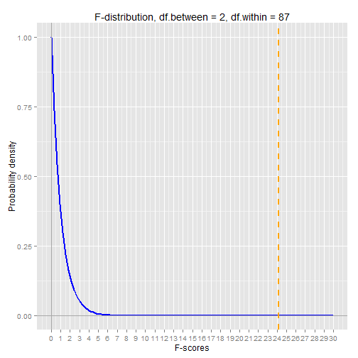

```r
set.seed(1)
n1 <- 30
n2 <- 30
n3 <- 30
s1 <- rnorm( n1, mean=67, sd=3 )
s2 <- rnorm( n2, mean=68.5, sd=2.5)
s3 <- rnorm( n3, mean=72, sd=4 )


# first compute sum of squares within samples.
s1.ss <- sum( (s1 - mean(s1))^2 )
s2.ss <- sum( (s2 - mean(s2))^2 )
s3.ss <- sum( (s3 - mean(s3))^2 )

ss.within = s1.ss + s2.ss + s3.ss

# compute sum of squares between samples
s.overall <- c(s1, s2, s3)
s1.between <- ( mean(s1) - mean(s.overall) )^2 * n1
s2.between <- ( mean(s2) - mean(s.overall) )^2 * n2
s3.between <- ( mean(s3) - mean(s.overall) )^2 * n3

ss.between <- s1.between + s2.between + s3.between

# compare overall sum of squares to ss.within and ss.between
s.overall.ss <- sum( (s.overall - mean(s.overall))^2 )
s.overall.ss
```

```
## [1] 1190.591
```

```r
ss.within + ss.between
```

```
## [1] 1190.591
```

```r
# compute f-score and p-value
df.within <- n1 + n2 + n3 - 3
df.between <- 3 - 1

f <- ( ss.between / df.between ) / (ss.within / df.within)

p.value <- 1 - pf(f, df.between, df.within)

s.factor <- factor( c( rep(1,n1), rep(2,n2), rep(3,n3) ) )
summary( aov(s.overall ~ s.factor))
```

```
##             Df Sum Sq Mean Sq F value   Pr(>F)    
## s.factor     2  425.1   212.6   24.16 4.52e-09 ***
## Residuals   87  765.5     8.8                     
## ---
## Signif. codes:  0 '***' 0.001 '**' 0.01 '*' 0.05 '.' 0.1 ' ' 1
```

To finish off the example, let's chart the probability density of the F-distribution curve that corresponds to the degrees of freedom in our example.


```r
library(ggplot2)

x <- seq(0, 30, 0.1)

ggplot() + 
    stat_function(aes(x=x), 
                  fun=df, 
                  args=list(df1=df.between, df2=df.within),
                  size=1, 
                  colour="blue") +
    ggtitle("F-distribution, df.between = 2, df.within = 87") + 
    geom_hline(y=0, colour="darkgray") +
    geom_vline(x=0, colour="darkgray") +
    geom_vline(x=f, linetype="dashed", colour="orange", size=1) +
    ylab("Probability density") + 
    xlab("F-scores")  +
    scale_x_continuous(breaks=0:30, labels=0:30)
```

 


## latex

\begin{align*}
variance\ between\ samples &= \frac{SS_{between}}{DF_{between}}
\\ \\
where,
\\[8pt]
SS_{between} & = Sum\ of\ Squares\ between\ samples
\\[8pt]
DF_{between} & = Degrees\ of\ Freedom\ between\ samples
\end{align*}

\begin{align*}
variance\ within\ samples &= \frac{SS_{within}}{DF_{within}}
\\ \\
where,
\\[8pt]
SS_{within} & = Sum\ of\ Squares\ within\ samples
\\[8pt]
DF_{within} & = Degrees\ of\ Freedom\ within\ samples
\end{align*}


\begin{align*}
SS_{within} & =  \sum_i SS_i 
\\[8pt]
            & = SS_1 + SS_2 + \cdots + SS_i
\\ \\
where,
\\[8pt]
SS_i & = Sum\ of\ Squares\ for\ the\ i^{th}\ sample
\end{align*}


\begin{align*}
SS_{between} & =  \sum_i ( \overline{X_i} - \overline{X_o} )^2 \cdot N_i 
\\ \\
where,
\\[8pt]
\overline{X_i} & = the\ i^{th}\ sample\ mean
\\[8pt]
\overline{X_o} & = the\ overall\ mean
\\[8pt]
N_i & = the\ i^{th}\ sample\ size
\end{align*}


\begin{align*}
DF_{within} = DF_1 + DF_2 + \cdots + DF_i
\\ \\
DF_{between} = Number\ of\ samples - 1
\end{align*}


\begin{align*}
F & =  \frac{ \frac{ SS_{between} }{ I - 1 } }{ \frac{ SS_{within} }{ N_{overall} - I } }
\\ \\
where,
\\[8pt]
I &= the\ number\ of\ samples
\\[8pt]
N_{overall} &= the\ total\ number\ of\ observations
\end{align*}


