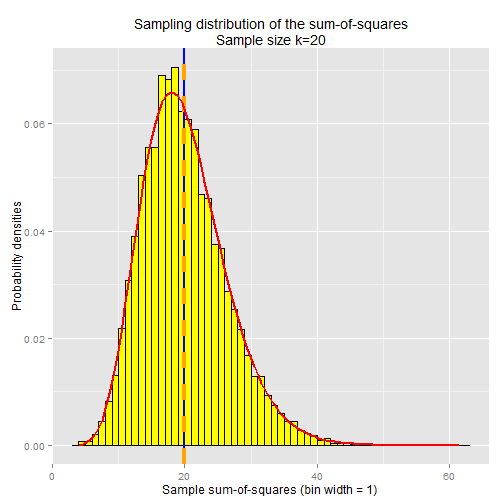
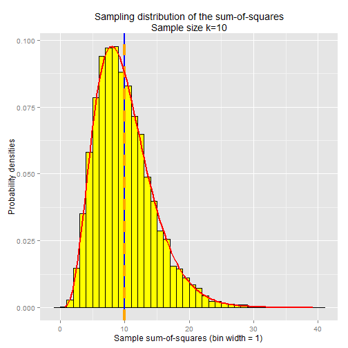
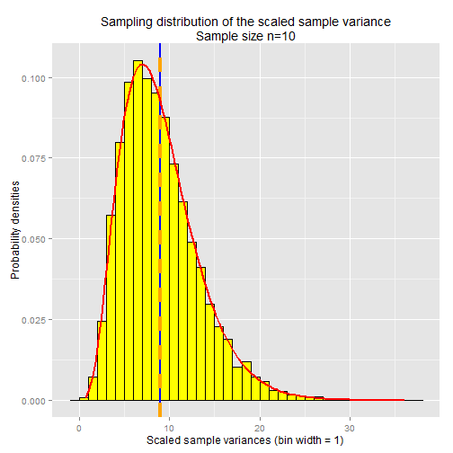

## Simulation: sampling distribution of the sum-of-squares.

Let's run a simulation in R to plot the sampling distribution of the sum-of-squares.  We'll take 10,000 samples of size k=20 from the standard normal distribution (using the rnorm function in R).  For each sample we'll compute the sum-of-squares, then plot the density histogram (probability distribution) of all 10,000 sample sum-of-squares.


```r
library(ggplot2)


set.seed(33)
k <- 20
sample.SSXs <- NULL

for (i in 1:10000) {
    samp <- rnorm(k)
    sample.ssx <- sum( samp^2 )
    sample.SSXs <- c(sample.SSXs, sample.ssx)
}

ggplot() + 
    geom_histogram(aes(y=..density..,x=sample.SSXs), 
                   binwidth=1, fill="yellow", colour="black") +
    ggtitle("Sampling distribution of the sum-of-squares\nSample size k=20") +
    ylab("Probability densities") + 
    xlab("Sample sum-of-squares (bin width = 1) ") +
    geom_vline(x=k,size=1,colour="blue") +
    geom_vline(x=mean(sample.SSXs),
               linetype="dashed",size=1.5,colour="orange") +
    stat_function(aes(x=sample.SSXs), fun=dchisq, args=list( df=k ), size=0.75, colour="red" )
```

 

There's quite a bit going on in this chart so let's break it down.  The yellow bars are the density histogram for the sampling distribution of the sum-of-squares.  The vertical blue line is the expected value of the chi-squared distribution with degrees of freedom equal to k=20, which is 20.  k in this case is the sample size; or in other words, k is the number of independent standard-normal random variables that make up this chi-squared distribution.  The vertical orange line is the actual calculated mean of the sum-of-squares across all samples (the mean of the sampling distrubtion of the sum-of-squares).  Note that the orange line and the blue line are right on top of each other, indicating that the simulated sampling distribution is consistent with what is theoretically expected from a chi-squared distribution.

The red line is the chi-squared distribution curve with degrees of freedom = 20.  It fits the simulated sampling distribution very well.

Let's re-run the simulation, this time with a sample size/degrees of freedom equal to k=10


```r
set.seed(33)
k <- 10
sample.SSXs <- NULL

for (i in 1:10000) {
    samp <- rnorm(k)
    sample.ssx <- sum( samp^2 )
    sample.SSXs <- c(sample.SSXs, sample.ssx)
}

ggplot() + 
    geom_histogram(aes(y=..density..,x=sample.SSXs), 
                   binwidth=1, fill="yellow", colour="black") +
    ggtitle("Sampling distribution of the sum-of-squares\nSample size k=10") +
    ylab("Probability densities") + 
    xlab("Sample sum-of-squares (bin width = 1) ") +
    geom_vline(x=k,size=1,colour="blue") +
    geom_vline(x=mean(sample.SSXs),
               linetype="dashed",size=1.5,colour="orange") +
    stat_function(aes(x=sample.SSXs), fun=dchisq, args=list( df=k ), size=0.75, colour="red" )
```

 

The distribution looks similar, only this time everything's centered around 10, the degrees of freedom for this chi-squared distribution.


## How the chi-squared distribution relates to sample variance

The population variance for the standard normal distribution is 1, so the scaling factor is simply (n - 1).  This is to say, if you multiplied all of the sample variances by a factor of (n - 1), the resulting distribution follows a chi-squared distribution with n - 1 degrees of freedom.

Let's prove this to ourselves by running another simulation, same as those above, except for this one we'll multiple the sample variance by (n - 1) and plot the resulting distribution:


```r
set.seed(33)
n <- 10
sample.vars.scaled <- NULL

for (i in 1:10000) {
    samp <- rnorm(n)
    sample.var <- sum( (samp - mean(samp)) ^2 ) / (n-1)
    sample.var.scaled <- sample.var * (n-1)
    sample.vars.scaled <- c(sample.vars.scaled, sample.var.scaled)
}

k <- n-1    # degrees of freedom

ggplot() + 
    geom_histogram(aes(y=..density..,x=sample.vars.scaled), 
                   binwidth=1, fill="yellow", colour="black") +
    ggtitle(paste("Sampling distribution of the scaled",
                  "sample variance\nSample size n=10")) +
    ylab("Probability densities") + 
    xlab("Scaled sample variances (bin width = 1) ") +
    geom_vline(x=k,size=1,colour="blue") +
    geom_vline(x=mean(sample.vars.scaled),
               linetype="dashed",size=1.5,colour="orange") +
    stat_function(aes(x=sample.vars.scaled), fun=dchisq, args=list( df=k ), size=0.75, colour="red" ) 
```

 

The red line is the chi-squared distribution curve with degrees of freedom k=n-1.  As you can see, it's
a close fit to the sampling distribution of the scaled sample variance.

Note that when we multiply the sample variance by the scaling factor, we're left with the sum-of-squared-diffs,
i.e. the numerator of the sample variance formula:

TODO: 
s^2 = \frac{1}{n-1} \sum_{i=1}^n (X_i - \overline{X})^2
\\ \\
(n-1) \cdot s^2 = \sum_{i=1}^n (X_i - \overline{X})^2

And if we assume that the expected value of the sample mean is 0 (the known population mean for the standard normal
distribution), the equation reduces to the sum-of-squares:

TODO: 
(n-1) \cdot s^2 = \sum_{i=1}^n (X_i - 0)^2
\\ \\
(n-1) \cdot s^2 = \sum_{i=1}^n X_i^2


Note that this is the same formula for the chi-squared random variable with degrees of freedom k=n:

TODO: Q & = \sum_{i=1}^n X_i^2 \sim \chi_n^2


So you might be wondering why the sampling distribution of the sample variance doesn't follow a chi-squared
distribution with degrees of freedom equal to n instead of (n - 1).  Good question.  Well, the best I know
how to explain it is, we start off by assuming we know the sample variance, because we've calculated it.
So then the question becomes, how many "moving parts" go into the calculation of sample variance.  Your first
instinct might be to say n.  But if we start off by assuming the sample variance is known and therefore fixed,
then there are actually only n - 1 moving parts, since if we know the first n - 1 terms of the sample variance
formula, then we can deduce the nth term via basic algebra.  Therefore, the degrees of freedom for the sample
variance is n - 1.

## RECAP
#
#

\begin{align*} 
Q & = \sum_{i=1}^n X_i^2 \sim \chi_n^2

\\ \\
(n-1) \frac{s^2}{\sigma^2} \sim \chi_{n-1}^2
\\ \\
\frac{(n-1)}{\sigma^2}
\\ \\
(n-1) \frac{ \frac{1}{n-1} \sum_{i=1}^n (X_i - \mu)^2}{\sigma^2} \sim \chi_{n-1}^2
\\ \\
\frac{ \sum_{i=1}^n (X_i - \mu)^2}{\sigma^2} \sim \chi_{n-1}^2
\\ \\
\sum_{i=1}^n X_i^2  \sim \chi_{n-1}^2
\\ \\
s^2 = \frac{1}{n-1} \sum_{i=1}^n (X_i - \overline{X})^2
\\ \\
(n-1) \cdot s^2 = \sum_{i=1}^n (X_i - \overline{X})^2
\\ \\
(n-1) \cdot s^2 = \sum_{i=1}^n (X_i - 0)^2
\\ \\
(n-1) \cdot s^2 = \sum_{i=1}^n X_i^2

\end{align*}

