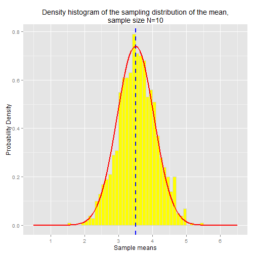
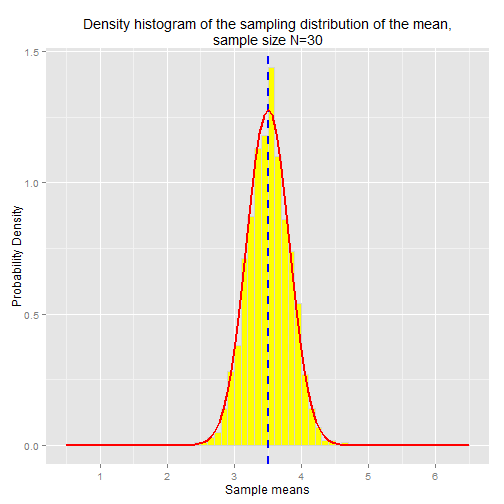

## Central Limit Theorem Example

Let's revisit the sampling distributions we plotted above.  This time we'll overlay the
density histogram of the sampling distribution with the theoretically expected normal distribution curve.
According to the CLT, the normal distribution curve has mean = E[X] and variance = Var(X) / N,
where X is the underlying random variable (the six-sided die roll) and N is the sample size
(N=10 in the first chart, N=30 in the second).  Recall that the variance of a discrete uniform distribution is given by

TODO: Var(X) = n^2 -1  / 12 = 35/12
        


```r
N <- 10     
samples <- NULL
sample.means <- NULL

# Loop 1000 times to collect 1000 samples and calculate 1000 sample means.
for (i in 1:1000) {

    sample <- ceiling( runif( N, 0, 6) )  
    sample.mean <- mean(sample)

    # Remember the sample and sample mean for later
    samples <- c(samples, sample)
    sample.means <- c(sample.means, sample.mean)
}

library(ggplot2)

ggplot(data=NULL, mapping=aes(x=sample.means)) + 
    geom_histogram(aes(y=..density.., x=sample.means), 
                   binwidth=0.1, 
                   fill="yellow", 
                   colour="lightgray") + 
    scale_x_continuous(breaks=1:6, limits=c(0.5,6.5)) +
    ggtitle("Density histogram of the sampling distribution of the mean,\nsample size N=10") +
    geom_vline(x=3.5,linetype="dashed",size=1,colour="blue") +
    xlab("Sample means") +
    ylab("Probability Density") +
    stat_function(fun = dnorm, arg=list(mean=3.5, sd=sqrt((6^2-1)/12/N)), size=1, colour="red") 
```

 


```r
N <- 30     
samples <- NULL
sample.means <- NULL

# Loop 1000 times to collect 1000 samples and calculate 1000 sample means.
for (i in 1:1000) {

    sample <- ceiling( runif( N, 0, 6) )  
    sample.mean <- mean(sample)

    # Remember the sample and sample mean for later
    samples <- c(samples, sample)
    sample.means <- c(sample.means, sample.mean)
}

library(ggplot2)

ggplot(data=NULL, mapping=aes(x=sample.means)) + 
    geom_histogram(aes(y=..density.., x=sample.means), 
                   binwidth=0.1, 
                   fill="yellow", 
                   colour="lightgray") + 
    scale_x_continuous(breaks=1:6, limits=c(0.5,6.5)) +
    ggtitle("Density histogram of the sampling distribution of the mean,\nsample size N=30") +
    geom_vline(x=3.5,linetype="dashed",size=1,colour="blue") +
    xlab("Sample means") +
    ylab("Probability Density") +
    stat_function(fun = dnorm, arg=list(mean=3.5, sd=sqrt((6^2-1)/12/N)), size=1, colour="red") 
```

 

As you can see, the normal distribution curves fit perfectly over the sampling distribution.


### Recap

