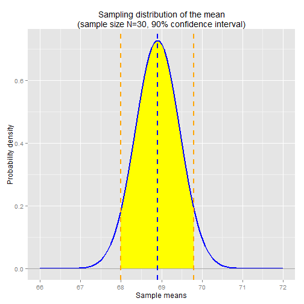
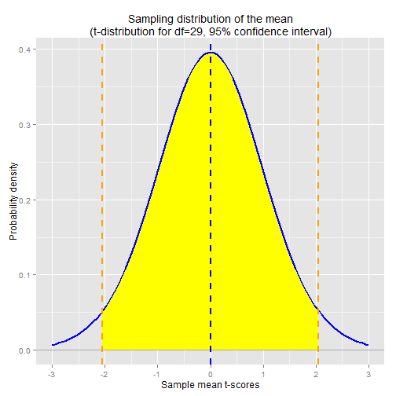

The concept of confidence intervals is best illustrated with an example.  Let's
pretend that your Norwegian sample mean is 68.9in, and the sample standard
deviation is 3in.  Given this information we can construct a sampling
distribution of the mean, using the sample mean and sample standard deviation
as estimates of the true population mean and true population standard
deviation.


```r
library(ggplot2)

N <- 30
sample.mean <- 68.9
sample.sd <- 3

sampling.se <- sample.sd / sqrt(N)  # standard error of the mean

x <- seq(66,72,0.01)
ggplot() + 
    stat_function(aes(x=x), 
                  fun=dnorm, 
                  arg=list(mean=sample.mean, sd=sampling.se),
                  size=1, 
                  colour="blue") +
    ggtitle("Sampling distribution of the mean\n(sample size N=30)") + 
    geom_hline(y=0, colour="darkgray") +
    geom_vline(x=sample.mean, linetype="dashed", colour="blue", size=1) +
    ylab("Probability density") + 
    xlab("Sample means")  +
    scale_x_continuous(breaks=66:72, labels=66:72)
```

 

Confidence intervals are expressed with a certain degree of confidence, for
example a 90% confidence interval, 95% confidence interval, 99% confidence interval, etc.
The degree of confidence corresponds to the probability of finding the sample mean
within a certain range.  We can determine the range using the sampling distribution.
Remember that the sampling distribution gives us the probability of observing various
sample means for a given sample size, in this case for sample size N=30.

For a 95% confidence interval, we're looking for the range of sample means that constitute
95% of the sampling distribution, centered around our estimate of the true population mean,
which we've estimated using the sample mean.  We know that our sample mean sits at the
center of the sampling distribution, so we know that 50% of sample means lie below the estimate
and 50% lie above the estimate.  If we want the 95% confidence interval, then we're looking
for the range between 47.5% below and 47.5% above the sample mean. In terms of quantiles, 
this is the 2.5% quantile and 97.5% quantile, respectively.  We can determine these values
using the qnorm function.


```r
conf.int.95.lower.bound <- qnorm(0.025, mean=sample.mean, sd=sampling.se)
conf.int.95.lower.bound
```

```
## [1] 67.82648
```

```r
conf.int.95.upper.bound <- qnorm(0.975, mean=sample.mean, sd=sampling.se)
conf.int.95.upper.bound
```

```
## [1] 69.97352
```

This gives us our 95% confidence interval: 67.83in thru 69.97in.  Note that our sample mean lies
directly in the center of that interval.

What about a 90% confidence interval?  In that case, we're looking for the range between 45% below
and 45% above the sample mean, which correspond to quantiles 5% and 95%:


```r
conf.int.90.lower.bound <- qnorm(0.05, mean=sample.mean, sd=sampling.se)
conf.int.90.lower.bound
```

```
## [1] 67.99908
```

```r
conf.int.90.upper.bound <- qnorm(0.95, mean=sample.mean, sd=sampling.se)
conf.int.90.upper.bound
```

```
## [1] 69.80092
```

This gives us a 90% confidence interval of 68.00in thru 69.80in.  Again, the sample mean lies directly
in the center of the interval. Note that the 90% confidence interval is smaller than the 95% interval.  
This is because we're less confident in this range (90% confidence vs 95% confidence), because the range is smaller.

The charts below show the 90% and 95% confidence intervals:


```r
shade_x.90 <- seq(conf.int.90.lower.bound,conf.int.90.upper.bound,0.01)
shade_y.90 <- dnorm(shade_x.90, mean=sample.mean, sd=sampling.se)
shade.90 <- data.frame( rbind(c(conf.int.90.lower.bound,0), cbind(shade_x.90,shade_y.90), c(conf.int.90.upper.bound,0)) )


ggplot() + 
    geom_polygon(data = shade.90, aes(shade_x.90, shade_y.90), fill="yellow") +
    stat_function(aes(x=x), 
                  fun=dnorm, 
                  arg=list(mean=sample.mean, sd=sampling.se),
                  size=1, 
                  colour="blue") +
    ggtitle("Sampling distribution of the mean\n(sample size N=30, 90% confidence interval)") + 
    geom_hline(y=0, colour="darkgray") +
    geom_vline(x=sample.mean, linetype="dashed", colour="blue", size=1) +
    geom_vline(x=conf.int.90.lower.bound, linetype="dashed", colour="orange", size=1) +
    geom_vline(x=conf.int.90.upper.bound, linetype="dashed", colour="orange", size=1) +
    ylab("Probability density") + 
    xlab("Sample means")  +
    scale_x_continuous(breaks=66:72, labels=66:72)
```

 

```r
shade_x.95 <- seq(conf.int.95.lower.bound,conf.int.95.upper.bound,0.01)
shade_y.95 <- dnorm(shade_x.95, mean=sample.mean, sd=sampling.se)
shade.95 <- data.frame( rbind(c(conf.int.95.lower.bound,0), cbind(shade_x.95,shade_y.95), c(conf.int.95.upper.bound,0)) )

ggplot() + 
    geom_polygon(data = shade.95, aes(shade_x.95, shade_y.95), fill="yellow") +
    stat_function(aes(x=x), 
                  fun=dnorm, 
                  arg=list(mean=sample.mean, sd=sampling.se),
                  size=1, 
                  colour="blue") +
    ggtitle("Sampling distribution of the mean\n(sample size N=30, 95% confidence interval)") + 
    geom_hline(y=0, colour="darkgray") +
    geom_vline(x=sample.mean, linetype="dashed", colour="blue", size=1) +
    geom_vline(x=conf.int.95.lower.bound, linetype="dashed", colour="orange", size=1) +
    geom_vline(x=conf.int.95.upper.bound, linetype="dashed", colour="orange", size=1) +
    ylab("Probability density") + 
    xlab("Sample means")  +
    scale_x_continuous(breaks=66:72, labels=66:72)
```

 


One thing to note about confidence intervals.  They're often misinterpreted as the *probability* that
the true population parameter lies within the interval.  In the context of this example, that would
be like saying there's a 90% probability that the true population mean lies within the range 68.0in to 69.8in.
This is a misinterpretation.  The confidence interval merely states how confident you are in the estimated
range. The degree of confidence has more to do with the procedure you used, rather than anything having
to do with the true population parameter.  This is a subtle (and difficult to grasp) notion. 
If you don't quite get it, well, join the club, cuz neither do I.  
You can read up on wikipedia if you'd like (I read it like 5 times, still unsure).  The important
thing to remember is that confidence intervals do not express the probability that the true popuation
parameter lies within the interval.


## Computing confidence intervals using the t-distribution

If your sample size is small (N < 30 is usually the rule of thumb), then you should use a t-distribution
to estimate the sampling distribution of the mean, not a normal distribution as we did above.  
Recall that the t-distribution is a family of curves, each curve identified by the degrees of freedom.
Our sample size is N=30, so the degrees of freedom is N-1=29. 

We can use the qt function to determine the 0.025 and 0.0975 quantile t-scores, just as we did above
using the qnorm function:


```r
conf.int.95.lower.bound.tscore <- qt(0.025, df=N-1)
conf.int.95.lower.bound.tscore
```

```
## [1] -2.04523
```

```r
conf.int.95.upper.bound.tscore <- qt(0.975, df=N-1)
conf.int.95.upper.bound.tscore
```

```
## [1] 2.04523
```

The chart below plots the 95% confidence interval on the t-distribution curve for degrees of freedom = 29.


```r
x <- seq(-3,3,0.01)

shade_x.95 <- seq(conf.int.95.lower.bound.tscore,conf.int.95.upper.bound.tscore,0.01)
shade_y.95 <- dt(shade_x.95, df=N-1)
shade.95 <- data.frame( rbind(c(conf.int.95.lower.bound.tscore,0), cbind(shade_x.95,shade_y.95), c(conf.int.95.upper.bound.tscore,0)) )

ggplot() + 
    geom_polygon(data = shade.95, aes(shade_x.95, shade_y.95), fill="yellow") +
    stat_function(aes(x=x), 
                  fun=dt, 
                  arg=list(df=N-1),
                  size=1, 
                  colour="blue") +
    ggtitle("Sampling distribution of the mean\n(t-distribution for df=29, 95% confidence interval)") + 
    geom_hline(y=0, colour="darkgray") +
    geom_vline(x=0, linetype="dashed", colour="blue", size=1) +
    geom_vline(x=conf.int.95.lower.bound.tscore, linetype="dashed", colour="orange", size=1) +
    geom_vline(x=conf.int.95.upper.bound.tscore, linetype="dashed", colour="orange", size=1) +
    ylab("Probability density") + 
    xlab("Sample mean t-scores")  +
    scale_x_continuous(breaks=-3:3, labels=-3:3)
```

 

The orange lines are the lower and upper bound t-scores for the 95% confidence interval.
To convert the t-score back to the original units of inches, we need to "de-normalize" it
by multiplying by the standard deviation of the sampling distribution (a.k.a. the
standard error of the mean) and adding back in the sample mean:


```r
conf.int.95.lower.bound.tscore * sampling.se + sample.mean
```

```
## [1] 67.77978
```

```r
conf.int.95.upper.bound.tscore * sampling.se + sample.mean
```

```
## [1] 70.02022
```

This gives us a 95% confidence interval of 67.78in thru 70.02in.  This is slightly larger
than the 95% confidence interval derived above from the normal distribution: 67.83in thru 69.97in.
That makes sense, since the t-distribution has "thicker tails" than the normal distribution,
in order to account for greater variability due to the small sample size.  The difference is 
meager in this case, since our sample size is big enough such that the t-distribution curve 
closely approximates a normal distribution.


## RECAP

## latex

\mathchardef\mhyphen="2D
\begin{align*}
t\mhyphen score & = \frac{\overline{X} - \mu}{ \frac{s}{\sqrt{N}} }
\\[8pt]
t\mhyphen score \cdot \frac{s}{\sqrt{N}} & = \overline{X} - \mu
\\[8pt]
t\mhyphen score \cdot \frac{s}{\sqrt{N}} + \mu & = \overline{X} 
\end{align*}


