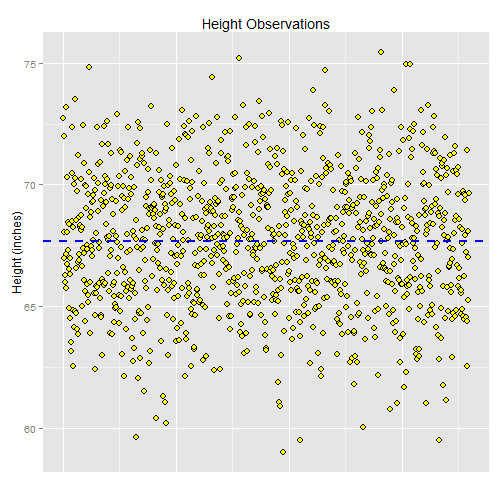
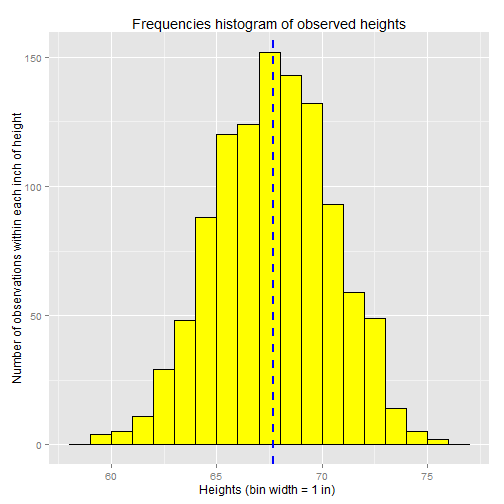
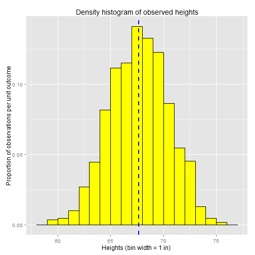
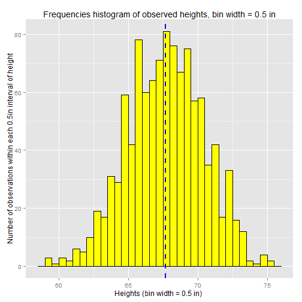
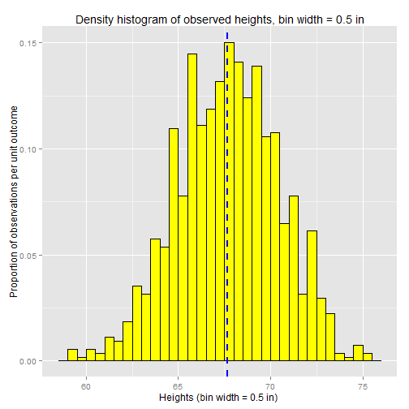

So let's walk thru an example of taking a sample and computing some summary statistics about that sample's distribution. We can take a sample of heights from the father-son heights dataset provided by the datasets library in R.  The father-son heights dataset contains 1078 measurements of fathers' heights along with their sons' heights.  Let's focus on only the fathers' heights for this example, so our sample size is 1078.

On the chart below is a scatter plot of all the observed heights in the sample.  The mean of the sample is depicted by the dashed blue line.  Note that I've included the R code for generating the plot.  


```r
library(UsingR, warn.conflicts=F, quietly=T)
library(ggplot2)
data(father.son)
heights <- sample(father.son$fheight)
ggplot() + 
    geom_point(aes(x=1:1078,y=heights),size=3,shape=21,fill="yellow") + 
    geom_hline(y=mean(heights),linetype="dashed",colour="blue", size=1) +
    ggtitle("Height Observations") + 
    ylab("Height (inches)") + 
    xlab("") + 
    theme(axis.ticks.x = element_blank(), axis.text.x = element_blank())
```

 
 
Notice that the heights are generally clustered around the mean. The mean is roughly 67.5 inches. Most observations fall between 65 - 70, with fewer falling a bit further away from the mean, between 62.5 - 65, and 70 - 72.5, and still fewer even further away, around 60in on the shorter side and 75in on the taller side.  This makes sense. We'd expect most people to be close to the average height, with a few people a bit taller or shorter, and even fewer people who are extremely tall or short. 

Another way to chart the distribution of heights in the sample (or generally speaking, the distribution of outcomes for a random variable) is to use a histogram.  In a histogram, the heights (outcomes) are listed along the x axis (not the y axis like the scatter plot above). The y axis of the histogram indicates the number of times a given height (x axis) is observed.  Since heights are a continuous variable, we simplify things by "binning" the heights into ranges (or "bins") and counting up the number of observations that fall into each range.  For this example let's use a bin width of 1 inch.

```r
ggplot() + 
    geom_histogram(aes(x=heights), binwidth=1, fill="yellow", colour="black") +
    ggtitle("Frequencies histogram of observed heights") + 
    ylab("Number of observations within each inch of height") + 
    xlab("Heights (bin width = 1 in) ") +
    geom_vline(x=mean(heights),linetype="dashed",size=1,colour="blue")
```

 

The blue vertical dashed line depicts the mean of the sample, which as expected cuts right down the middle of the data and balances the distribution.  The mean is the expected value of the random variable that represents the heights in this sample. 

### Density Histogram

We can convert this histogram from a frequencies histogram (which shows counts) to a density histogram  (which shows proportions) by simply adding the parameter y=..density.. to our geom_histogram:


```r
ggplot() + 
    geom_histogram(aes(y=..density.., x=heights), 
                   binwidth=1, fill="yellow", colour="black") +
    ggtitle("Density histogram of observed heights") + 
    ylab("Proportion of observations per unit outcome") + 
    xlab("Heights (bin width = 1 in) ") +
    geom_vline(x=mean(heights),linetype="dashed",size=1,colour="blue")
```

 

Notice that the shape of the histogram didn't change at all.  The only thing that changed is the scale of the y axis, which instead of showing the number of observations in each bin, now shows the density of each bin.  The density is the proporition of observations that fall in each bin per unit of outcome:

TODO: 
\frac{\{\frac{\#\ of\ observations\ in\ each\ bin}{total\ \#\ of\ observations}\}}{bin\ width}


The numerator gives you the proporition of observations that fall in each bin.  The denominator normalizes that proportion per unit of outcome (where in this case the "unit of outcome" is 1 in).  For example, The frequencies histogram shows about 150 observations fall in the tallest bin, from 67-68in.  The total number of observations is 1078.  So the density of this bin is computed as:

TODO: 
\begin{align*}
density & = \frac{\{\frac{150}{1078}\}}{1}
\\ \\
 & = 0.139
\end{align}


...which corresponds to the height of the bin in the density histogram.

We can compute the probability associated with each bin by multiplying the density of the bin by its bin width.  This in effect cancels out the division we did in the density calculation above, leaving us with the proporition of outcomes that fall in each bin.  

TODO: probability = density \times  bin\ width 


The probability of a bin tells you how likely it would be, if you selected a height at random from the sample, that the height would fall in that bin.  For example, the bin from 67 - 68in has a density of approximately 0.139, which when multiplied by the bin width (1in), gives the probability for that bin: 0.139.  That is to say, if you were to draw a height at random from this sample, there's a 13.9% chance it would fall between 67 and 68in.  

### Adjusting the bin width

We can see more clearly the effect of the bin width by plotting the histogram again, this time using a bin width of 0.5in:


```r
ggplot() + 
    geom_histogram(aes(x=heights), binwidth=0.5, fill="yellow", colour="black") +
    ggtitle("Frequencies histogram of observed heights, bin width = 0.5 in") + 
    ylab("Number of observations within each 0.5in interval of height") + 
    xlab("Heights (bin width = 0.5 in) ") +
    geom_vline(x=mean(heights),linetype="dashed",size=1,colour="blue")
```

 

```r
ggplot() + 
    geom_histogram(aes(y=..density.., x=heights), 
                   binwidth=0.5, fill="yellow", colour="black") +
    ggtitle("Density histogram of observed heights, bin width = 0.5 in") + 
    ylab("Proportion of observations per unit outcome") + 
    xlab("Heights (bin width = 0.5 in) ") +
    geom_vline(x=mean(heights),linetype="dashed",size=1,colour="blue")
```

 

The number of observations in the tallest bin, 67.5 - 68in, given by the frequencies histogram (first chart) is approximately 80.  This corresponds to a density of:

TODO:
\begin{align*}
density & = \frac{\{\frac{80}{1078}\}}{0.5}
\\ \\
 & = 0.148
\end{align}

... which corresponds to the height of the bin in the density histogram (second chart).  The probability for this bin is the density multiplied by the bin width:

TODO:
\begin{align*}
probability &= 0.148 \times  0.5 
\\ \\
 &=0.074
\end{align*}

Note that the probability is equal to the area (height * width) of the bar for that bin.  Keep this in mind for the next article, when we discuss probability density functions.


### Distribution Curve

You may have noticed the distribution of our sample resembles the shape of the familiar "bell curve", which you've probably seen before. The bell curve is formally known as the normal distribution.  We'll talk about the normal distribution later on in this series, but all you need to know for now is that a normal distribution curve is governed by two factors: the mean and the variance/standard deviation of the distribution.  With those two statistics we can construct a normal distribution curve (the red line) and lay it over the actual data. 


```r
ggplot() + 
    geom_histogram(aes(y=..density..,x=heights), 
                   binwidth=1, fill="yellow", colour="black") +
    ggtitle("Density histogram of observed heights") + 
    ylab("Proportion of observations per unit outcome") + 
    xlab("Heights (bin width = 1 in) ") +
    geom_vline(x=mean(heights),linetype="dashed",size=1,colour="blue") +
    stat_function(aes(x=heights), fun = dnorm, colour="red",size=1,
                  arg=list(mean=mean(heights), sd=sd(heights)) )
```

 

As you can see it's a close fit. 

