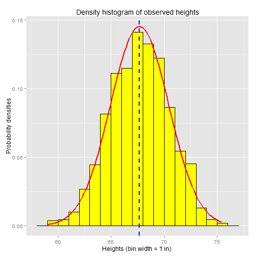
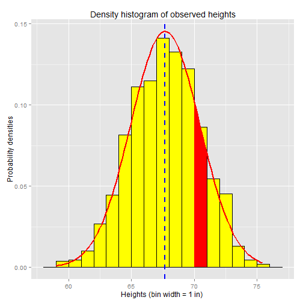

Let's talk about probability density functions.  In the previous article charted our distribution with a density histogram and showed how to interpret densities and how to convert them to probabilities.  In the process we had a quick preview of a probability density function when we overlaid the data with a normal distribution curve.  Here's the chart from the previous article to refresh your memory:


```r
library(UsingR)
library(ggplot2)
data(father.son)
heights <- sample(father.son$fheight)

ggplot() + 
    geom_histogram(aes(y=..density..,x=heights), 
                   binwidth=1, fill="yellow", colour="black") +
    ggtitle("Density histogram of observed heights") + 
    ylab("Probability densities") + 
    xlab("Heights (bin width = 1 in) ") +
    geom_vline(x=mean(heights),linetype="dashed",size=1,colour="blue") +
    stat_function(aes(x=heights), fun = dnorm, colour="red",size=1,
                  arg=list(mean=mean(heights), sd=sd(heights)) )
```

 

The normal distribution curve (red line) is one example of a probability density function.  A probablity density function (sometimes referred to as a distribution curve) is a mathematical function that describes a random variable's distribution, in terms of probability densities.

A probablity density function takes an outcome value as input and returns the probability density associated with that outcome.  Remember that probability density is probability divided by unit of outcome, so in order to convert the probability density to an actual probability, we need to multiply it by the bin width, where the bin width is the width of the range of outcomes that we're interested in.

So for example, if we wanted to know the probability of observing someone with a height of 70in, we could plug 70in into the probability density function (the normal distribution curve) that we overlaid, and it will return the corresponding probability density.  So then what is our bin width?  Well, the "bin width" for a singular outcome of a continuous distribution is 0, because when we're talking about the the outcome 70in, we're actually talking about 70.00000000000..., and the probability of observing that precise outcome is 0.

Instead we can compute the probability of observing an outcome within a given range of outcomes, for example between 70 and 71in.  The range is essentially the same as the bin width, but since our probability density function is a continuously changing function, the density of the first value in the range might be different than the density of the last value in the range, so computing the probability isn't as easy as it is when the outcomes are "binned" up with constant density over the range, as they are in the density histogram.  

Recall that the probability for each bin in the density histogram is equal to the area of the bin (height * width).  In order to compute the probability of a given range using the probability density function, we need to determine the area under the curve across that range of outcomes.  This is the equivalent of taking an integral in calculus. 

Aside: Calculating areas under function curves is a calculus thing.  So if you've learned calculus then this should look familiar.  If you haven't learned calculus, don't worry about it, it's not that important.  You don't need to know calculus to understand statistics.  Just know that calculus provides the theories that allow us to compute the area under the curve precisely; but you can let your computer do the actual number crunching.

So for example if we wanted to know the probability of observing a height between 70in and 71in, we'd compute the area under the distribution curve between 70 and 71.  The area in question is depicted below in red.


```r
x <- seq(70,71,0.001)
y <- dnorm(x, mean=mean(heights), sd=sd(heights))
shade <- data.frame( rbind(c(70,0), cbind(x,y), c(71,0)) )

ggplot() + 
    geom_histogram(aes(y=..density..,x=heights), 
                   binwidth=1, fill="yellow", colour="black") +
    ggtitle("Density histogram of observed heights") + 
    ylab("Probability densities") + 
    xlab("Heights (bin width = 1 in) ") +
    geom_vline(x=mean(heights),linetype="dashed",size=1,colour="blue") +
    stat_function(aes(x=heights), fun = dnorm, colour="red",size=1,
                  arg=list(mean=mean(heights), sd=sd(heights)) ) +
    geom_polygon(data = shade, aes(x, y), fill="red")
```

 

Notice that the area in red looks to be roughly the same as the yellow bar behind it. Remember the yellow bar represents our "binned up" estimate of the probability for that range.

As with the density histogram, it's worth noting that the area under the probability density function across the entire range of outcomes is equal to 1.  This is consistent with the idea that the sum of probabilities for all outcomes in a distribution equals 1. 

### R Functions

R provides a few handy functions for working with the probability density function of a normal distribution:   

* dnorm: d = density - takes an outcome value as input and returns its density
* pnorm: p = probability = takes an outcome value as input and returns the probability of observing an outcome less than or equal to the given outcome (i.e. the range from -infinity up to the given outcome).
* qnorm: q = quantile - takes a probability value (a "quantile") and returns the corresponding outcome such that the probability of observing an outcome less than or equal to the returned outcome is equal to the given probability (go ahead and take a second to parse that...).

qnorm is basically the reverse of pnorm.  Where pnorm takes an outcome and returns a probability, qnorm takes a probability (technically a "quantile"), and returns an outcome.  Or in mathematical terms:

    qnorm( pnorm(x) ) = x

where x is an outcome value.  

pnorm and qnorm are probably the functions you'll use most often, so take some time to get familiar with them. 

### Probability function

So for example we can use pnorm to determine the area of the region shaded in red above, which gives us the probability of observing a height between 70 and 71in (according to the normal distribution curve that we fitted to the data).  First we compute the pnorm result for 71, which gives us the probability of 71 or less, then subtract away the pnorm result for 70.  This leaves us with the probability of observing an outcome in the range 70 - 71in:


```r
p71.or.less <- pnorm(71, mean=mean(heights), sd=sd(heights))
p70.or.less <- pnorm(70, mean=mean(heights), sd=sd(heights))
round(p71.or.less - p70.or.less, 3)
```

```
## [1] 0.086
```

The probability value is equal to the area of the region shaded in red.  Notice that it's approximately the same area as the yellow bar behind it, whose height is about 0.086 (which when multiplied by the bin width (1 inch) gives the probability, 0.086, which is the same as the pnorm-computed probability).

### Quantile Function

As mentioned above, the quantile function takes a probability and returns the corresponding outcome such that the probability of observing an outcome that is less than or equal to the returned outcome is equal to the given probability.  

For example, we can use the quantile functions to answer questions like, "what is the height for which 25% of the population is shorter than or equal to that height?"


```r
height <- qnorm(0.25, mean=mean(heights), sd=sd(heights));
round(height, 1)
```

```
## [1] 65.8
```

This tells us that 25% of our sample heights are equal to or shorter than 65.8in.  Or in other words, if you selected a height at random from the sample, the probability that it is less or equal to 65.8 in is 0.25.


### Recap


