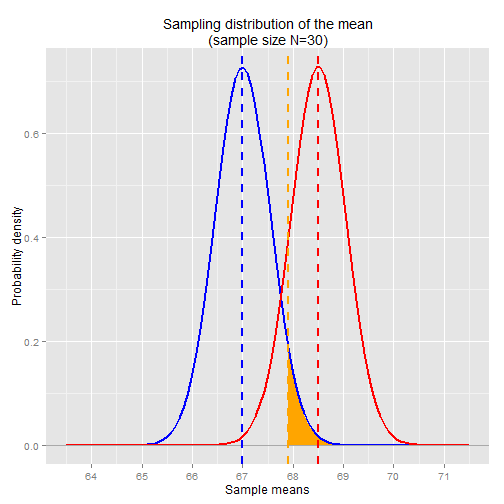

## Power Analysis Example


```r
library(ggplot2)

N <- 30
pop.mean <- 67
nor.mean <- 68.5
pop.var <- 9
se.mean <- sqrt( pop.var / N )

x <- seq(63.5,71.5,0.01)
ggplot() + 
    stat_function(aes(x=x), 
                  fun=dnorm, 
                  arg=list(mean=pop.mean, sd=se.mean),
                  size=1, 
                  colour="blue") +
    stat_function(aes(x=x), 
                  fun=dnorm, 
                  arg=list(mean=nor.mean, sd=se.mean),
                  size=1, 
                  colour="red") +
    ggtitle("Sampling distribution of the mean\n(sample size N=30)") + 
    geom_hline(y=0, colour="darkgray") +
    geom_vline(x=pop.mean, linetype="dashed", colour="blue", size=1) +
    geom_vline(x=nor.mean, linetype="dashed", colour="red", size=1) +
    ylab("Probability density") + 
    xlab("Sample means")  +
    scale_x_continuous(breaks=64:71, labels=64:71)
```

 

The blue line is the sampling distribution centered around the global population mean, 67in.  This is the sampling distribution we'll use for our significance test, when we test whether the Norwegian sample mean is significantly larger than the global population mean.

The red line is the sampling distribution centered around the *assumed* Norwegian population mean, 68.5in.  Even if our assumption is correct, it's still possible that our randomly selected sample will include some sampling error.  The sampling distribution gives us the distribution of sample means that we might observe.  

For our significance test, let's say we choose the conventional significance level of *alpha*=0.05, and let's say we're only concerned with the difference in one direction, so we'll use the one-tailed test. We can use the qnorm function to find where the significance level falls in the distribution.


```r
alpha <- 0.05
alpha.sample.mean <- qnorm(1-alpha, mean=pop.mean, sd=se.mean)
alpha.sample.mean
```

```
## [1] 67.90092
```

```r
shade_x <- seq(alpha.sample.mean,71.5,0.01)
shade_y.pop <- dnorm(shade_x, mean=pop.mean, sd=se.mean)
shade.pop <- data.frame( rbind(c(alpha.sample.mean,0), cbind(shade_x,shade_y.pop), c(71.5,0)) )

ggplot() + 
    geom_polygon(data = shade.pop, aes(shade_x, shade_y.pop), fill="orange") +
    stat_function(aes(x=x), 
                  fun=dnorm, 
                  arg=list(mean=pop.mean, sd=se.mean),
                  size=1, 
                  colour="blue") +
    stat_function(aes(x=x), 
                  fun=dnorm, 
                  arg=list(mean=nor.mean, sd=se.mean),
                  size=1, 
                  colour="red") +
    ggtitle("Sampling distribution of the mean\n(sample size N=30)") + 
    geom_hline(y=0, colour="darkgray") +
    geom_vline(x=pop.mean, linetype="dashed", colour="blue", size=1) +
    geom_vline(x=nor.mean, linetype="dashed", colour="red", size=1) +
    geom_vline(x=alpha.sample.mean, linetype="dashed", colour="orange", size=1) +
    ylab("Probability density") + 
    xlab("Sample means")  +
    scale_x_continuous(breaks=64:71, labels=64:71)
```

 

The orange line is the alpha-level sample mean (67.9 in) that corresponds to a significance level of alpha=0.05.  The orange-shaded region is the range of sample means that, if we were to observe a Norwegian sample mean in this range, we'd conclude that the result is significant and thus reject the null hypothesis (for the p-value is smaller than the significance level).

As mentioned before, the power of the test is equal to the probability of rejecting the null hypothesis.  This is the probability of observing a Norwegian sample mean greater than the alpha-level sample mean, 67.9 in.  If we assume the Norwegian population mean is 68.5 in, then we can use the sampling distribution centered around the Norwegian population mean to determine the probability of observing a sample mean greater than 67.9 in.  This probability is given by the area of the yellow-shaded region in the chart below.


```r
shade_x <- seq(alpha.sample.mean,71.5,0.01)
shade_y.nor <- dnorm(shade_x, mean=nor.mean, sd=se.mean)
shade.nor <- data.frame( rbind(c(alpha.sample.mean,0), cbind(shade_x,shade_y.nor), c(71.5,0)) )

ggplot() + 
    geom_polygon(data = shade.nor, aes(shade_x, shade_y.nor), fill="yellow") +
    geom_polygon(data = shade.pop, aes(shade_x, shade_y.pop), fill="orange") +
    stat_function(aes(x=x), 
                  fun=dnorm, 
                  arg=list(mean=pop.mean, sd=se.mean),
                  size=1, 
                  colour="blue") +
    stat_function(aes(x=x), 
                  fun=dnorm, 
                  arg=list(mean=nor.mean, sd=se.mean),
                  size=1, 
                  colour="red") +
    ggtitle("Sampling distribution of the mean\n(sample size N=30, alpha=0.05)") + 
    geom_hline(y=0, colour="darkgray") +
    geom_vline(x=pop.mean, linetype="dashed", colour="blue", size=1) +
    geom_vline(x=nor.mean, linetype="dashed", colour="red", size=1) +
    geom_vline(x=alpha.sample.mean, linetype="dashed", colour="orange", size=1) +
    ylab("Probability density") + 
    xlab("Sample means")  +
    scale_x_continuous(breaks=64:71, labels=64:71)
```

 

Note that the yellow-shaded region covers the range of statistically significant sample means that overlap across the two sampling distributions.  We can use pnorm to get the probability of observing a sample mean in this range, using the sampling distribution centered around the Norwegian mean:


```r
1 - pnorm(alpha.sample.mean, mean=nor.mean, sd=se.mean)
```

```
## [1] 0.8629697
```

So, assuming the Norwegian population mean is 68.5 in, and assuming the population variance is 9, and given a sample size of N=30, the probability of observing a Norwegian sample mean greater than 67.9 in is 0.86. This is the statistical power of the experiment -- i.e. the probability of rejecting the null hypothesis.  

The Type II error rate is 1 - power, or 0.14.  This is the probability of getting a Norwegian sample mean that's smaller than the alpha-level sample mean.  This probability is represented by the red-shaded region in the chart below:


```r
shade_x.type2 <- seq(63.5,alpha.sample.mean,0.01)
shade_y.type2 <- dnorm(shade_x.type2, mean=nor.mean, sd=se.mean)
shade.type2 <- data.frame( rbind(c(63.5,0), cbind(shade_x.type2,shade_y.type2), c(alpha.sample.mean,0)) )

ggplot() + 
    geom_polygon(data = shade.nor, aes(shade_x, shade_y.nor), fill="yellow") +
    geom_polygon(data = shade.type2, aes(shade_x.type2, shade_y.type2), fill="red") +
    geom_polygon(data = shade.pop, aes(shade_x, shade_y.pop), fill="orange") +
    stat_function(aes(x=x), 
                  fun=dnorm, 
                  arg=list(mean=pop.mean, sd=se.mean),
                  size=1, 
                  colour="blue") +
    stat_function(aes(x=x), 
                  fun=dnorm, 
                  arg=list(mean=nor.mean, sd=se.mean),
                  size=1, 
                  colour="red") +
    ggtitle("Sampling distribution of the mean\n(sample size N=30)") + 
    geom_hline(y=0, colour="darkgray") +
    geom_vline(x=pop.mean, linetype="dashed", colour="blue", size=1) +
    geom_vline(x=nor.mean, linetype="dashed", colour="red", size=1) +
    geom_vline(x=alpha.sample.mean, linetype="dashed", colour="orange", size=1) +
    ylab("Probability density") + 
    xlab("Sample means")  +
    scale_x_continuous(breaks=64:71, labels=64:71)
```

 

The red-shaded region covers the range of NON-significant sample means that overlap across the two sampling distributions.

## The effect of changing the significance level on power

As mentioned above, power depends in part on sample size and significance level.  If we change the significance level, that will move the orange line in the charts above, which will change the alpha-level sample mean and therefore change the probability of observing a sample mean above or below the alpha-level. For example, if we changed the significance level to *alpha*=0.10, that would move the orange line to the left and therefore increase power, since it increases the range of statistically significant outcomes in the Norwegian sampling distribution and therefore increases the likelihood of rejecting the null hypothesis.


```r
alpha <- 0.10
alpha.sample.mean <- qnorm(1-alpha, mean=pop.mean, sd=se.mean)
alpha.sample.mean
```

```
## [1] 67.70193
```

```r
shade_x <- seq(alpha.sample.mean,71.5,0.01)
shade_y.pop <- dnorm(shade_x, mean=pop.mean, sd=se.mean)
shade.pop <- data.frame( rbind(c(alpha.sample.mean,0), cbind(shade_x,shade_y.pop), c(71.5,0)) )

shade_y.nor <- dnorm(shade_x, mean=nor.mean, sd=se.mean)
shade.nor <- data.frame( rbind(c(alpha.sample.mean,0), cbind(shade_x,shade_y.nor), c(71.5,0)) )


ggplot() + 
    geom_polygon(data = shade.nor, aes(shade_x, shade_y.nor), fill="yellow") +
    geom_polygon(data = shade.pop, aes(shade_x, shade_y.pop), fill="orange") +
    stat_function(aes(x=x), 
                  fun=dnorm, 
                  arg=list(mean=pop.mean, sd=se.mean),
                  size=1, 
                  colour="blue") +
    stat_function(aes(x=x), 
                  fun=dnorm, 
                  arg=list(mean=nor.mean, sd=se.mean),
                  size=1, 
                  colour="red") +
    ggtitle("Sampling distribution of the mean\n(sample size N=30, alpha=0.10)") + 
    geom_hline(y=0, colour="darkgray") +
    geom_vline(x=pop.mean, linetype="dashed", colour="blue", size=1) +
    geom_vline(x=nor.mean, linetype="dashed", colour="red", size=1) +
    geom_vline(x=alpha.sample.mean, linetype="dashed", colour="orange", size=1) +
    ylab("Probability density") + 
    xlab("Sample means")  +
    scale_x_continuous(breaks=64:71, labels=64:71)
```

 

The first chart is the same from above, with alpha=0.05.  The second chart shows the ranges corresponding to alpha=0.10.  The alpha-level sample mean in the second chart dropped to 67.7, down from 67.9 in the first chart.  This increases the range of sample means that are considered statistically significant.

Again we can use pnorm to compute the probability a.k.a power:


```r
1 - pnorm(alpha.sample.mean, mean=nor.mean, sd=se.mean)
```

```
## [1] 0.9274503
```


Note that by increasing the significance level, we're also increasing the Type I error rate, which means we're increasing the likelihood of incurring a Type I error (false positive).  However, as previously mentioned, for a power analysis, we're not concerned with Type I errors, because the power analysis *assumes* a priori that a real effect exists.


## The effect of changing the sample size on power

If we change the sample size, that changes the shape of the sampling distribution.  Larger sample sizes result in tighter (narrowly dispersed) sampling distributions, since the variance of the sampling distribution is inversely related to the sample size.  This effectively increases power, since it makes it less likely that a Type II error (false negative) will occur. Smaller sample sizes, on the other hand, result in more widely dispersed sampling distributions, thereby increasing the probability of Type II error and decreasing power.

For example, if we reduced the sample size from N=30 to N=10, the chart now looks like this.  The significance level is set to *alpha*=0.05.


```r
N <- 10
se.mean <- sqrt( pop.var / N )

alpha <- 0.05
alpha.sample.mean <- qnorm(1-alpha, mean=pop.mean, sd=se.mean)
alpha.sample.mean
```

```
## [1] 68.56045
```

```r
shade_x <- seq(alpha.sample.mean,71.5,0.01)
shade_y.pop <- dnorm(shade_x, mean=pop.mean, sd=se.mean)
shade.pop <- data.frame( rbind(c(alpha.sample.mean,0), cbind(shade_x,shade_y.pop), c(71.5,0)) )

shade_y.nor <- dnorm(shade_x, mean=nor.mean, sd=se.mean)
shade.nor <- data.frame( rbind(c(alpha.sample.mean,0), cbind(shade_x,shade_y.nor), c(71.5,0)) )

ggplot() + 
    geom_polygon(data = shade.nor, aes(shade_x, shade_y.nor), fill="yellow") +
    geom_polygon(data = shade.pop, aes(shade_x, shade_y.pop), fill="orange") +
    stat_function(aes(x=x), 
                  fun=dnorm, 
                  arg=list(mean=pop.mean, sd=se.mean),
                  size=1, 
                  colour="blue") +
    stat_function(aes(x=x), 
                  fun=dnorm, 
                  arg=list(mean=nor.mean, sd=se.mean),
                  size=1, 
                  colour="red") +
    ggtitle("Sampling distribution of the mean\n(sample size N=10)") + 
    geom_hline(y=0, colour="darkgray") +
    geom_vline(x=pop.mean, linetype="dashed", colour="blue", size=1) +
    geom_vline(x=nor.mean, linetype="dashed", colour="red", size=1) +
    geom_vline(x=alpha.sample.mean, linetype="dashed", colour="orange", size=1) +
    ylab("Probability density") + 
    xlab("Sample means")  +
    scale_x_continuous(breaks=64:71, labels=64:71)
```

 

The alpha-level sample mean jumps to 68.6in, up from 67.9in when the sample size was larger at N=30.  Note that this is actually larger than our assumed Norwegian population mean, 68.5in, so in order to get a statistically significant result, we'd have to select a sample that was biased with slightly above-average heighted Norwegians.

Again we can use pnorm to compute the probability and power:


```r
1 - pnorm(alpha.sample.mean, mean=nor.mean, sd=se.mean)
```

```
## [1] 0.4745987
```

With a sample size of N=10, power has been reduced to 0.47, down from 0.86 when the sample size was N=30.  This means there's only a 47% chance we'll observe a statistically significant difference between the Norwegian sample mean and the global population mean, even when we assume the Norwegian population mean is truly larger than the global population mean.


## RECAP


## latex


\begin{align*}
\alpha &= Type\ I\ error\ rate\ (false\ positive)
\\ \\
\beta &= Type\ II\ error\ rate\ (false\ negative)
\\ \\
power &= 1 - \beta
\end{align*}

