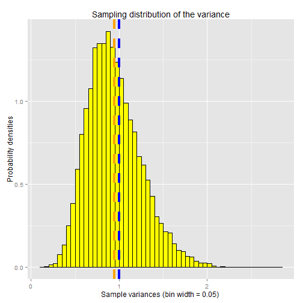
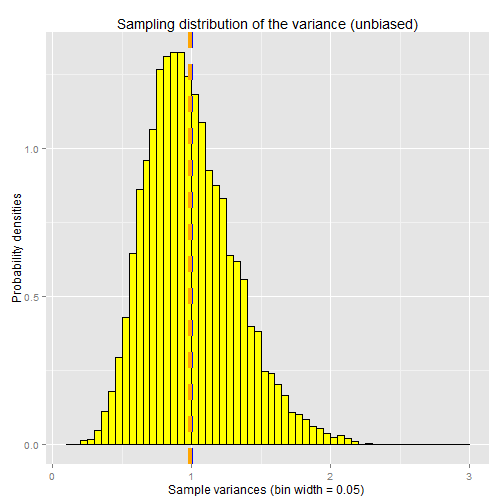
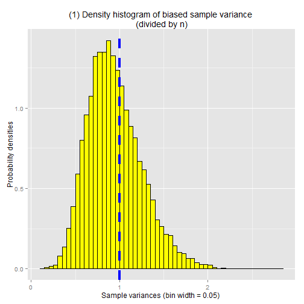
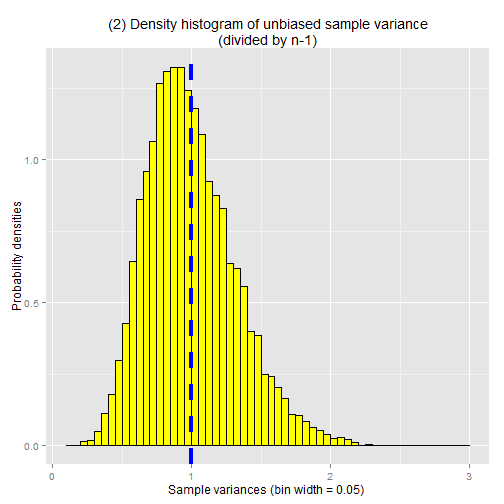
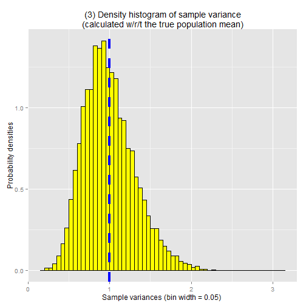
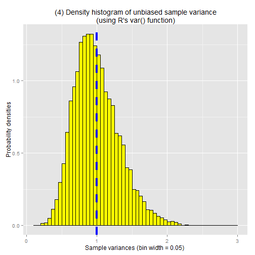

## Plotting the sampling distribution of the variance

To help visualize the sample variance bias, let's run a simulation in R where we take a bunch of random samples from the standard normal distribution, with a relatively small sample size of n=20.  We'll compute the mean and variance for each sample, then plot the sample variances using a density histogram.  In effect, we're plotting the sampling distribution of the variance (analogous to the sampling distribution of the mean).  


```r
library(ggplot2)

set.seed(33)
n <- 20
sample.vars <- NULL

for (i in 1:10000) {
    samp <- rnorm(n)
    sample.mean <- mean(samp)
    sample.var <- sum( (samp-sample.mean)^2 ) / n
    sample.vars <- c(sample.vars, sample.var)
}

ggplot() + 
    geom_histogram(aes(y=..density..,x=sample.vars), 
                   binwidth=0.05, fill="yellow", colour="black") +
    ggtitle("Sampling distribution of the variance") +
    ylab("Probability densities") + 
    xlab("Sample variances (bin width = 0.05) ") +
    geom_vline(x=1,linetype="dashed",size=1.5,colour="blue") +
    geom_vline(x=mean(sample.vars),linetype="dashed",size=1.5,colour="orange") 
```

 

The vertical blue line indicates the true population variance for the standard normal distribution (var=1).  The vertical orange line indicates the mean (expected value) of the sampling distribution of the variance.  As you can see, it slightly underestimates the true population variance.


## Plotting the unbiased sampling distribution of the variance

Let's re-run the same simulation as before, this time however we'll plot the unbiased
sample variances.


```r
library(ggplot2)

set.seed(33)
n <- 20
sample.vars.unbiased <- NULL

for (i in 1:10000) {
    samp <- rnorm(n)
    sample.mean <- mean(samp)
    sample.var.unbiased <- sum( (samp-sample.mean)^2 ) / (n-1)
    sample.vars.unbiased <- c(sample.vars.unbiased, sample.var.unbiased)
}

ggplot() + 
    geom_histogram(aes(y=..density..,x=sample.vars.unbiased), 
                   binwidth=0.05, fill="yellow", colour="black") +
    ggtitle("Sampling distribution of the variance (unbiased)") +
    ylab("Probability densities") + 
    xlab("Sample variances (bin width = 0.05) ") +
    geom_vline(x=1,linetype="dashed",size=1.5,colour="blue") +
    geom_vline(x=mean(sample.vars.unbiased),linetype="dashed",size=1.5,colour="orange") 
```

 


## Example: Plotting the distribution of sample variances

To help visualize the sample variance bias, let's run a simulation in R where we take a bunch of random samples from the standard normal distribution, with a relatively small sample size of 20, and compute the variance for each sample.  We'll compute both the biased variance and the unbiased variance and plot the results using a density histogram.  Remember the density histogram is like a probability density function. It shows us the distribution of the random variable, where in this case the random variable is the sample variance.  This is analogous to the simulation we ran before where we plotted the distribution of sample means (i.e. the sampling distribution of the mean).  In this case we're plotting the distribution of sample variances (i.e. the sampling distribution of the variance).

Since the underlying population that we're sampling from is the standard normal distribution, we know ahead of time both the population mean (mean=0) and population variance (var=1).  For the purposes of this simulation, we'll estimate both parameters (mean and variance) from our samples (as if we didn't the population parameters were unknown).

I've included four plots below, showing four different ways to calculate the sample variance:

1. the biased estimate (divide by n), where the sample variance is calculated based on the sample mean (remember, the sample mean is also just an estimate of the population mean)
2. the unbiased estimate (divide by n-1), where the sample variance is calculated based on the sample mean
3. the estimate where the variance is calculated based on the known population mean
4. the variance estimate returned by the var() function in R


```r
library(ggplot2)

set.seed(33)
n <- 20
var.biased <- NULL
var.unbiased <- NULL
var.pop.mean <- NULL
var.R <- NULL

for (i in 1:10000) {
    x <- rnorm(n)
    x.mean <- mean(x)
    x.var.biased <- sum( (x-x.mean)^2 ) / n
    x.var.unbiased <- sum( (x-x.mean)^2 ) / (n-1)
    x.var.pop.mean <- sum( (x-0)^2 ) / n
    x.var.R <- var(x)

    var.biased <- c(var.biased, x.var.biased)
    var.unbiased <- c(var.unbiased, x.var.unbiased)
    var.pop.mean <- c(var.pop.mean, x.var.pop.mean)
    var.R <- c(var.R, x.var.R)
}

ggplot() + 
    geom_histogram(aes(y=..density..,x=var.biased), 
                   binwidth=0.05, fill="yellow", colour="black") +
    ggtitle(paste("(1) Density histogram of biased sample variance",
                  "\n(divided by n)")) + 
    ylab("Probability densities") + 
    xlab("Sample variances (bin width = 0.05) ") +
    geom_vline(x=1,linetype="dashed",size=1.5,colour="blue") 
```

 

```r
ggplot() + 
    geom_histogram(aes(y=..density..,x=var.unbiased), 
                   binwidth=0.05, fill="yellow", colour="black") +
    ggtitle("(2) Density histogram of unbiased sample variance\n(divided by n-1)") + 
    ylab("Probability densities") + 
    xlab("Sample variances (bin width = 0.05) ") +
    geom_vline(x=1,linetype="dashed",size=1.5,colour="blue") 
```

 

```r
ggplot() + 
    geom_histogram(aes(y=..density..,x=var.pop.mean), 
                   binwidth=0.05, fill="yellow", colour="black") +
    ggtitle("(3) Density histogram of sample variance\n(calculated w/r/t the true population mean)") + 
    ylab("Probability densities") + 
    xlab("Sample variances (bin width = 0.05) ") +
    geom_vline(x=1,linetype="dashed",size=1.5,colour="blue") 
```

 

```r
ggplot() + 
    geom_histogram(aes(y=..density..,x=var.R), 
                   binwidth=0.05, fill="yellow", colour="black") +
    ggtitle("(4) Density histogram of unbiased sample variance\n(using R's var() function)") + 
    ylab("Probability densities") + 
    xlab("Sample variances (bin width = 0.05) ") +
    geom_vline(x=1,linetype="dashed",size=1.5,colour="blue") 
```

 

The vertical blue line is the known population variance for the standard normal distribution (var=1).  As you can see, the biased estimate (plot 1) tends to underestimate the true population variance.  The other three plots also tend to underestimate, but they are closer to the true population variance. 

Note that, unlike the distribution of sample means, the distribution of sample variances is lower-bounded at 0, because variance can never be a negative number.  This causes the sampling distribution of the variance to be not quite normally distributed.  Instead it follows a chi square distribution, which we'll introduce the next article.

 

## Recap


