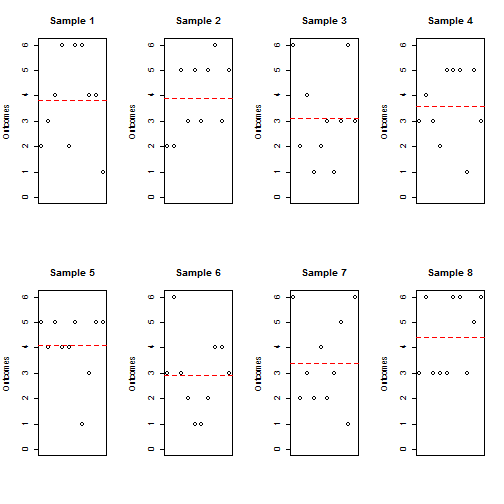
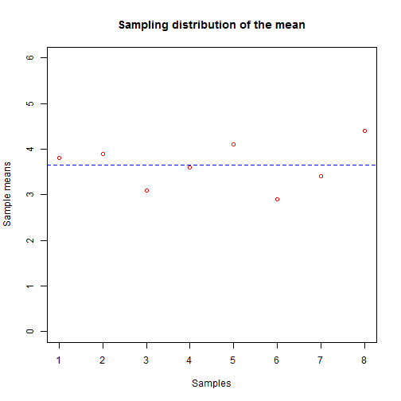
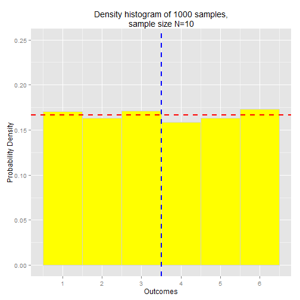
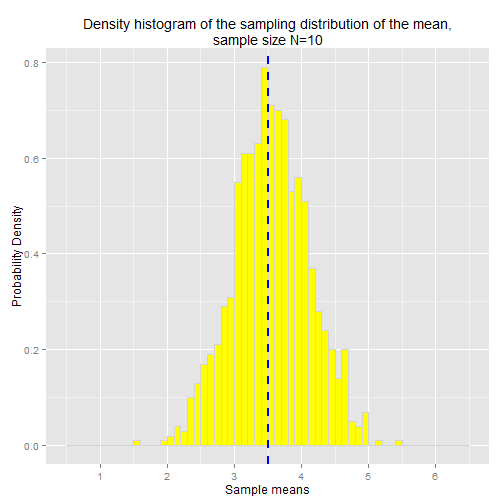
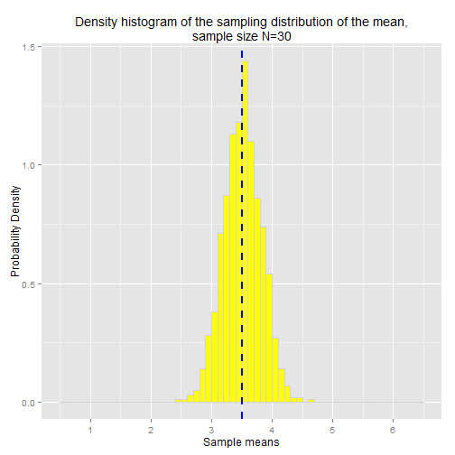

## Sampling Distribution Example

Let's try to visualize this with an example. We'll use R to simulate taking multiple samples from a random variable with a uniform distribution of outcomes between 1 and 6. Remember in a uniform distribution, each outcome has equal probability. So this is equivalent to rolling a six-sided die a bunch of times and taking samples of the outcomes.

We'll use the runif function to generate our random samples.  runif generates
uniformly distributed random values in whatever range of possible outcomes you
tell it.  For this example we'll use the range 1 - 6.  Our sample size is N=10.

Aside: note that runif returns random values for a continuous random variable, 
not a discrete random variable like our six-sided die.  To account for this, we'll
generate random values between 0 and 6 and round them all up (i.e take their ceiling).
This effectively converts the runif output from continuous outcomes between 0 and 6
to discrete outcomes between 1 and 6.

The code below uses a for-loop to generate and plot eight samples, all with sample size N=10.  


```r
set.seed(1)

N <- 10     
sample.means <- NULL
par(mfrow=c(2,4))

# Loop eight times to collect eight samples and calculate eight sample means.
for (i in 1:8) {

    # converting from continuous to discrete outcomes between 1 and 6.
    sample <- ceiling( runif( N, 0, 6) )  
    sample.mean <- mean(sample)

    plot(x=1:N, 
         y=sample, 
         main=paste("Sample",i), 
         ylim=c(0,6),
         xlab="",
         xaxt='n',
         ylab="Outcomes")
    abline(a=sample.mean,b=0,col="red",lty="dashed")

    # Remember the sample means to graph them later
    sample.means <- c(sample.means, sample.mean)
}
```

 

The mean for each sample is plotted as a dashed red line along with the sample data.  Recall that the theoretical mean for a six-sided die is:

E[X] = 3.5

The sample means shown above are all in the neighborhood of 3.5, with minor variations due to the randomness by which the samples were collected.

We then collect the set of sample means compiled from all the samples and plot them below. The set of sample means comprises the sampling distribution of the mean.  


```r
# Plot the sample.means; i.e. the sampling distribution of the mean
par(mfrow=c(1,1))
plot(x=1:8, 
     y=sample.means, 
     col="red",
     main="Sampling distribution of the mean", 
     ylim=c(0,6),
     xlab="Samples",
     ylab="Sample means")
abline(a=mean(sample.means),b=0,col="blue",lty="dashed")
```

 


The blue dashed line is the mean of the sample means.  Or in other words, it's
the expected value of the sampling distribution of the mean.  Remember, the
mean statistic that we calculated from our samples is a random variable itself,
and its distribution is the sampling distribution.  The expected value of
the sampling distribution is the mean of sample means -- i.e. the mean of the means
(I warned you about the overloaded terminology).

Note that the expected value of the sampling distribution is nearly the same as the
theoretical expected value of the underlying distribution of the six-sided die, E[X] = 3.5.
This makes sense since the expected value of the sampling distribution is the mean of
the sample means, and the sample means are clustered around the actual theoretical mean,
with slight variations due to random chance.  So, in effect, taking the mean of the
sample means attempts to account for that random variation in order to find the true
mean of the sample means, which would be the same as the theoretical mean.

We're beginning to touch on the Central Limit Theorem, which is one of the most important
theories of math and serves as the basis of statistical inference.  We'll go over the
Central Limit Theorem in the next article, but before we get there I want to show another
example of a sampling distribution in order to highlight a different aspect of it, namely
its probability density, that will serve as a quick preview of what's to come.


### A density histogram of the sampling distribution

So let's run another simulation, again using our six-sided die, but this time let's
ramp up the number of samples to 1000.


```r
N <- 10     
samples <- NULL
sample.means <- NULL

# Loop 1000 times to collect 1000 samples and calculate 1000 sample means.
for (i in 1:1000) {

    sample <- ceiling( runif( N, 0, 6) )  
    sample.mean <- mean(sample)

    # Remember the sample and sample mean for later
    samples <- c(samples, sample)
    sample.means <- c(sample.means, sample.mean)
}

library(ggplot2)
ggplot() + 
    geom_histogram(aes(y=..density.., x=samples), 
                   binwidth=1, 
                   fill="yellow", 
                   colour="lightgray", 
                   origin=-0.5) + 
    scale_x_continuous(breaks=1:6, limits=c(0.5,6.5)) +
    ggtitle("Density histogram of 1000 samples,\nsample size N=10") +
    geom_hline(y=1/6,linetype="dashed",size=1,colour="red") +
    geom_vline(x=3.5,linetype="dashed",size=1,colour="blue") +
    xlab("Outcomes") +
    ylab("Probability Density") +
    ylim(0, 0.25)
```

 

```r
ggplot() + 
    geom_histogram(aes(y=..density.., x=sample.means), 
                   binwidth=0.1, 
                   fill="yellow", 
                   colour="lightgray") + 
    scale_x_continuous(breaks=1:6, limits=c(0.5,6.5)) +
    ggtitle("Density histogram of the sampling distribution of the mean,\nsample size N=10") +
    geom_vline(x=3.5,linetype="dashed",size=1,colour="blue") +
    xlab("Sample means") +
    ylab("Probability Density")
```

 

The first chart depicts the density histogram for all of our sample data. As expected 
the probability density is uniformly distributed.  Since the six-sided die is a discrete 
random variable, this is technically a probability mass histogram, and so the probability
density values are the actual probabilities associated with each outcome.  Note that 
the probability for each outcome is approximately 0.1667, or 1/6, which is the theoretical
true probability for each outcome. The red dashed line marks the true probability.

The second chart depicts the density histogram for the sampling distribution of the mean.
Notice that the distribution is shaped like a normal distribution, clustered around the 
mean of the means, which is approximately the same as the expected value of the underlying
distribution (the six-sided die), E[X] = 3.5.  The blue dashed line in both charts indicates the
true expected value E[X] = 3.5.


So let's run yet another simulation with our six-sided die, but this time let's
increase the sample size to N=30. Again we'll collect 1000 samples.


```r
N <- 30     
samples <- NULL
sample.means <- NULL

# Loop 1000 times to collect 1000 samples and calculate 1000 sample means.
for (i in 1:1000) {

    sample <- ceiling( runif( N, 0, 6) )  
    sample.mean <- mean(sample)

    # Remember the sample and sample mean for later
    samples <- c(samples, sample)
    sample.means <- c(sample.means, sample.mean)
}

library(ggplot2)
ggplot() + 
    geom_histogram(aes(y=..density.., x=samples), 
                   binwidth=1, 
                   fill="yellow", 
                   colour="lightgray", 
                   origin=-0.5) + 
    scale_x_continuous(breaks=1:6, limits=c(0.5,6.5)) +
    ggtitle("Density histogram of 1000 samples,\nsample size N=30") +
    geom_hline(y=1/6,linetype="dashed",size=1,colour="red") +
    geom_vline(x=3.5,linetype="dashed",size=1,colour="blue") +
    xlab("Outcomes") +
    ylab("Probability Density") +
    ylim(0, 0.25)
```

 

```r
ggplot() + 
    geom_histogram(aes(y=..density.., x=sample.means), 
                   binwidth=0.1, 
                   fill="yellow", 
                   colour="lightgray") + 
    scale_x_continuous(breaks=1:6, limits=c(0.5,6.5)) +
    ggtitle("Density histogram of the sampling distribution of the mean,\nsample size N=30") +
    geom_vline(x=3.5,linetype="dashed",size=1,colour="blue") +
    xlab("Sample means") +
    ylab("Probability Density")
```

 

As you can see, the density histogram for our sample data looks pretty much the same, 
although now we have more data so the densities of each outcome more closely approximate
their true density, 0.16667, or 1/6, as indicated by the red dashed line.  

Notice that the sampling distribution in the second chart has become even more tightly clustered around the
theoretical expected value of the underlying distribution than it was when we used a smaller sample size.  
In other words, the variance of the sampling distribution of the mean gets smaller as the sample size gets bigger. 
This makes sense because with a larger sample size, we'd expect each of our sample means to more closely approximate
the true mean/expected value of the random variable. 

With all that said, we're now ready to talk about the Central Limit Theorem, which we'll
take on in the next article. 


### Recap

