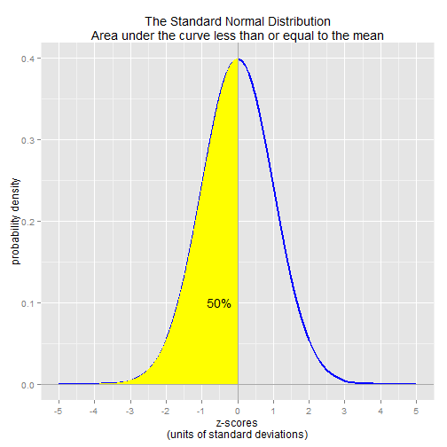
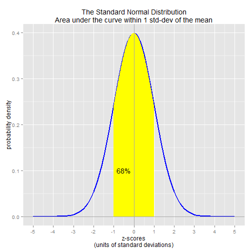
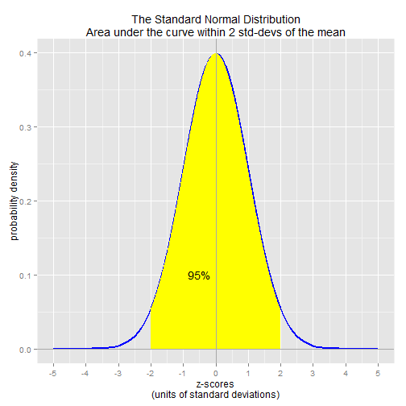
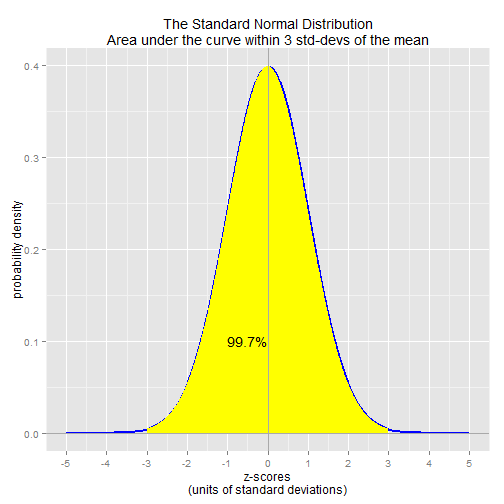
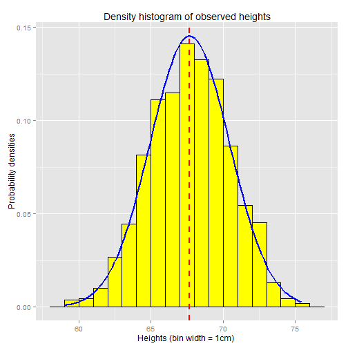
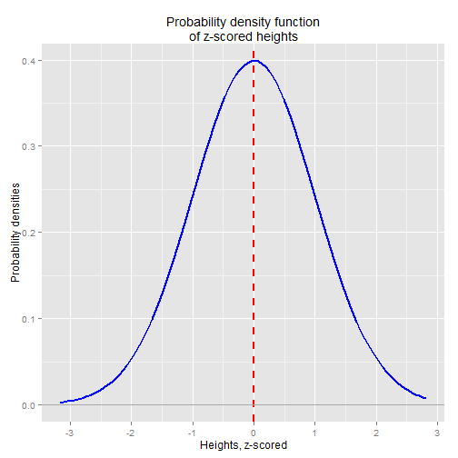

Here's the probability density function for the standard normal distribution:


```r
x <- seq(-5,5,0.01)
ggplot() + 
    stat_function(aes(x=x), fun=dnorm, size=1, colour="blue") +
    ggtitle("The Standard Normal Distribution") + 
    geom_hline(y=0, colour="darkgray") +
    geom_vline(x=0, colour="darkgray") +
    ylab("probability density") + 
    xlab("z-scores\n(units of standard deviations)") + 
    scale_x_continuous(breaks=-5:5, labels=-5:5)
```

 

The standard normal distribution is centered around a mean of 0.  This is similar to z-scores, which themselves are "centered" around 0 by subtracting the mean from the actual outcome.  The standard normal distribution has a standard deviation of 1, which again is similar to z-scores, in that z-scores are "scaled" such that a z-score of 1 is equivalent to being one standard deviation away from the mean.

Recall from the article on (blog/2015/5/1/intro-to-statistics-part-7-common-distributions)[common distribution patterns] that we could use R functions like dnorm, pnorm, and qnorm to calculate things like densities, probabilities, and quantiles, respectively.  By default, if you don't specify the mean and standard deviation of the normal distribution, then these functions operate on the standard normal distribution (i.e. the defaults are mean=0 and sd=1).  So for example if we wanted to know the probability of an outcome being less than or equal to the mean, we'd use pnorm and give it the outcome value 0, since 0 represents the mean:


```r
pnorm(0)
```

```
## [1] 0.5
```

As expected, there's a 0.5 or 50% chance of an outcome being below the mean (remember the mean/expected value is the "center of mass" of the distribution that splits the outcomes in half).

The probability of an outcome being within one standard deviation of the mean can be calculated by first computing the probability of an outcome being less than or equal to +1 standard deviation, then subtracting away the probability of an outcome being less than or equal to -1 standard deviations.  This leaves us with the probability of an outcome being between -1 and +1 standard deviations:


```r
pnorm(1) - pnorm(-1)
```

```
## [1] 0.6826895
```

Recall that the probability of an outcome falling in a given range is equal to the area under the distribution curve across that range.  In the charts below I've highlighted various areas to give you an idea of the shape of the standard normal distribution and how the outcomes are distributed:


```r
x <- seq(-5,5,0.01)

shade_x <- seq(-5,0,0.01)
shade_y <- dnorm(shade_x, mean=0, sd=1)
shade <- data.frame( rbind(c(-5,0), cbind(shade_x,shade_y), c(0,0)) )

ggplot() + 
    stat_function(aes(x=x), fun=dnorm, size=1, colour="blue") +
    ggtitle("The Standard Normal Distribution\nArea under the curve less than or equal to the mean") + 
    ylab("probability density") + 
    xlab("z-scores\n(units of standard deviations)") + 
    scale_x_continuous(breaks=-5:5, labels=-5:5) +
    geom_polygon(data = shade, aes(shade_x, shade_y), fill="yellow") +
    geom_hline(y=0, colour="darkgray") +
    geom_vline(x=0, colour="darkgray") +
    geom_text(aes(x=-0.5,y=0.1,label="50%"))
```

 

```r
shade_x <- seq(-1,1,0.01)
shade_y <- dnorm(shade_x, mean=0, sd=1)
shade <- data.frame( rbind(c(-1,0), cbind(shade_x,shade_y), c(1,0)) )

ggplot() + 
    stat_function(aes(x=x), fun=dnorm, size=1, colour="blue") +
    ggtitle("The Standard Normal Distribution\nArea under the curve within 1 std-dev of the mean") + 
    ylab("probability density") + 
    xlab("z-scores\n(units of standard deviations)") + 
    scale_x_continuous(breaks=-5:5, labels=-5:5) +
    geom_polygon(data = shade, aes(shade_x, shade_y), fill="yellow") +
    geom_hline(y=0, colour="darkgray") +
    geom_vline(x=0, colour="darkgray") +
    geom_text(aes(x=-0.5,y=0.1,label="68%"))
```

 

```r
shade_x <- seq(-2,2,0.01)
shade_y <- dnorm(shade_x, mean=0, sd=1)
shade <- data.frame( rbind(c(-2,0), cbind(shade_x,shade_y), c(2,0)) )

ggplot() + 
    stat_function(aes(x=x), fun=dnorm, size=1, colour="blue") +
    ggtitle("The Standard Normal Distribution\nArea under the curve within 2 std-devs of the mean") + 
    ylab("probability density") + 
    xlab("z-scores\n(units of standard deviations)") + 
    scale_x_continuous(breaks=-5:5, labels=-5:5) +
    geom_polygon(data = shade, aes(shade_x, shade_y), fill="yellow") +
    geom_hline(y=0, colour="darkgray") +
    geom_vline(x=0, colour="darkgray") +
    geom_text(aes(x=-0.5,y=0.1,label="95%"))
```

 

```r
shade_x <- seq(-3,3,0.01)
shade_y <- dnorm(shade_x, mean=0, sd=1)
shade <- data.frame( rbind(c(-3,0), cbind(shade_x,shade_y), c(3,0)) )

ggplot() + 
    stat_function(aes(x=x), fun=dnorm, size=1, colour="blue") +
    ggtitle("The Standard Normal Distribution\nArea under the curve within 3 std-devs of the mean") + 
    ylab("probability density") + 
    xlab("z-scores\n(units of standard deviations)") + 
    scale_x_continuous(breaks=-5:5, labels=-5:5) +
    geom_polygon(data = shade, aes(shade_x, shade_y), fill="yellow") +
    geom_hline(y=0, colour="darkgray") +
    geom_vline(x=0, colour="darkgray") +
    geom_text(aes(x=-0.5,y=0.1,label="99.7%"))
```

 

In other words, in a normally distributed population, 99.7% of outcomes, nearly all of them, fall within three standard deviations of the mean.


## Z-scoring the heights dataset

Recall the dataset of people's heights that we looked at in (https://rob-alderman.squarespace.com/blog/2015/4/22/intro-to-statistics-experiments-populations-samples-statistical-inference-oh-my)[Part 5] of the series.  The probability density chart looked like this:


```r
library(UsingR)
data(father.son)
heights <- sample(father.son$fheight)

ggplot() + 
    geom_histogram(aes(y=..density..,x=heights), 
                   binwidth=1, fill="yellow", colour="black") +
    ggtitle("Density histogram of observed heights") + 
    ylab("Probability densities") + 
    xlab("Heights (bin width = 1cm) ") +
    geom_vline(x=mean(heights),linetype="dashed",size=1,colour="red") +
    stat_function(aes(x=heights), fun = dnorm, colour="blue",size=1,
                  arg=list(mean=mean(heights), sd=sd(heights)) )
```

 

```r
z.scored.heights <- (heights - mean(heights))/sd(heights)

ggplot() + 
    ggtitle("Probability density function\nof z-scored heights") + 
    ylab("Probability densities") + 
    xlab("Heights, z-scored") +
    scale_x_continuous(breaks=-5:5, labels=-5:5) +
    geom_vline(x=mean(z.scored.heights),linetype="dashed",size=1,colour="red") +
    geom_hline(y=0, colour="darkgray") +
    stat_function(aes(x=z.scored.heights), fun = dnorm, colour="blue",size=1,
                  arg=list(mean=mean(z.scored.heights), sd=sd(z.scored.heights)))
```

 

The z-scored heights is a standard normal distribution.  We know from above that 68% of outcomes fall within one standard deviation of the mean.  We can verify this on our original heights dataset by calculating the percent of heights that fall within one standard deviation:


```r
within.1.sd <- heights >= mean(heights) - sd(heights) & heights <= mean(heights) + sd(heights)
round( sum(within.1.sd) / length(within.1.sd), 2)
```

```
## [1] 0.68
```

As expected, 68% of heights fall within a standard deviation.  This is strong evidence that the distribution of heights is truly normally distributed.


## Recap
