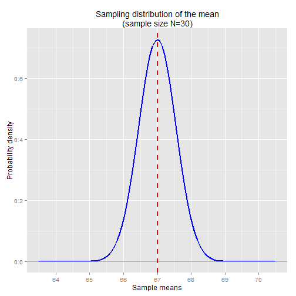
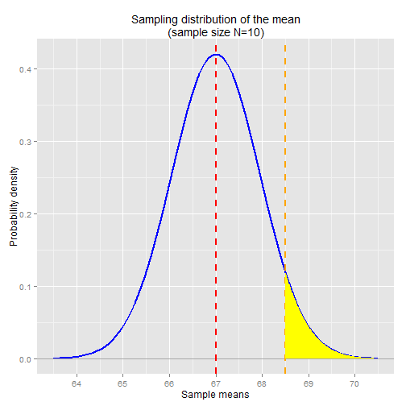

This assumption we're making is known as a null hypothesis.  A null hypothesis
assumes that, in reality, there should be no difference ("null") between the
two sample means.   Working from that assumption, we can use the theoretical
sampling distribution of the mean, as given by the Central Limit Theorem, to
assess the probability of observing the difference in sample means that we
observed.

Remember that the sampling distribution of the mean is the distribution of sample means,
where the sample means are computed from multiple samples drawn from the underlying distribution, 
with each sample contributing a single outcome (its mean) to the distribution.  In this case, we 
don't have multiple samples from which to compute means and build a sampling distribution.  
But we can use the Central Limit Theorem to construct a theoretical sampling distribution.
According to the Central Limit Theorem, all we need to know in order to construct a
theoretical sampling distribution is:

* the sample size
* the true mean of the population (which is the expected value of the sampling distribution)
* the true variance of the population (which when divided by the sample size gives
the variance of the sampling distribution)

We know the sample size, since that's a given (for this example let's say the sample size
is N=30).  However we don't know the true mean or variance of the population, since
we haven't measured every single person in the population.  So we have to estimate
those values.  

The best estimate we have is from our sample data, so let's use that.  
Let's assume the Spanish sample is the unbiased sample; in other words
the Spanish sample is representative of the true distribution of heights across
both the Spanish and Norweigian groups, and the Norweigian sample is biased
in that it just happened to include a disproportionate number of tall people that skewed
up the mean height.  Our null hypothesis, then, is that the true mean of Norweigian
heights is 67in (same as the Spanish mean).

We'll also use the variance from our sample to estimate the true variance of the population.
Let's assume the variance of both samples is about the same and is equal to 9.  This
gives us a standard deviation of 3 (square root of the variance).  We'll use this value
as our estimate of the true variance/standard deviation of population.  

The variance of the sampling distribution is equal to the true population variance divided by the sample size:
9/30 = 0.3.  The square root of this gives the standard deviation of the sampling distribution,
which is more commonly referred to as the standard error of the mean: sqrt(0.3) = 0.55.

At this point we can construct the theoretical sampling distribution of the mean, based
on the given sample size and the estimated mean and variance of the true population.


```r
N <- 30
mean_height <- 67
var_height <- 9
se_mean <- sqrt( var_height / N )

x <- seq(63.5,70.5,0.01)
ggplot() + 
    stat_function(aes(x=x), 
                  fun=dnorm, 
                  arg=list(mean=mean_height, sd=se_mean),
                  size=1, 
                  colour="blue") +
    ggtitle("Sampling distribution of the mean\n(sample size N=30)") + 
    geom_hline(y=0, colour="darkgray") +
    geom_vline(x=mean_height, linetype="dashed", colour="red", size=1) +
    ylab("Probability density") + 
    xlab("Sample means")  +
    scale_x_continuous(breaks=64:70, labels=64:70)
```

 

Recall that the sampling distribution of the mean is normally distributed and
centered around the true mean of the underlying population.  In this case we're
assuming that the true mean is represented by the Spanish sample, with sample
mean = 67in (the vertical red line), and that the Norweigian sample mean of 68.5in is biased due to sampling error.
In an actual sampling distribution we'd expect to have some samples exhibit bias, just due
to random chance in how the sample is selected (sometimes you just happen to randomly select
a lot of tall people for your sample).  The sampling distribution gives us a way to calculate
the probability randomly selecting such a biased sample.  More specifically it tells us
where in the sampling distribution our biased sample mean falls, and from that we can
determine the probability of observing that outcome (the biased sample mean) given that
distribution (the sampling distribution). 

The chart below is the same as the one above, with the addition of the vertical green
line, which shows where the Norweigian sample mean falls in the sampling distribution.


```r
nor_mean <- 68.5

ggplot() + 
    stat_function(aes(x=x), 
                  fun=dnorm, 
                  arg=list(mean=mean_height, sd=se_mean),
                  size=1, 
                  colour="blue") +
    ggtitle("Sampling distribution of the mean\n(sample size N=30)") + 
    geom_hline(y=0, colour="darkgray") +
    geom_vline(x=mean_height, linetype="dashed", colour="red", size=1) +
    geom_vline(x=nor_mean, linetype="dashed", colour="orange", size=1) +
    ylab("Probability density") + 
    xlab("Sample means")  +
    scale_x_continuous(breaks=64:70, labels=64:70)
```

 

As you can see the Norweigian sample mean falls pretty far out along the
upper tail of the sampling distribution.  Given what we know about normal
distributions, we can tell that the Norweigian sample mean, when viewed
as a random outcome drawn from the sampling distribution, is quite unlikely
to be observed (although not impossible).  

For our statistical significance test, we want to compute the probability of 
observing a sample mean as extreme as the one we observed, 68.5in, under
the assumption of our null hypothesis, which is that the true mean is 67in
and this particular Norweigian sample just happens to be biased.  The
probability of observing an outcome as extreme as 68.5 is equivalent to 
the probability of observing an outcome of 68.5 or greater.  This is
given by the area under the curve for the range >= 68.5, which is shaded
in yellow below.


```r
shade_x <- seq(68.5,70.5,0.01)
shade_y <- dnorm(shade_x, mean=mean_height, sd=se_mean)
shade <- data.frame( rbind(c(68.5,0), cbind(shade_x,shade_y), c(70.5,0)) )

ggplot() + 
    stat_function(aes(x=x), 
                  fun=dnorm, 
                  arg=list(mean=mean_height, sd=se_mean),
                  size=1, 
                  colour="blue") +
    ggtitle("Sampling distribution of the mean\n(sample size N=30)") + 
    geom_hline(y=0, colour="darkgray") +
    geom_vline(x=mean_height, linetype="dashed", colour="red", size=1) +
    geom_vline(x=nor_mean, linetype="dashed", colour="orange", size=1) +
    geom_polygon(data = shade, aes(shade_x, shade_y), fill="yellow") +
    ylab("Probability density") + 
    xlab("Sample means")  +
    scale_x_continuous(breaks=64:70, labels=64:70)
```

 

As you can see, it's a very tiny range, so we should expect a very tiny probability.
We can use the pnorm function to calculate the probability.  Remember that
pnorm computes probabilities across ranges, and if you supply a single outcome
value then it gives the probability of observing the given outcome or lower.  The
probability of observing the given outcome or greater is simply 1 minus the former
probability.


```r
1 - pnorm(68.5, mean=67, sd=sqrt(9/30))
```

```
## [1] 0.00308495
```

So the probability of observing an outcome of 68.5 or greater is 0.003. In other
words, the probability of observing a sample mean of 68.5in, under the assumption
that the true mean is 67in, and given a sample size of N=30, is a mere 0.003.
This probability is known as the p-value for our significance test.

So is the result significant?  Another way to ask that question is, should we 
reject the null hypthosis?  I.e should we reject the assumption that Norweigian
people are, on average, the same height as Spanish people?  If we do, then
we're saying that the difference in heights is significant, and that Norweigian
people are, in fact, taller than Spanish people on average.

There's no hard and fast rule for determining significance.  Obviously the
smaller the p-value, the better, since the p-value tells you how likely
it is to observe the result in question under the assumption of the null hypothesis.
Most often people use p=0.05 as the cutoff, so anything less than 0.05 is 
considered statistically significant, while anything greater than 0.05 is not.  
This is just an arbitrary criterion, however.  

### One-tailed vs. two-tailed significance tests

The above is an example of a one-tailed significance test, in that we only
considered the probability contained in one tail (the upper tail) of the distribution.
In a two-tailed test, we'd also consider the probability of observing that extreme
an outcome in the other direction (the lower tail).  The two-tailed probability is
the region shaded in yellow below:


```r
shade_x <- seq(68.5,70.5,0.01)
shade_y <- dnorm(shade_x, mean=mean_height, sd=se_mean)
shade <- data.frame( rbind(c(68.5,0), cbind(shade_x,shade_y), c(70.5,0)) )

shade_x_lower <- seq(63.5,65.5,0.01)
shade_y_lower <- dnorm(shade_x_lower, mean=mean_height, sd=se_mean)
shade_lower <- data.frame( rbind(c(63.5,0), cbind(shade_x_lower,shade_y_lower), c(65.5,0)) )

ggplot() + 
    stat_function(aes(x=x), 
                  fun=dnorm, 
                  arg=list(mean=mean_height, sd=se_mean),
                  size=1, 
                  colour="blue") +
    ggtitle("Sampling distribution of the mean\n(sample size N=30)") + 
    geom_hline(y=0, colour="darkgray") +
    geom_vline(x=mean_height, linetype="dashed", colour="red", size=1) +
    geom_vline(x=nor_mean, linetype="dashed", colour="orange", size=1) +
    geom_vline(x=65.5, linetype="dashed", colour="orange", size=1) +
    geom_polygon(data = shade, aes(shade_x, shade_y), fill="yellow") +
    geom_polygon(data = shade_lower, aes(shade_x_lower, shade_y_lower), fill="yellow") +
    ylab("Probability density") + 
    xlab("Sample means")  +
    scale_x_continuous(breaks=64:70, labels=64:70)
```

 

We could use pnorm to calculate the total probability of the two shaded regions.
But given the symmetry of the normal distribution, we know that the probability for
the two-tailed test is simply twice the probability of the one-tailed test.


```r
pnorm(65.5, mean=67, sd=sqrt(9/30)) 
```

```
## [1] 0.00308495
```

```r
1 - pnorm(68.5, mean=67, sd=sqrt(9/30))
```

```
## [1] 0.00308495
```

```r
2 * pnorm(65.5, mean=67, sd=sqrt(9/30)) 
```

```
## [1] 0.006169899
```

Whether you use the one-tailed or two-tailed test depends on the nature of your experiment.
If you only care about whether or not the mean in question is *different* from the null-hypothesis mean,
then you'd use the two-tailed test, since the mean could be different in either direction (lower or higher).
If, on the other hand, you expect the mean in question to be different in a specific direction (for example
you're running your experiment under the assumption that Norweigian people are taller), then you
may only be interested in one tail, since under the assumptions of the experiment you do not
expect the result to be skewed in the other direction, so you don't need to consider that tail's probability.


### The effect of sample size

Recall that the sample size influences the shape of the sampling distribution, and therefore
it also influences the p-value of the statistical significance test.  To illustrate the effect,
let's use the same data from the example above, but this time 


```r
N <- 10
mean_height <- 67
var_height <- 9
se_mean <- sqrt( var_height / N )

nor_mean <- 68.5

shade_x <- seq(68.5,70.5,0.01)
shade_y <- dnorm(shade_x, mean=mean_height, sd=se_mean)
shade <- data.frame( rbind(c(68.5,0), cbind(shade_x,shade_y), c(70.5,0)) )

ggplot() + 
    stat_function(aes(x=x), 
                  fun=dnorm, 
                  arg=list(mean=mean_height, sd=se_mean),
                  size=1, 
                  colour="blue") +
    ggtitle("Sampling distribution of the mean\n(sample size N=10)") + 
    geom_hline(y=0, colour="darkgray") +
    geom_vline(x=mean_height, linetype="dashed", colour="red", size=1) +
    geom_vline(x=nor_mean, linetype="dashed", colour="orange", size=1) +
    geom_polygon(data = shade, aes(shade_x, shade_y), fill="yellow") +
    ylab("Probability density") + 
    xlab("Sample means")  +
    scale_x_continuous(breaks=64:70, labels=64:70)
```

 

As you can see, with a smaller sample size, the probability of observing 
such an extreme result goes up, since smaller samples are more likely to
be skewed away from the true mean of the population (or, looking at it
the other way, larger samples are more likely to closely approximate
the true mean).

Again we can use pnorm to compute the probability:


```r
1-pnorm(68.5, mean=67, sd=sqrt(10/9))
```

```
## [1] 0.07736446
```

So when the sample size drops from N=30 to N=10, the p-value rises from p=0.003
to p=0.077.  Note that with the smaller sample size, our result is no longer
statistically significant, at least according to the arbitrary cutoff of p=0.05.

### Recap

