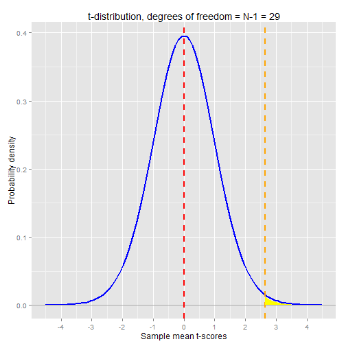

Now let's plot our t-statistic in the t-distribution to see where it lands.  As mentioned above, the t-distribution is not a single distribution curve but rather a family of distribution curves, with each curve corresponding to a particular degrees of freedom.  The degrees of freedom for our t-statistic is n - 1, the same as the degrees of freedom for the unbiased sample variance which we  used in the calculation of the t-statistic.  So we plot our t-statistic against the t-distribution curve with degrees of freedom k = n - 1.


```r
library(ggplot2)

N <- 30
s <- 3.1
nor.mean <- 68.5
pop.mean <- 67
nor.tscore <- (nor.mean - pop.mean) / (s / sqrt(N))

x <- seq(-4.5,4.5,0.01)
shade_x <- seq(nor.tscore,4.5,0.01)
shade_y <- dnorm(shade_x)
shade <- data.frame( rbind(c(nor.tscore,0), cbind(shade_x,shade_y), c(4.5,0)) )

ggplot() + 
    stat_function(aes(x=x), 
                  fun=dt, 
                  args=list(df=N-1),
                  size=1, 
                  colour="blue") +
    ggtitle("t-distribution, degrees of freedom = N-1 = 29") + 
    geom_hline(y=0, colour="darkgray") +
    geom_vline(x=0, linetype="dashed", colour="red", size=1) +
    geom_vline(x=nor.tscore, linetype="dashed", colour="orange", size=1) +
    geom_polygon(data = shade, aes(shade_x, shade_y), fill="yellow") +
    ylab("Probability density") + 
    xlab("Sample mean t-scores")  +
    scale_x_continuous(breaks=-4:4, labels=-4:4)
```

 

Like the R functions dnorm, pnorm, qnorm, and rnorm that deal with normal distributions, we
can use the dt, pt, qt, and rt functions when we're dealing with t-distributions.  Each of these
functions takes an additional required parameter, df, for the degrees of freedom, which specifies
which t-distribution curve (from the t-distribution family) we're working with.

The p-value for our significance test (the area of the yellow-shaded region) can be determined using the pt function with df=N-1:


```r
1 - pt( nor.tscore, df=N-1 )
```

```
## [1] 0.006444771
```

Compare this to the p-value we got using the z-score and the standard normal distribution, p=0.003.
The p-value using the t-score and t-distribution is twice as large.  This is because the t-distribution
has "fatter tails" than the standard normal.  "Fatter tails" simply means that extreme outcomes which fall
far from the mean have a greater probability of occuring under a t-distribution than under the standard
normal distribution.  In the context of our significance test, the t-distribution represents the sampling distribution of the mean.
So it's basically giving a higher probability of observing sample means that fall far from the population
mean, to account for that extra bit of error that gets introduced when we have to estimate the underlying
population mean and variance from a small sample.


## Recap

## latex math

\begin{align*} 
s^2 & = \frac{N}{N-1} \cdot \sigma_x^2
\\[8pt]
s^2 & = \frac{30}{30-1} \cdot 9
\\[8pt]
s^2 & = 9.3
\\[8pt]
s & = \sqrt{9.3} = 3.1
\\ \\
where,
\\[8pt]
\sigma_x^2 & = biased \ sample \ variance
\\[8pt]
s^2 & = unbiased \ sample \ variance 
\\[8pt]
s & = unbiased \ sample \ standard \ deviation
\\[8pt]
N & = the \ sample \ size
\end{align*}

\mathchardef\mhyphen="2D
\begin{align*} 
t\mhyphen statistic & = \frac{\overline{X} - \mu}{ \frac{s}{\sqrt{N}} }
\\[8pt]
& = \frac{68.5 - 67}{ \frac{3.1}{\sqrt{30} } }
\\[8pt]
& = 2.650
\end{align*}


\begin{align*} 
z-statistic & = \frac{\overline{X} - \mu}{ \frac{\sigma}{\sqrt{N}} }
\\ \\
where,
\\[8pt]
\overline{X} & = the \ sample \ mean
\\[8pt]
\mu & = the \ population \ mean
\\[8pt]
\sigma & = the \ population \ standard \ deviation
\\[8pt]
N & = the \ sample \ size
\end{align*}


\begin{align*} 

Q & = \sum_{i=1}^n X_i^2 \sim \chi_n^2

\\ \\
(n-1) \frac{s^2}{\sigma^2} \sim \chi_{n-1}^2
\\ \\
\frac{(n-1)}{\sigma^2}
\\ \\
(n-1) \frac{ \frac{1}{n-1} \sum_{i=1}^n (X_i - \mu)^2}{\sigma^2} \sim \chi_{n-1}^2
\\ \\
\frac{ \sum_{i=1}^n (X_i - \mu)^2}{\sigma^2} \sim \chi_{n-1}^2
\\ \\
\sum_{i=1}^n X_i^2  \sim \chi_{n-1}^2
\\ \\
s^2 = \frac{1}{n-1} \sum_{i=1}^n (X_i - \overline{X})^2
\\ \\
(n-1) \cdot s^2 = \sum_{i=1}^n (X_i - \overline{X})^2
\\ \\
(n-1) \cdot s^2 = \sum_{i=1}^n (X_i - 0)^2
\\ \\
(n-1) \cdot s^2 = \sum_{i=1}^n X_i^2

\end{align*}
