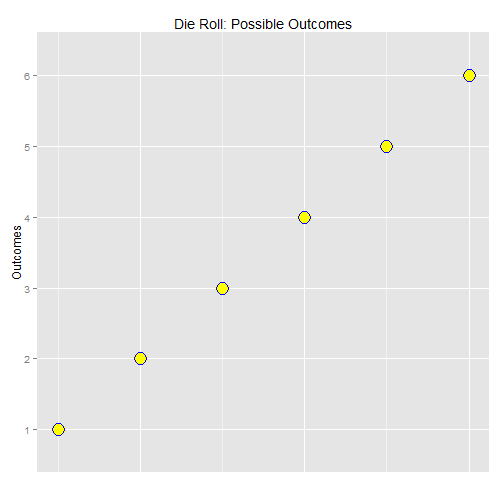
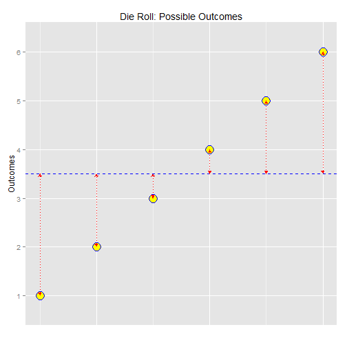
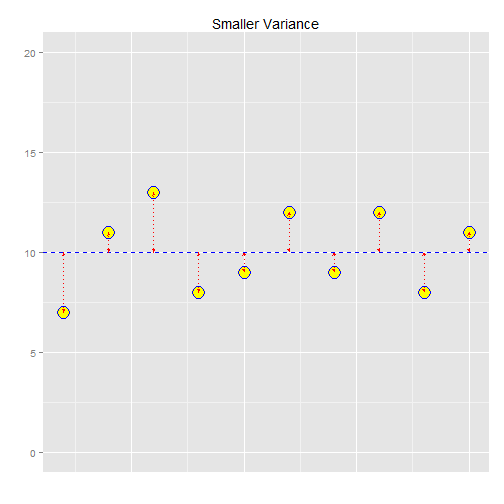
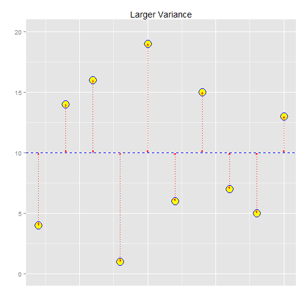

Conceptually it might be easier to understand what variance is by taking a look at it graphically.
The following chart depicts the complete set of outcomes for a random variable
representing the toss of a single die.  There are six possible outcomes, 1 - 6.


```r
die <- c(1,2,3,4,5,6)
ggplot() +
    ggtitle("Die Roll: Possible Outcomes") +
    ylab("Outcomes") +
    xlab("") +
    geom_point(aes(x=1:6, y=die), shape=21, size=6, colour="blue", fill="yellow") +
    scale_y_discrete(breaks=1:6, labels=1:6) +
    theme(axis.ticks.x = element_blank(), axis.text.x = element_blank())
```

 


The Variance, as mentioned above, is a measure of the "spread" of the data -- 
in other words, how much the data vary from the expected value.
The expected value, 3.5, is depicted by the blue dashed line that cuts horizontally thru
the center of the data.  The variance is illustrated as the dotted red lines between
each outcome and the expected value.


```r
ev <- rep(3.5,6)
ggplot() +
    ggtitle("Die Roll: Possible Outcomes") +
    ylab("Outcomes") +
    xlab("") +
    geom_point(aes(x=1:6, y=die), shape=21, size=6, colour="blue", fill="yellow") +
    scale_y_discrete(breaks=1:6, labels=1:6) +
    theme(axis.ticks.x = element_blank(), axis.text.x = element_blank()) +
    geom_hline(yintercept=3.5,color="blue",linetype="dashed") + 
    geom_line(aes(x=rep(1:6,2),y=c(die,ev), group=rep(1:6,2)),color="red", linetype="dotted", arrow=arrow(ends="both",type="closed",length=unit(5,"points")))
```

 

```r
#    geom_point(aes(x=1:6, y=ev), shape=16, size=1, colour="red") +
```


The closer the data are to the expected value, the smaller the variance.  The
further away the data are, the larger the variance.  Below are two charts of
two random variables, both with the same expected value but different
variances.  The left-hand chart has smaller variance than the right-hand chart.


```r
y.sv <- c(7,11,13,8,9,12,9,12,8,11)
ev <- rep(10,10)

ggplot() +
    ggtitle("Smaller Variance") +
    ylab("") +
    xlab("") +
    theme(axis.ticks.x = element_blank(), axis.text.x = element_blank()) +
    ylim(0,20) +
    geom_hline(yintercept=10,color="blue",linetype="dashed") + 
    geom_point(aes(x=1:10, y=y.sv), shape=21, size=6, colour="blue", fill="yellow") +
    geom_line(aes(x=rep(1:10,2),y=c(y.sv,ev), group=rep(1:10,2)),color="red", linetype="dotted", arrow=arrow(ends="both",type="closed",length=unit(3,"points")))
```

 


```r
y.lv <- c(4,14,16,1,19,6,15,7,5,13)
ggplot() +
    ggtitle("Larger Variance") +
    ylab("") +
    xlab("") +
    theme(axis.ticks.x = element_blank(), axis.text.x = element_blank()) +
    ylim(0,20) +
    geom_hline(yintercept=10,color="blue",linetype="dashed") + 
    geom_point(aes(x=1:10, y=y.lv), shape=21, size=6, colour="blue", fill="yellow") +
    geom_line(aes(x=rep(1:10,2),y=c(y.lv,ev), group=rep(1:10,2)),color="red", linetype="dotted", arrow=arrow(ends="both",type="closed",length=unit(3,"points")))
```

 


