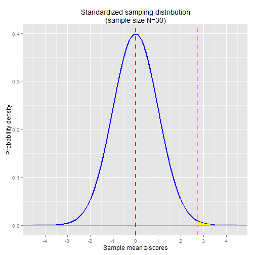

```r
library(ggplot2)

N <- 30
sd <- 3
nor.mean <- 68.5
pop.mean <- 67
nor.zscore <- (nor.mean - pop.mean) / (sd / sqrt(N))

x <- seq(-4.5,4.5,0.01)
shade_x <- seq(nor.zscore,4.5,0.01)
shade_y <- dnorm(shade_x)
shade <- data.frame( rbind(c(nor.zscore,0), cbind(shade_x,shade_y), c(4.5,0)) )

ggplot() + 
    stat_function(aes(x=x), 
                  fun=dnorm, 
                  size=1, 
                  colour="blue") +
    ggtitle("Standardized sampling distribution\n(sample size N=30)") + 
    geom_hline(y=0, colour="darkgray") +
    geom_vline(x=0, linetype="dashed", colour="red", size=1) +
    geom_vline(x=nor.zscore, linetype="dashed", colour="orange", size=1) +
    geom_polygon(data = shade, aes(shade_x, shade_y), fill="yellow") +
    ylab("Probability density") + 
    xlab("Sample mean z-scores")  +
    scale_x_continuous(breaks=-4:4, labels=-4:4)
```

 

The area shaded in yellow is the probability of observing a sample mean z-score as extreme
as the Norwegian sample mean.  As in the previous article, we can calculate the probability
in R using the pnorm function:


```r
nor.zscore
```

```
## [1] 2.738613
```

```r
1 - pnorm(nor.zscore)
```

```
## [1] 0.00308495
```

Note that this is the exact same probability we got in the non-standardized significance
test.  

## Recap
